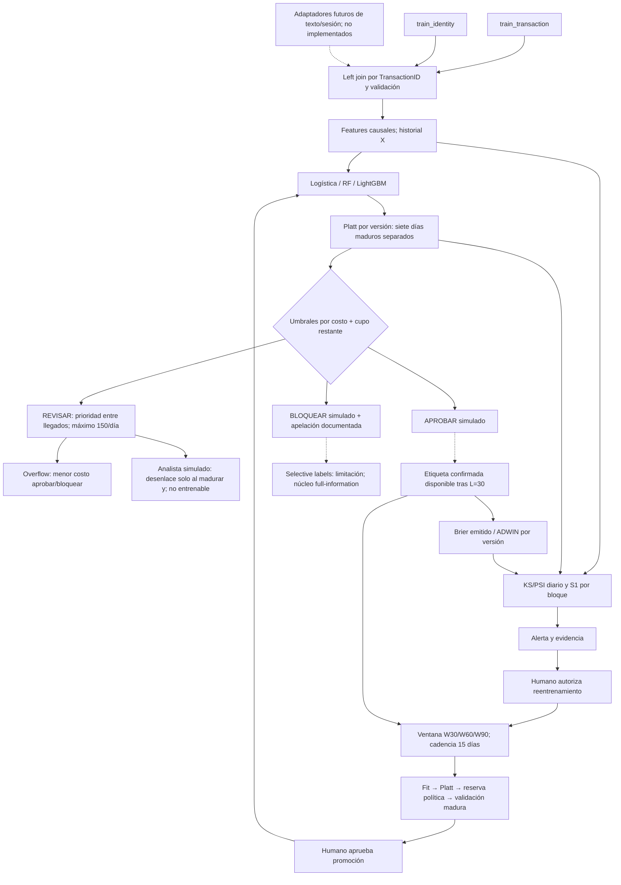
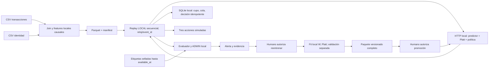
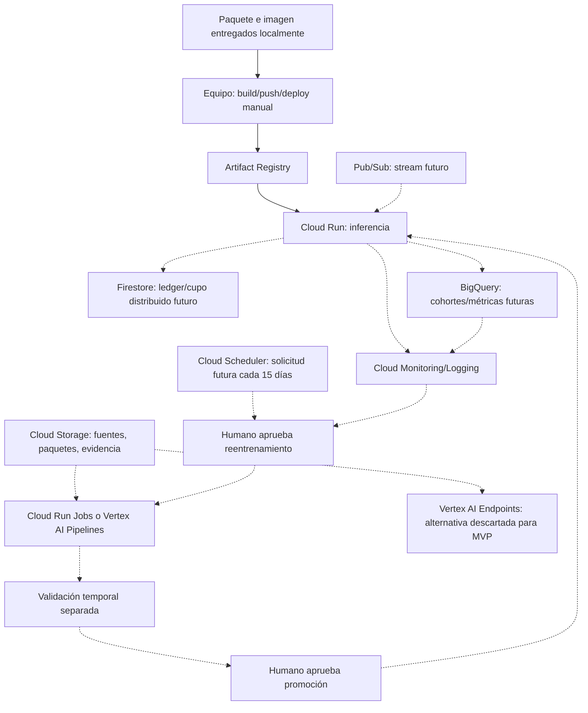

# Plan de implementación: sistema adaptativo de decisión ante fraude transaccional

Actualización: 20/09/2026. Curso: Planificación y Toma de Decisiones en IA, UTEC. Dataset: IEEE-CIS Fraud Detection. **Plazo operativo: dos días, D1=20/09 y D2=21/09, cierre en D2 noche; límite absoluto de 48 horas desde el inicio de la implementación.** Si una sesión comienza después de su bloque nominal, comprimiré tareas opcionales y usaré el orden de prioridad, sin ampliar las dos jornadas ni el cómputo.

**Alcance de esta sesión:** solo actualizar este plan. No ejecutaré experimentos ni escribiré implementación ni modificaré otros archivos en esta sesión. En las próximas sesiones **yo, Codex, implementaré y validaré localmente todas las fases y produciré todos los entregables**. El equipo revisará, autorizará los actos operativos humanos, desplegará manualmente en GCP y ensayará. No ejecutaré `gcloud` ni crearé recursos cloud ni estimaré facturas. La propuesta de despliegue cubre §3.4 mediante diseño, análisis cualitativo de costos y paquete portable probado localmente.

**Contrato de ejecución.** Cada paso numerado es una instrucción para mí, salvo los rotulados explícitamente «equipo». Registraré decisiones por delegación sin devolver preguntas técnicas. La autorización para implementar llegará en las próximas sesiones; esta planificación no inicia una corrida ni una automatización. La aprobación humana de reentrenamiento y promoción permanece en el diseño: la corrida nocturna offline usará un manifest de autorización humana previo que enumere sus fits y promociones simuladas, sin autorizar despliegues reales.

### Estrategia para el puntaje máximo en dos días

Garantizaré las evidencias y su trazabilidad como criterios de cierre, no una nota ni mejoras de métricas aún no medidas. La rúbrica de p. 5 asigna 18 puntos al producto actual y 2 al avance ya presentado.

| Criterio de rúbrica | Dos o tres evidencias concretas que produciré | Bloque de producción |
|---|---|---|
| Problema, objetivos, restricciones y métricas — 4 | Contrato O1–O5 con las tres familias de métricas; política económica con abstención/cupo; tabla de resultados y límites por segmento. | D1 mañana, D1 tarde y D2 mañana |
| Análisis y preparación de datos — 3 | EDA semanal de fraude/faltantes/anomalías con KS/PSI; join transacciones–identidad y features causales; manifiestos y pruebas automáticas de leakage. | D1 mañana |
| Modelado y evaluación temporal — 3 | Logística, Random Forest y LightGBM con folds comunes; tabla CSV y curvas semanales/bloques del estático; intervalos por bootstrap temporal e interpretación de degradación o resultado negativo. | D1 tarde y D2 mañana |
| Diseño del sistema y adaptación — 4 | Mermaid con cinco componentes; comparación S0/E15/W30/W60/W90 con ADWIN; servicio/replay local con tres acciones, alerta, cambio de versión y gates humanos documentados. | D1 mañana, D1 noche y D2 mañana |
| Calidad del producto — 4 | Código modular, locks, pruebas y tres notebooks ejecutables; informe completo Markdown/PDF de máximo 8 páginas; infografía SVG, guion y runbook manual. | D1 mañana a D2 noche |
| Presentación del avance — 2 | Trazabilidad del Markdown definitivo a decisiones vigentes; reutilización de problema/objetivos/arquitectura en el informe y guion. No puedo reasignar ni garantizar una nota pasada. | D1 mañana y D2 tarde; ensayo del equipo D2 noche |

**Núcleo cerrado:** seed 42, L=30, cadencia 15 días, W={30,60,90}; tres configuraciones por modelo y dos folds forward; 8 horas máximas de cómputo acumulado en un único equipo con hasta 4 threads. Benchmark v2, D*, otros L/cadencias, MLflow, Terraform, shadow y masked-label quedan fuera del camino crítico. C1, C4 y C16 se modifican por plazo y coherencia temporal, con registro explícito en §4.

## 1. Fuentes leídas

La tabla conserva la lectura documental de la planificación anterior. En esta actualización releí el plan completo y las páginas 3–5 del enunciado; inspeccioné visualmente la rúbrica de p. 5, renderizada en memoria sin crear archivos. Las rutas de esta tabla son relativas a `C:\Users\User\Documents\UTEC\2026-2\PLANIFICA\Proyecto\`. Se leyeron los cinco Markdown encontrados recursivamente en `artifacts\`, no solamente sus títulos.

| Archivo | Resumen | Cómo influye en el plan |
|---|---|---|
| `UTEC_2026_1__Planificación_y_Toma_de_Decisiones_en_IA.pdf` | Enunciado de cinco páginas: actividades 3.1–3.5, productos y rúbrica de 20 puntos. Texto extraído de todas las páginas y tabla de rúbrica de p. 5 inspeccionada visualmente. | Fuente de verdad: cinco componentes del sistema, evaluación temporal, dos modelos tradicionales y uno avanzado, prioridad a ventanas fijas deslizantes, informe de ocho páginas. |
| `propuesta_proyecto1_final.md` | Avance de la etapa 3.1: objetivos O1–O5, costos, tres acciones, señales S1–S4, etiquetas tardías, protocolo de días 0–181 y límites de autonomía. | Registro definitivo del avance por mandato del equipo. Conservaré su historia; §2 y §4 identifican modificaciones por el plazo de dos días. |
| `concept_drift_findings.md` | Benchmark de selección: cinco ventanas cronológicas, domain classifier, stale-model gap con importance weighting y validación sintética; IEEE-CIS con señal más fuerte, confianza media. | Reutilizar selección y resultados como antecedentes. Mantener limitaciones y moderar las afirmaciones de causalidad siguiendo el avance. |
| `concept_drift_benchmark_instructions.md` | Protocolo de comparación de datasets: separar P(X) de P(y\|X), corregir covariate shift, controlar temporalidad y validar con datos sintéticos. | Conservaré K=5, corrección y gate sintético como protocolo del antecedente histórico. Repetirlo/benchmark v2 es extensión; el núcleo operativo usa ADWIN y W30/W60/W90. |
| `artifacts\Sem2_Fundamentos_Guia.md` | Predicción frente a decisión, PEAS, confianza apropiada y ciclo de vida con responsables y rollback. | Justificar acciones y autonomía; reutilizar el ciclo de vida para la infografía. |
| `artifacts\Sem3_Iniciación_Guia.md` | Componentes A–G de iniciación, integración de fuentes, EDA, seis criterios de calidad y feature engineering. | Estructurar auditoría de datos y justificar preprocessing. Las técnicas generales de interpolación se restringen al pasado. |
| `artifacts\Sem4_Modelado_Guia.md` | Regresión logística, árboles, bagging/boosting, desbalance y métricas de clasificación. Incluye erratas identificadas en la propia guía. | Sustentar la escalera logística–Random Forest–LightGBM y explicar F1, precision, recall y costos de FP/FN. |
| `artifacts\Sem5_Evaluación_Guia.md` | Pesos de clase, remuestreo solo en train, leakage, comparación con los mismos folds y búsqueda de hiperparámetros. | Adaptar la evaluación a folds temporales; no trasladar el holdout aleatorio del ejemplo al proyecto. |
| `artifacts\Sem6_Despliegue_Guia.md` | Cuatro decisiones de despliegue, niveles de autonomía, pipelines de datos/modelos/código, MLflow y monitoreo. | Justificar contenedor y Cloud Run, separar entrenamiento de serving, registrar artefactos y definir promoción/rollback. |
| `cd_bench\results\synthetic_validation.md` y `comparison_table.csv` | Gate sintético registrado como PASSED, diez comprobaciones; fraude: gap corregido medio 0.0956 y degradación relativa corregida 0.1897. | Evidencia ya producida que no se presenta como ejecución nueva ni como resultado del sistema adaptativo. |
| `cd_bench\run_benchmark.py` y fragmento de `results\fraud_metrics.json` | Inspección focal de configuración, particiones, preprocessing y métricas: semilla 42, cap de 30 000 filas/ventana, AP y split interno 70/30 cronológico. | Reutilización con auditoría: encoding sobre toda w0 y preprocessing del domain classifier antes del cross-fitting necesitan revisión. |
| `.venv\` y listado de `ieee-fraud-detection\` | Se consultaron versiones instaladas y existencia de los CSV; no se ejecutó EDA ni se volvieron a contar todas las filas. | Partiré del entorno existente, verificaré compatibilidad y fijaré pins al implementar; evitaré descarga redundante. |

**Disponibilidad de las diapositivas (nuevo intento, 20/09/2026).** El inventario recursivo de PDF y la apertura de la ruta exacta de `Adaptive_Transactional_Fraud_Systems.pdf` vuelven a indicar archivo inexistente. No pude leer ninguna página, determinar su cantidad ni si contiene imágenes. Mantengo **Página del avance = N/D** en todas las filas; no inventaré correspondencias. `propuesta_proyecto1_final.md` es el registro definitivo por instrucción del equipo. La rúbrica p. 5 sí es legible; sus seis criterios fueron verificados en texto y visualmente.

## 2. Decisiones ya tomadas en el avance

Fuente histórica: `propuesta_proyecto1_final.md`, registro definitivo. Las decisiones de la primera columna se conservan como historia; la última contiene las instrucciones vigentes por delegación del 20/09/2026. Página N/D se mantiene porque el PDF del avance no está disponible. C1/C4/C16 están **MODIFICADAS por plazo**; las demás decisiones aprobadas permanecen salvo sus concreciones operativas.

| Decisión comprometida | Localizador verificable | Página del avance | Consecuencia para implementar |
|---|---|---|---|
| Comercio electrónico, aproximadamente 3 200 transacciones diarias; fraude y fricción por rechazos legítimos. | §1 | N/D | Simular autorización transaccional y medir impacto por transacción. |
| Clasificación binaria de `isFraud`, integrada a aprobar/revisar/bloquear. | §1 | N/D | Separar score, política y acción. |
| IEEE-CIS elegido tras benchmark; Diabetes excluido del ranking temporal por falta de eje temporal verificable. | §2 | N/D | No repetir selección de dataset. |
| Cinco ventanas cronológicas de igual cantidad; PR-AUC, importance weighting y gate sintético para el benchmark. | §2.1 | N/D | Conservaré el benchmark histórico como antecedente; no lo repetiré en el núcleo. C16 MODIFICADA por plazo: benchmark v2 opcional, siempre en carpeta separada y con transforms dentro de cada fit/fold. |
| Señal consistente con concept drift, confianza media; anonimización y tamaño muestral limitan la interpretación. | §2.2–2.3 | N/D | No afirmar prueba causal de P(y\|X). |
| Repetir benchmark con D* crudas, D* transformadas como D−día y D* excluidas. | §2.3, §10 | N/D | MODIFICADA por plazo: las tres ablaciones pasan a extensiones; usaré D* crudas, sin inferir su semántica ni transformar D−día en el núcleo. |
| Repetir con cinco semillas, media y desviación. | §2.3 | N/D | MODIFICADA por plazo: seed 42 en el núcleo; si queda presupuesto, semillas 43 y 44 solo para repetir la tabla final. No presentaré varianza entre semillas no ejecutadas. |
| O1: menor costo que política actual y modelo estático. | §3 | N/D | Compararé con aprobar todo y S0 como referencias simuladas. Costo observado simulado es el criterio de decisión; no afirmaré una política comercial observada. |
| O2: limitar caída de PR-AUC respecto de referencia reentrenada. | §3 | N/D | Usaré caída relativa de AP del 10% como señal diagnóstica; la comparación temporal no identifica causalmente drift. |
| O3: respetar capacidad diaria de revisión. | §3, §9.3 | N/D | Límite duro de 150 casos/día. |
| O4: señales sin etiqueta que anticipen caída confirmada. | §3, §6.6 | N/D | Registrar tiempo del evento y tiempo de disponibilidad del diagnóstico. |
| O5: limitar disparidad de FP entre segmentos. | §3 | N/D | Reportaré brecha de bloqueo legítimo de 2 pp como umbral de alerta con soporte ≥1 000 legítimas/segmento, e intervalos; no es garantía de equidad demográfica. |
| Solo train de Kaggle etiquetado; aproximadamente 182 días; variables anónimas y faltantes extensos. | §4.1 | N/D | Test interno temporal; no utilizar `test_*`. |
| Decisión online y latencia p95. | §4.2, §5.1 | N/D | Medir inferencia y flujo completo por separado. |
| Retrasos simulados L={30,60,90,120} días; principal L=30. | §4.2, §8 | N/D | MODIFICADA por plazo: solo L=30; el resto queda en extensiones sin ejecución obligatoria. |
| Selective labels y diferencia entre veredicto del analista y etiqueta confirmada. | §4.2, §6.5 | N/D | No usaré veredictos como ground truth. C28: el veredicto simulado solo se calcula al madurar y; feedback humano rápido queda como interfaz futura, no señal observada de IEEE-CIS. |
| Cómputo académico Colab Pro/Khipu; CPU y RAM como cuello de botella. | §4.3 | N/D | Usaré CPU local/académica, hasta 4 threads, seed 42 y cómputo total ≤8 h. Equipo ejecuta GCP manualmente; no entrenaré en la nube. |
| No cerrar cuentas, listas negras, bloqueo sin apelación, explicaciones causales ni reentrenamiento autónomo. | §4.4 | N/D | Mantener responsable humano y trazabilidad. |
| PR-AUC, recall a precisión fija, Brier/reliability y p95. | §5.1 | N/D | C8 aprobada: reportar F1, recall a FPR fijo y recall a precisión fija; conservar el resto y mantener costo como criterio de decisión. |
| Costo: monto de FN + fricción de FP + costo de revisiones. | §5.2 | N/D | Usar `TransactionAmt` por fila, no monto promedio. |
| Umbrales minimizan costo bajo capacidad; pérdida evitada por analista-hora. | §5.2, §6.4 | N/D | No elegir umbrales por F1 ni asumir 0.5. |
| Disparidad operativa por monto, correo, dispositivo y dirección; no hay atributos protegidos verificables. | §5.3 | N/D | No presentar segmentos como auditoría demográfica. |
| Cobertura automática; bloqueo sin apelación resuelta como métrica solo de producción. | §5.3 | N/D | Diferenciar métricas medibles del dataset y métricas futuras. |
| Dos fuentes: transacciones e identidad, left join por `TransactionID`, cobertura parcial informativa; fuentes tipo 2. | §6.1 | N/D | Preservar filas de transacciones y registrar ausencia de identidad. |
| Multi-fuente tabular no equivale a multimodalidad; modalidades adicionales solo como extensión. | §6.1 | N/D | C7 aprobada: integración real transacciones + identidad; adaptadores de texto/señales de sesión como extensión futura no implementada, sin nuevas modalidades ni datasets. La consulta al docente sigue abierta y no bloquea implementar. |
| Agregaciones por tarjeta/dispositivo solo hacia atrás. | §6.1, §8.5 | N/D | Historia causal, sin frecuencias globales ni eventos futuros. |
| Regresión logística, Random Forest y LightGBM. | §6.2 | N/D | Comparar exactamente estos tres modelos. |
| Calibración Platt o isotónica en validación temporal. | §6.3 | N/D | C4 MODIFICADA por plazo: Platt por versión, 7 días en [c−21,c−14); reservaré después 7 días para política inicial y 7 para validación de promoción. Predictor y calibrador no acceden a estas reservas. |
| Dos umbrales, zona gris y ampliación ante drift. | §6.3–6.4 | N/D | Dos umbrales globales fijados por costo en desarrollo; δ=0 en comparación central, sensibilidad δ=0.02 solo en desarrollo sin nuevos fits. Cupo duro 150. |
| Cola priorizada por p×monto; excedente por menor costo esperado. | §6.4 | N/D | C12 aprobada: priorizar por p×monto solo entre casos ya llegados y con cupo restante; excedentes por costo esperado. Top-150 retrospectivo diario solo como cota oracle. |
| Alertas y arquitectura con dos velocidades de feedback y aprobación humana. | §6.5, §7 | N/D | Conservar las conexiones del Mermaid del avance. |
| S1 domain classifier; S2 scores; S3 confirmación del analista; S4 stale-model gap. | §6.6 | N/D | KS/PSI y ADWIN obligatorios; S1 por bloque con cap 2 000 por dominio; S3 simulado; S4 solo antecedente histórico, no nuevos fits de stale-model gap. |
| Escalamiento: S1/S2 → alerta y abstención; con S3 → recomendación; S4 → reentrenamiento aprobado. | §6.6 | N/D | Las señales recomiendan y alertan; la decisión de reentrenar cada 15 días y toda promoción conservan gate humano. S4 no es prerrequisito del núcleo recortado. |
| Comparar lotes periódicos y un modelo incrementalmente adaptativo. | §6.6 | N/D | Registro histórico reemplazado por C1, ahora MODIFICADA por plazo: olvido fijo con W={30,60,90}, cadencia 15, S0/E15 solo referencias. Incremental solo extensión. |
| Desarrollo 0–89, arranque 90–119, backtest 120–181 en cuatro bloques de ~15 días. | §8.2 | N/D | Mantendré [0,90) desarrollo, [90,120) warmup X sin scores y [120,182) test secuencial; reservaré [69,76) calibración, [76,83) política/selección y [83,90) validación de promoción inicial. |
| Política e hiperparámetros congelados; disponibilidad y cuando t−t_i≥L. | §8.2–8.4 | N/D | Congelaré familia, hiperparámetros, método Platt y umbrales antes de [120,182). Ajustaré pesos/calibrador solo con pasado maduro por versión; selección de W se realiza en desarrollo, nunca con test final. |
| L≥60 no es simulación point-in-time exacta con política congelada; L=120 inviable temprano. | §8.2–8.3 | N/D | Fuera del núcleo; documentaré la limitación histórica sin ejecutar esas sensibilidades. |
| Costos de FP/revisión pendientes; sensibilidad económica; reserva aleatoria de casos para auditar selective labels. | §9.3, §10 | N/D | Elegiré c_FP=5 UM, c_R=1 UM, analista r_H=0.90/f_H=0.02; sensibilidad pequeña de F1. Auditoría selectiva adicional y masked-label quedan como extensiones. |

## 3. Brechas del avance frente a la rúbrica

Rúbrica verificada en p. 5: 4+3+3+4+4+2=20 puntos. No existe un criterio de despliegue cloud puntuado aparte. La propuesta de §3.4 se entrega aunque el equipo no alcance a desplegar.

| Criterio y nivel Excelente | Brecha que cerraré | Fase, bloque y evidencia de cierre |
|---|---|---|
| Problema, objetivos, restricciones y métricas — 4: claridad y justificación de métricas técnicas, de decisión y sociales. | Convertir O1–O5 del avance en contrato con costos, tolerancias y límites explícitos. | F1/D1 mañana: contrato y política; F3–F4/D2 mañana: tabla de métricas, soporte y sensibilidad económica. |
| Datos — 3: análisis temporal sólido, cambios/anomalías y atributos adecuados. | Falta EDA de ambas fuentes, features históricas e integridad temporal demostrada. | F2/D1 mañana: join auditado, EDA semanal con KS/PSI, manifests y suite anti-leakage aprobada. |
| Modelado y evaluación temporal — 3: modelos comparados rigurosamente y degradación interpretada. | Falta tabla de logística/RF/LightGBM y curvas operativas. | F3/D1 tarde: dos folds comunes, tres modelos; F4/D2 mañana: curvas, AP/F1/recalls/costo, bootstrap temporal sin inventar mejoras. |
| Diseño y adaptación — 4: los cinco componentes y mecanismos de drift completos. | Implementar el olvido y concretar calibración/promoción sin contaminación, y demostrar decisiones. | F1/F4/F5: W30/W60/W90 frente a S0/E15, ADWIN, contratos C20/C21 resueltos y replay local. D1 noche/D2 mañana. |
| Calidad del producto — 4: código reproducible y documento/diagramas/tablas/protocolos/infografía coherentes. | Integrar resultados y artefactos finales, no ampliar plataformas. | F0–F6: locks, pruebas, tres notebooks, README, servicio/Dockerfile/runbook, informe de máximo 8 páginas, SVG y guion. Cierre D2 noche. |
| Presentación del avance — 2: dirección clara. | Mantener trazabilidad de lo presentado sin simular feedback o nota. | F1/F6: historial de decisiones y material reutilizado. La calificación pasada queda fuera del control de esta implementación. |
| Actividades §3.1 y §3.4–3.5. | Consideración de multimodalidad, arquitectura/flujo/frecuencia/autonomía y desafíos de escala/costo/integración. | Dos fuentes reales y adaptadores futuros no implementados; propuesta GCP documentada, manual del equipo, servicio probado localmente. Consulta docente no bloqueante. |

## 4. Contradicciones, ambigüedades y resoluciones por delegación

**Autoridad y prioridad:** restricciones no negociables del enunciado y de esta solicitud; mandato actual de dos días; registro histórico del avance; demás antecedentes. Resuelvo todas las filas en indicativo. C1/C4/C16 incluyen **MODIFICADA por plazo**; C7/C8/C12 se ratifican. Los documentos fuente e históricos no se alteran. Cada justificación explicita el criterio favorecido y el riesgo aceptado.

| ID | Contradicción o ambigüedad | Decisión que ejecutaré | Justificación: rúbrica y riesgo | Estado |
|---|---|---|---|---|
| C1 | Avance §6.6 contrapone batch e incremental; enunciado §3.5 prioriza olvido por ventanas fijas. | **MODIFICADA por plazo.** Usaré W={30,60,90} días y cadencia 15. S0/E15 son únicamente referencias; la estrategia desplegable seguirá siendo olvido con ventana fija. W14 pasa a extensión porque las tres reservas de 7 días la dejan sin fit; incremental no es obligatorio. | Favorece diseño/adaptación y comparación rigurosa; se pierde el escenario más corto, conservando tres tamaños. | RESUELTA por delegación (20/09/2026) |
| C2 | «Ventana móvil» y «ventana expansiva» aparecen como si fueran equivalentes en §6.1/§8.5. | Calcularé features por proxy con ventanas de 1 h, 24 h y 7 d, rezagos y conteo expansivo causal; distinguiré esos históricos de la ventana que limita el fit del predictor. | Favorece datos; asumo proxies imperfectos y mediré colisiones. | RESUELTA por delegación (20/09/2026) |
| C3 | Findings/instrucciones llaman al gap prueba genuina o incluso lower bound del concept drift; avance §2.3 reconoce varianza, soporte y muestra finita. | Citaré el benchmark como evidencia consistente de drift, no prueba causal ni lower bound garantizado. D* y repetición del benchmark son extensiones; probaré ADWIN con dos streams sintéticos pequeños sin nuevos fits predictivos. | Favorece interpretación/calidad; queda menor robustez causal del antecedente, declarada. | RESUELTA por delegación (20/09/2026) |
| C4 | Política congelada del avance no especifica si un nuevo modelo conserva el mismo calibrador. | **MODIFICADA por plazo.** Ajustaré Platt propio por versión en [c−21,c−14), después del predictor [c−W,c−21). Reservaré [c−14,c−7) para umbrales/selección solo al inicio y [c−7,c) para validación de promoción. Después del inicio no reutilizaré la reserva intermedia en ese fit. Método, hiperparámetros y umbrales permanecerán congelados. | Favorece evaluación temporal sin fuga y resuelve C20 sin shadow; el calibrador tiene 14 días más de antigüedad que la cola madura más reciente. | RESUELTA por delegación (20/09/2026) |
| C5 | L≥60 usa política construida con etiquetas no disponibles en T=120. | Ejecutaré únicamente L=30. L=60/90/120 son extensiones fuera de los dos días, sin resultados ni inferencias operativas nuevos. | Favorece comparación completa dentro del plazo; no mediré sensibilidad a retrasos largos. | RESUELTA por delegación (20/09/2026) |
| C6 | §6.6 dice «no se puede monitorear F1» y «dos meses», pero L principal es 30 días. | Monitorearé F1/costo solo al madurar y; conservaré evento y available_at. Al terminar el stream avanzaré solo el reloj de evaluación hasta la última madurez, sin nuevas acciones ni entrenamiento. | Favorece métricas válidas; evidencia de error necesariamente tardía. | RESUELTA por delegación (20/09/2026) |
| C7 | Dos tablas tabulares frente a «considerando fuentes multimodales» del enunciado. | Ratifico integración real transacciones + identidad; dibujaré texto/señales de sesión como adaptadores futuros no implementados. No añadiré modalidades/datasets. Asumo que documentar esa consideración satisface §3.1; consulta docente no bloqueante. | Favorece integración y alcance; la interpretación docente de multimodalidad sigue siendo externa. | RESUELTA por delegación (20/09/2026) |
| C8 | Petición actual exige recall a FPR fijo y F1; el avance fija recall a precisión fija. | Ratifico F1, recall a FPR=1% y recall a precisión=80%, además de AP/Brier/latencia. Reportaré las restricciones realmente obtenidas. Costo decidirá la política; no sustituiré estos objetivos por optimizar F1. | Favorece tres familias de métricas; objetivos pueden incumplirse por drift y se declarará. | RESUELTA por delegación (20/09/2026) |
| C9 | Guías muestran holdout/k-fold aleatorios, interpolación con futuro y entrenamiento final con todos los datos. | Usaré splits forward, fit de preprocessing por fold y solo pasado. Separaré predictor, calibrador, elección de umbrales y validación de promoción. Reportaré calidad final solo sobre predicciones prequential no usadas previamente por la versión que las emitió. | Favorece rigor temporal; reduce soporte de entrenamiento. | RESUELTA por delegación (20/09/2026) |
| C10 | Instrucciones del benchmark dicen que no hace falta Kaggle API; esta solicitud pide descarga reproducible. | Reutilizaré CSV locales verificados por hash; documentaré Kaggle API para reconstrucción y solo descargaré los dos train si faltan en implementación. Credenciales individuales fuera del repo. | Favorece reproducción; acceso/reglas de Kaggle dependen de la cuenta del equipo. | RESUELTA por delegación (20/09/2026) |
| C11 | Orden de etapas: §3.4 despliegue precede a §3.5 drift; el usuario pide F4 drift y F5 despliegue. | Ejecutaré F4/§3.5 antes de F5/§3.4; conservaré correspondencia con el enunciado, no su orden de ejecución. | Favorece coherencia: paquete y frecuencia usan resultados medidos. | RESUELTA por delegación (20/09/2026) |
| C12 | Ordenar todas las sospechas de un día por p×monto exige ver transacciones futuras; además ampliar abstención puede saturar la cola. | Ratifico cola causal por p×monto entre llegados, con cupo restante y overflow por costo esperado. Reservaré cupo de forma atómica por event_id; máximo 150/día. El top-150 retrospectivo, si se calcula, solo será oracle en una tabla aparte. | Favorece decisión implementable; se renuncia a la ventaja irreal de conocer todo el día. | RESUELTA por delegación (20/09/2026) |
| C13 | Auditoría aleatoria de bloqueos descrita como generadora de etiquetas «no sesgadas» en §10. | Usaré full-information offline: toda y del dataset madura tras 30 días incluso si la acción simulada bloqueó. El analista es simulado con r_H=0.90/f_H=0.02; calcularé su resultado solo al madurar y (C28) y no entrenaré con su veredicto. Auditorías adicionales y masked-label son extensiones; no afirmaré ahorro causal ni eliminación de sesgo. | Favorece evidencia reproducible en dos días; selective labels queda como limitación explícita. | RESUELTA por delegación (20/09/2026) |
| C14 | 150 casos/día se justifica con 2×8×10, cuyo producto es 160. | Mantendré 150 revisiones efectivas/día y 10 cupos teóricos como holgura frente a 2×8×10=160. Núcleo sin auditorías extra; si se añaden después, consumirán el mismo límite de 150. | Favorece restricción verificable; la holgura es una convención operativa, no medición. | RESUELTA por delegación (20/09/2026) |
| C15 | Findings rotula 12.8% en w1 junto al gap corregido, pero JSON da 11.79% corregido; 12.8% corresponde al raw. | Conservaré históricos intactos. Extraeré 11.79% corrected y 12.8% raw de w1 con nombres distintos, y 18.97% como promedio corrected histórico; no los presentaré como mejora de ventanas. | Favorece calidad/trazabilidad; se conservan limitaciones del benchmark heredado. | RESUELTA por delegación (20/09/2026) |
| C16 | El código ajusta categorías en toda w0, aunque f_early entrena en su 70% inicial; además imputa/escala antes del cross-fitting del domain classifier. | **MODIFICADA por plazo.** Benchmark v2 y ablaciones D* serán extensiones opcionales; no serán pasos, archivos ni gates obligatorios. Citaré el histórico con su preprocessing contaminado como limitación. Todo pipeline nuevo del núcleo sí ajustará preprocessing/vocabulario dentro del fit/fold. Si ejecuto v2 después, irá a reports/benchmark_v2/, separado de cd_bench/results/. | Favorece producto completo y evita rehacer selección de dataset; no se reparará retrospectivamente la evidencia histórica. | RESUELTA por delegación (20/09/2026) |
| C17 | La selección de IEEE-CIS ya examinó periodos tardíos, incluso futuros bloques de test. | Prerregistraré protocolo antes de corridas y declararé la exposición exploratoria previa. Elegiré W/familia/umbrales solo con desarrollo; el test final no se usará para elegir un ganador desplegable ni para retuning. | Favorece evaluación rigurosa; sigue siendo backtest retrospectivo, no validación prospectiva. | RESUELTA por delegación (20/09/2026) |
| C18 | «Hasta 120 días» se presenta como ventana regulatoria universal de redes, sin referencia primaria concreta en el avance. | Describiré L=30 como supuesto de simulación, sin afirmar plazo regulatorio universal. Eliminaré afirmaciones legales no sustentadas; otros L quedan fuera del núcleo. | Favorece precisión del informe; no modela la distribución real de chargebacks. | RESUELTA por delegación (20/09/2026) |
| C19 | El arranque 90–119 pretende alimentar S2, pero la política final usa etiquetas hasta 89 y L=30. | Calentaré únicamente estado X y referencia de covariables en [90,120); no emitiré scores/acciones S2 ni entrenaré un provisional. El primer sistema comienza en T=120 con datos maduros de [0,90). | Favorece causalidad y ahorra un fit; no habrá métricas de negocio en warmup. | RESUELTA por delegación (20/09/2026) |
| C20 | En el plan anterior, F5 reservaba un holdout adicional o esperaba shadow, pero C4 destinaba [c−7,c) al calibrador: no quedaba un holdout posterior ya maduro en el mismo cutoff. | Reservaré holdout maduro [c−7,c) después de predictor, calibración y reserva de política. No usaré shadow ni moveré decisiones usando el test final. La validación de promoción es selección interna, no evaluación final independiente. Rechazaré el paquete si hay IDs compartidos con su ajuste/calibración/política. | Favorece temporalidad y producto completo; el fit usa W−21 días, 9/39/69 para W30/60/90. | RESUELTA por delegación (20/09/2026) |
| C21 | C1 impide desplegar S0/E15, pero F5 contemplaba conservar el estático si las ventanas no mejoraban y F2/C19 propone una versión provisional de warmup que aún no satisface un contrato de ventana/C4. Falta definir arranque o contingencia cuando no hay ninguna versión de ventana deslizante elegible previa. | Elegiré W por costo en [76,83), validaré bootstrap en [83,90) y pediré aprobación humana para activar ese paquete. Si no hay ventana válida, pausaré replay/activación con model_unavailable, sin autorizar pagos ni desplegar S0/E15. Con campeón válido conservaré su versión ante fallo; rollback solo a otra ventana válida. | Favorece estabilidad y autonomía apropiada; un gate fallido puede impedir la demo real, que se documentará sin inventar éxito. | RESUELTA por delegación (20/09/2026) |
| C22 | Elegir W o umbrales con resultados finales, o usar el mismo tramo para promoción y métricas, contaminaría la evaluación. | Fijaré dos folds de tuning dentro de [0,60), calibración inicial [69,76), política/elección de W [76,83) y validación de promoción [83,90). [120,182) será test secuencial. Reutilizar una cohorte tras madurez solo permite entrenar versiones futuras; nunca reescribir ni reevaluar in-sample su predicción anterior. | Favorece rigor: seleccionar y evaluar sobre el mismo tramo deja de ser posible; comparación final puede no favorecer la W seleccionada. | RESUELTA por delegación (20/09/2026) |
| C23 | Corrida nocturna sin supervisión frente a aprobación humana del reentrenamiento/promoción. | La corrida nocturna será offline y reanudable con autorización humana previa del manifest enumerado; promociones dentro del benchmark se rotularán simuladas. El diseño operativo exigirá autorización humana por reentrenamiento y promoción real; ningún script nocturno desplegará. | Favorece autonomía y plazo; la aprobación instantánea del benchmark no representa tiempo humano real. | RESUELTA por delegación (20/09/2026) |
| C24 | Entrega cloud manual y sin servicios distribuidos implementados frente a cupo/idempotencia persistentes. | Implementaré endpoint local sin estado de cupo; replay local será el único orquestador, con ledger SQLite transaccional y contexto de cupo. Entregaré contenedor/modelos/runbook. Solo el equipo hará build/push/deploy manual remoto. Persistencia distribuida y servicios de stream/analítica cloud quedan solo en el diagrama. | Favorece entrega reproducible e integración documentada; demo secuencial no certifica decisiones concurrentes de producción. | RESUELTA por delegación (20/09/2026) |
| C25 | Exigir tres acciones, una alerta y cambio de versión podría inducir a inventar evidencia si el replay natural no los produce. | Mostraré acciones reales del modelo cuando existan en el replay, y completaré ramas faltantes con fixtures sintéticos rotulados de prueba de contrato. Una alerta de drift no observada en IEEE-CIS se demostrará con un stream sintético separado. El cambio de versión de contrato no se presentará como promoción de negocio aprobada. | Favorece demostración honesta y pruebas; no se garantiza que el dataset produzca todas las acciones/alertas. | RESUELTA por delegación (20/09/2026) |
| C26 | Repetir fits en notebooks/reproducción y ampliar sensibilidades excedería las 8 horas. | Cerraré 35 fits predictivos reales planificados, 17 calibradores y 4 domain classifiers; 6 h 22 min estimadas más 1 h 38 min de reserva, máximo 8 h acumuladas. Notebooks reutilizarán caché verificada por hash; un modo explícito reconstruirá desde cero sin repetir toda la corrida en la validación de entrega. | Favorece reproducibilidad y plazo; depende de tiempos medidos, con límites y resultados parciales honestos. | RESUELTA por delegación (20/09/2026) |
| C27 | Tiempo/RAM desconocidos frente a tres modelos y grilla completa en dos días. | Congelaré tres configuraciones por modelo, seed 42, L=30 y cadencia 15. Aplicaré caps de recursos solo con el piloto de desarrollo antes de abrir test: RF hasta 100 000 filas estratificadas por día/clase; panel de features reducido solo con datos de fit. No cambiaré grilla ni política a mitad de la noche para mejorar resultados. | Favorece comparación justa y completitud; submuestreo reduce información y se declarará con IDs y prevalencias. | RESUELTA por delegación (20/09/2026) |
| C28 | Un veredicto humano simulado a partir de isFraud antes de available_at usaría una etiqueta inmadura, aunque el predictor no la vea. | La acción de revisar usará p, monto, r_H/f_H y cupo disponibles; calcularé veredicto/costo observado simulado solo después de la madurez de y, en el evaluador separado. S3 del núcleo será diagnóstico tardío simulado, no feedback humano rápido observado. No cambiaré decisiones históricas al conocer el desenlace. | Favorece causalidad y métricas honestas; no se demostrará una señal humana rápida inexistente en el dataset. | RESUELTA por delegación (20/09/2026) |

## 5. Mapa de fases y criterios

| Fase | Etapa única del enunciado | Evidencia principal |
|---|---|---|
| F0 Setup | Transversal | Entorno, manifest y reproducción. |
| F1 Consolidación | 3.1 | Contrato de objetivos/métricas y arquitectura. |
| F2 Datos | 3.2 | EDA temporal, integración, splits y causalidad. |
| F3 Modelado | 3.3 | Tres modelos y degradación temporal. |
| F4 Drift y adaptación | 3.5 | Olvido con ventanas fijas, detector y comparación. |
| F5 Despliegue | 3.4 | Propuesta GCP, servicio/replay local, autonomía y análisis cualitativo de costo; ejecución cloud manual del equipo. |
| F6 Entregables | Producto esperado, sección 4 | Informe ≤8 páginas, infografía y exposición. |

## Fase 0. Setup y reproducción

**Objetivo.** Prepararé el entorno y las interfaces reproducibles para ejecutar el núcleo dentro de 48 horas y 8 horas de cómputo, sin depender de servicios cloud.

**Entradas.** Fuentes de §1, entorno local, los dos CSV etiquetados, decisiones C1–C28 y presupuesto de F4.

**Pasos que ejecutaré (D1 mañana).**

1. Inventariaré fuentes y guardaré tamaño, SHA-256, procedencia y esquema; mantendré `cd_bench/results/` de solo lectura. Inicializaré/versionaré el código si corresponde; no modificaré antecedentes.
2. Verificaré el entorno heredado antes de usarlo: el plan anterior registró Python 3.12.14, NumPy 2.5.2, pandas 3.0.5, scikit-learn 1.9.0, SciPy 1.18.1, LightGBM 4.7.0, matplotlib 3.11.1 y PyArrow 25.0.1. Son un inventario previo, no garantía de compatibilidad. Fijaré las versiones exactas que pasen importación y smoke fit, con hashes; no haré una actualización general. Fijaré también River, Jupyter, FastAPI/Uvicorn, pytest, serialización y herramientas de exportación de PDF/SVG; entorno de serving separado y base Docker por digest.
3. Usaré seed 42 y hasta 4 threads, sin paralelizar fits grandes. Registraré hardware y RAM. Elegiré caps y panel de features con el piloto de desarrollo antes del test; exportaré la configuración efectiva y su hash.
4. Reutilizaré `ieee-fraud-detection/` como DATA_ROOT. Documentaré la aceptación de reglas/token Kaggle fuera del repo y descarga individual de `train_transaction.csv` y `train_identity.csv` para una máquina nueva; solo la ejecutaré en implementación si faltan. No usaré los test de Kaggle.
5. Implementaré módulos en `src/fraud_adaptive/` y una entrada CLI local para preparar datos, entrenar, evaluar, reanudar, exportar y servir. Los tres notebooks invocarán esos módulos y narrarán resultados; no duplicarán lógica ni dependerán del orden manual de celdas.
6. Sustituiré MLflow por manifests JSON, CSV/Parquet y logs JSONL con run_id. Persistiré atómicamente estado por tarea, hashes de entrada/config/código, artefactos y duraciones. Cada ajuste/paquete tendrá un run_id único y el manifest de la corrida principal enlazará los subruns; compartir un paquete exige identidad de hashes/roles/config, evitando sobrescrituras entre versiones. El presupuesto acumulado incluirá fits, evaluaciones, pruebas y exportación; reanudar no reinicia ese contador.
7. Configuraré un modo notebook de reproducción desde artefactos verificados, ejecutable de principio a fin sin nuevos fits, y un modo explícito `rebuild` que reconstruye desde raw. Una caché inválida provoca error o reconstrucción explícita, nunca reutilización silenciosa.
8. Dejaré fuera MLflow, Terraform y SDKs cloud que no necesite el servicio local. El README distinguirá mis comandos locales de los pasos cloud que solo ejecutará el equipo.

**Archivos que crearé durante implementación.**

- `C:\Users\User\Documents\UTEC\2026-2\PLANIFICA\Proyecto\README.md`
- `C:\Users\User\Documents\UTEC\2026-2\PLANIFICA\Proyecto\pyproject.toml`
- `C:\Users\User\Documents\UTEC\2026-2\PLANIFICA\Proyecto\requirements.lock`
- `C:\Users\User\Documents\UTEC\2026-2\PLANIFICA\Proyecto\requirements-serving.lock`
- `C:\Users\User\Documents\UTEC\2026-2\PLANIFICA\Proyecto\.gitignore`
- `C:\Users\User\Documents\UTEC\2026-2\PLANIFICA\Proyecto\.env.example`
- `C:\Users\User\Documents\UTEC\2026-2\PLANIFICA\Proyecto\configs\base.yaml`
- `C:\Users\User\Documents\UTEC\2026-2\PLANIFICA\Proyecto\data\manifests\sources.json`
- `C:\Users\User\Documents\UTEC\2026-2\PLANIFICA\Proyecto\docs\reproducibilidad.md`
- `C:\Users\User\Documents\UTEC\2026-2\PLANIFICA\Proyecto\src\fraud_adaptive\__init__.py`
- `C:\Users\User\Documents\UTEC\2026-2\PLANIFICA\Proyecto\src\fraud_adaptive\__main__.py`
- `C:\Users\User\Documents\UTEC\2026-2\PLANIFICA\Proyecto\src\fraud_adaptive\tracking.py`

**Terminado verificable.** Ejecutaré yo mismo el smoke run en entorno limpio o reconstruido, comprobaré hashes y CLI, y dejaré logs con versiones/semilla/hardware. El equipo solo revisará la evidencia. No se requiere repetir el benchmark histórico.

**Riesgos.** Incompatibilidad o RAM insuficiente: corregiré pins mínimos y usaré caps predefinidos antes de test. No ocultaré una reconstrucción fallida ni prometeré igualdad bit a bit entre equipos.

**Rúbrica / Excelente.** Calidad (4 compartidos): código organizado, entorno fijado y ejecución repetible; checkpoint G0 en D1 mañana.

## Fase 1 (3.1). Consolidar objetivos, restricciones, métricas y diseño

**Objetivo.** Consolidaré O1–O5 y los cinco componentes del avance con decisiones ejecutables, sin esperar acuerdos adicionales sobre parámetros.

**Entradas.** Markdown definitivo del avance, rúbrica p. 5, guías Sem2–Sem4 y decisiones de §4.

**Pasos que ejecutaré (D1 mañana).**

1. Escribiré matriz O1–O5 → métrica → criterio → responsable → evidencia. Referenciaré secciones del avance y Página N/D; conservaré su historia y explicaré los recortes por plazo. El equipo A revisará redacción; no le asignaré implementación.
2. Fijaré costos simulados `c_FP=5 UM` y `c_R=1 UM`, con UM consistente con TransactionAmt, sin conversión a PEN/USD. Evaluaré tres escenarios emparejados {(1,0.5),(5,1),(10,2)} mediante rescoring de predicciones guardadas; no reajustaré modelos ni umbrales al conocer test.
3. Usaré como referencias operativas «aprobar todo» y S0; no las llamaré política real de un comercio. Conservaré O1 como objetivo, no garantía de mejora.
4. Fijaré FPR objetivo 1%, precision objetivo 80%, p95 warm local ≤300 ms y caída relativa de AP de 10% como señal diagnóstica. Segmentaré por cuartiles de monto definidos en fit, correo, DeviceType y addr1/addr2, con missing/unknown; señalaré brechas >2 pp con ≥1 000 legítimas por grupo. No inventaré atributos protegidos ni metas logradas.
5. Mantendré dos umbrales globales sensibles a costo y zona de revisión; 150 cupos diarios, sin auditorías extra. Congelaré δ=0 en la comparación principal. Sensibilidad δ=0.02 solo en desarrollo y sin nuevos fits; en operación una alerta recomienda revisión humana, no retuning automático.
6. Elegiré Platt con un calibrador propio por versión: regresión logística univariada sobre logit(p_cruda), clipping [1e−6,1−1e−6], C=1, solver=lbfgs, max_iter=1000 y sin pesos de clase. Para cutoff c reservaré las tres colas de 7 días de C4/C20, descritas exactamente en F2/F4. Congelaré familia, hiperparámetros, método y umbrales antes del test.
7. Concretaré r_H=0.90 y f_H=0.02 para el analista simulado; un escenario de estrés r_H=0.80/f_H=0.05 será sensibilidad pequeña sin fits. Usaré aleatoriedad determinista por event_id/seed; y estará sellada hasta madurez incluso para el simulador de analista. Solo entonces el evaluador calculará su veredicto y costo observado (C28); la acción original no cambia. La revisión en tiempo de decisión usa únicamente el costo esperado.
8. Dibujaré adquisición/integración, predictor, decisión, incertidumbre y acción, más feedback/monitor/gates humanos. Los adaptadores de texto/sesión serán solo futura integración; no añadiré datos ni modalidades.

### Contrato de métricas

| Familia | Métrica y definición operativa | Medición y salida |
|---|---|---|
| Técnica | **AUC-PR / PR-AUC**, implementada como **Average Precision (AP)** para mantener continuidad con `cd_bench`. No mezclar AP con integración trapezoidal. | Por semana y cuatro bloques; base rate y skill=(AP−prevalencia)/(1−prevalencia). Datos insuficientes o sin positivos → N/A. |
| Técnica | F1 obligatorio por C8 y balanced accuracy de un clasificador binario con umbral fijado en validación. | Matriz de confusión separada de la política de tres acciones; declarar qué umbral se usa. |
| Técnica | Recall a FPR fijo y recall a precisión fija, ambos obligatorios por C8 y conservando el segundo del avance. Costo sigue siendo el criterio de decisión. | En validación elegir el umbral que satisface cada restricción. En test reportar recall **y FPR/precision realmente obtenidas**: el nivel objetivo puede incumplirse por drift. La curva oracle recalculada con y de test es solo diagnóstico retrospectivo. |
| Técnica | Brier y reliability diagram; ECE como complemento dependiente de bins. | Antes/después de calibrar y por versión; bins definidos con desarrollo. C4 usa [c−21,c−14), siete días maduros excluidos del predictor, nunca y aún inmadura ni etiquetas de una cohorte antes de emitir su predicción. |
| Técnica | Latencia p50/p95/p99 y throughput. | Separar features, inferencia, decisión, almacenamiento y end-to-end; cold start y warm. Reportar hardware, concurrencia y tamaño del modelo. |
| Decisión | Costo observado simulado por transacción y costo esperado según p. | C_obs=[Σ monto_i·1(fraude finalmente aprobado)+c_FP·N(legítimas finalmente bloqueadas)+c_R·N(revisadas)]/N. Costos medios, totales e intervalos; no confundir C_obs con su estimación probabilística. |
| Decisión | Monto de fraude evitado. | Σ monto de fraudes detenidos por bloqueo o revisión, bajo el modelo de eficacia de revisión declarado. No es ahorro causal observado en Kaggle. |
| Decisión | Costo de falsos positivos y retorno por analista-hora. | c_FP×legítimas bloqueadas; pérdida neta evitada dividida entre horas efectivamente consumidas, con tasa de casos/h declarada. |
| Decisión | Revisiones/día, demanda excedente, utilización, tiempo en cola. | C12: ningún día procesa más de 150; prioridad p×monto entre casos ya llegados y con cupo restante. Excedentes por costo esperado con decisión y motivo; top-150 retrospectivo solo como cota oracle. |
| Social | Bloqueo de clientes legítimos. | Legítimas bloqueadas / total de legítimas; separado de revisión de legítimas y del FPR del clasificador binario. |
| Social | Disparidad operativa por segmentos. | FPR/bloqueo legítimo y revisión por bins de monto fijados en desarrollo, dominio de correo, DeviceType y addr1/addr2. Añadir grupo missing/unknown, soporte e intervalos; grupos pequeños → evidencia insuficiente. |
| Social | Cobertura automática y apelaciones. | (Aprobadas automáticas+bloqueadas automáticas)/N. Apelaciones no disponibles en IEEE-CIS: especificación futura, no métrica experimental inventada. |

**Modelo de decisión y revisión.** Para p calibrada y monto m usaré `E[aprobar]=p·m`, `E[bloquear]=(1−p)·c_FP` y `E[revisar]=c_R+p·(1−r_H)·m+(1−p)·f_H·c_FP`. El costo observado simulado usará el resultado final del analista; no equivaldrá a ahorro causal de pagos reales.

Elegiré `(τ_bajo,τ_alto)` solo en [76,83), por replay causal de los cuantiles de score {0,0.50,0.75,0.90,0.95,0.97,0.99,0.995,1}, incluyendo pares iguales (sin zona gris) y bordes de aprobar/bloquear todo. Minimizaré costo; desempates: menor bloqueo legítimo, menor demanda de revisión, menor complejidad. Conservaré los umbrales de cada modelo estático; la comparación adaptativa usará exactamente los de la familia elegida. No optimizaré F1 ni asumiré umbral 0.5. Reportaré F1/balanced accuracy con τ_alto como umbral binario. En [76,83) fijaré además dos umbrales diagnósticos, uno que maximice recall sujeto a FPR≤1% y otro sujeto a precision≥80%; los aplicaré sin reajuste a las versiones futuras. Si no existe solución con predicciones positivas y soporte, la métrica restringida será N/A con motivo, no una precision ficticia. Estos umbrales diagnósticos no reemplazan la política económica.

**Cola C12.** El replay reservará cupos atómicamente y de forma irrevocable al admitir una revisión; ordenar por p×monto entre casos ya llegados determinará el servicio de los admitidos, sin revocar decisiones por eventos futuros. Empates por tiempo/ID. Con cupo agotado, escogeré aprobar/bloquear por menor costo esperado, usando el monto de la fila. Registraré demanda, admisión, prioridad, overflow y motivo; revisión en espera es un estado operativo, no una pregunta sin resolver. El SLA de milisegundos mide emitir la acción, no terminar el análisis humano. El top-150 retrospectivo solo podrá figurar como cota oracle.

### Arquitectura consolidada

Separaré lo que implementaré localmente de las extensiones futuras; mantendré las conexiones conceptuales del avance y los gates humanos.



**Archivos que crearé.**

- `C:\Users\User\Documents\UTEC\2026-2\PLANIFICA\Proyecto\docs\contrato_sistema.md`
- `C:\Users\User\Documents\UTEC\2026-2\PLANIFICA\Proyecto\docs\decisiones_pendientes.md`
- `C:\Users\User\Documents\UTEC\2026-2\PLANIFICA\Proyecto\docs\arquitectura.mmd`
- `C:\Users\User\Documents\UTEC\2026-2\PLANIFICA\Proyecto\configs\decision.yaml`

Conservaré el nombre histórico `docs/decisiones_pendientes.md` como ruta de compatibilidad; contendrá el registro de decisiones **resueltas**, no solicitudes de aprobación técnica.

**Terminado verificable.** Contrato con valores cerrados, tres familias de métricas, cinco componentes conectados, fórmula económica y capacidad auditables; todas las decisiones de §4 propagadas. Cifras de costos/analista se rotulan supuestos. Consulta docente sobre multimodalidad no bloquea.

**Riesgos.** Costos ficticios, revisión idealizada y equidad mal interpretada. Los haré explícitos y acompañaré resultados con el estrés pequeño y soporte por segmento.

**Rúbrica / Excelente.** Problema/métricas (4) y diseño (4 compartidos): justificaré qué decisión permite cada métrica; G0/D1 mañana.

## Fase 2 (3.2). Integración, EDA y features temporales

**Objetivo.** Produciré datos causales, EDA temporal y particiones comprobables antes de entrenar modelos de evaluación.

**Entradas.** Solo los CSV train de transacciones e identidad, contratos F1, resultados históricos como contexto y guías Sem3/Sem5.

**Pasos que ejecutaré (D1 mañana).**

1. Validaré esquema, tipos, unicidad de TransactionID, isFraud binaria, montos no finitos/negativos, cardinalidades y rango de TransactionDT. Contaré filas/positivos por día y fuente; ~590 540 filas/~3.5%/~182 días son antecedentes a verificar, no nuevas mediciones.
2. Haré left join uno-a-uno por TransactionID; conservaré todas las transacciones y una sola etiqueta. Exportaré cobertura temporal, IDs huérfanos y has_identity. No eliminaré filas sin identidad ni trataré identity como modalidad distinta de tabular.
3. Derivaré `s=TransactionDT−min(TransactionDT)`, `día=floor(s/86400)`, `semana=floor(día/7)` y `hora=floor(s/3600) mod 24`. TransactionDT es delta, no fecha; hora relativa y ciclos de 24 h no identifican hora local ni día laboral. Mantendré timestamp original para causalidad. Orden (TransactionDT, TransactionID) solo desempata reproducibilidad.
4. Materializaré manifest de roles por ID e intervalos semiabiertos de la tabla siguiente; recortaré únicamente el extremo final a la cobertura real. Si faltan períodos, lo reportaré como limitación en lugar de mover cortes para mejorar métricas.
5. Haré EDA de desarrollo: fraude/volumen por semana con intervalos Wilson, cuantiles de monto, faltantes por familia V/C/D/id, cobertura identity, categorías nuevas, duplicados, anomalías temporales y montos extremos. Los diagnósticos tardíos se producirán después de congelar el protocolo y no alterarán features/modelos.
6. Aplicaré KS numérico (D y p con BH q≤0.05) y PSI por variable entre semanas y contra referencia de desarrollo; deciles/bins/missing se fijan en referencia, epsilon=1e−6, other/unknown en categóricas. No usaré KS sobre códigos nominales. Mostraré efecto/soporte además de significación.
7. Ajustaré imputación, escalado, vocabulario y selección de columnas **dentro de cada fit/fold**. Logística: mediana/indicadores, StandardScaler y one-hot sparse; RF: mediana/indicadores y one-hot; LightGBM: missing nativo y categorías locales con unknown. Fijaré min_frequency=10/max_categories=64 para one-hot y excluiré columnas >95% missing según el fit. No consultaré colas de calibración/política/evaluación para ello.
8. Construiré proxies de tarjeta (card1–card6) y dispositivo (DeviceType/DeviceInfo); missing no identifica un cliente común. Mediré colisiones/cardinalidad. Para cada proxy generaré conteo, suma/media de monto en [t−1h,t), [t−24h,t), [t−7d,t), rezago de monto, tiempo desde último evento y conteo expansivo.
9. Emitiré features antes de actualizar estado; filas empatadas en tiempo leen el mismo pasado. Mantendré historial X completo causal aun si el predictor usa una ventana menor. Excluiré TransactionID y delta/día absolutos del predictor; permitiré hora cíclica y log1p(monto). No usaré target encoding ni tasas históricas de fraude en features del núcleo.
10. Conservaré D* crudas con advertencia de semántica desconocida. Citaré benchmark histórico y su problema de preprocessing; D* transformadas/excluidas y benchmark v2 no se ejecutarán como requisito. La ruta opcional de v2 se mantiene separada.
11. Materializaré Parquet con downcast validado, sin duplicar raw; computaré históricos antes de cualquier submuestreo de RF. Guardaré IDs de fit y variables permitidas por artefacto.
12. Ejecutaré las pruebas siguientes y detendré el entrenamiento ante cualquier fuga. Un riesgo de semántica de captura anónima se declara; una fuga creada por mi pipeline se corrige, no se acepta como excepción.

### División temporal y relojes

**c=T−30; W incluye predictor y tres reservas de 7 días.** Etiqueta elegible solo si `available_at=TransactionDT+30×86400 < cutoff_job`. No usaré ≤ para empates. En T=120 el último día completo elegible es 89.

| Tramo | Intervalo de días relativos | Uso permitido |
|---|---|---|
| Tuning forward 1 | fit [0,30), validación [30,45) | Primera selección interna; transforms solo del fit. |
| Tuning forward 2 | fit [0,45), validación [45,60) | Segunda selección interna; mismos IDs de validación para las tres familias. Estas validaciones no se reportan como test final. |
| Fit base de tres modelos / S0 | [0,69) | Fit final de cada modelo con hiperparámetros ya elegidos. Los folds son selección interna y pueden entrar en este fit final. |
| Fit inicial de cada ventana | [90−W,69) | W30=[60,69), W60=[30,69), W90=[0,69). No incluye las tres reservas posteriores. |
| Calibración inicial | [69,76) | Platt propio por paquete, sin incluir filas del predictor. |
| Política y selección inicial | [76,83) | Elegir umbrales, familia adaptativa y W por costo; después congelarlos. Métricas aquí son de selección, no resultados finales. |
| Validación de promoción inicial | [83,90) | Gate de bootstrap, sin reajustar predictor, Platt o umbrales. No es test final. |
| Warmup solo X | [90,120) | Calentar históricos y monitor de covariables; no emitir S2/acciones ni modelo provisional. |
| Test B1 | [120,135) | Predecir antes de revelar etiqueta; evaluar solo cuando madura. |
| Test B2 | [135,150) | Mismo contrato, con actualizaciones maduras. |
| Test B3 | [150,165) | Mismo contrato. |
| Test B4 | [165,182), limitado al final real | Todo el remanente, sin descartar días para igualar tamaños. |

**Partición en cada actualización T∈{120,135,150,165}.** Predictor [c−W,c−21), calibrador [c−21,c−14), reserva de política [c−14,c−7), validación de promoción [c−7,c). E15 usa predictor [0,c−21) y las mismas reservas. En T>120 la reserva de política queda excluida de ese fit/calibrador y no se usa para retuning; mantenerla evita cambiar W efectivo. Cada predictor usa W−21 días: 9, 39 o 69. Todos los roles son disjuntos por versión. Una fila puede adquirir un rol futuro cuando madure, pero nunca ser evaluada in-sample por la versión que la usó.

**Tuning offline.** Los dos folds se reconstruyen como desarrollo en T=120, cuando sus etiquetas ya maduraron; no simulan una autorización instantánea en T=30 o T=45. Aun así, cada fit solo precede a su propia validación temporal.

**Relojes y cierre.** Durante el backtest habrá un reloj de evento y otro de disponibilidad de etiqueta. Al final, avanzaré solo la disponibilidad hasta madurar la última cohorte (aproximadamente día 212), sin inventar transacciones ni reentrenar fuera de la grilla. Guardaré predicción original y versión; nunca reescribiré scores antiguos con un modelo nuevo.

**C19/C21 resueltas.** No hay fit provisional de warmup. En T=120 crearé los paquetes iniciales únicamente con datos maduros; seleccionaré la ventana en [76,83) y verificaré [83,90). Si falta soporte o falla un gate, no iniciaré activación del sistema: registraré model_unavailable y pausa. El benchmark puede conservar resultados diagnósticos válidos de estrategias no aprobadas para operación, identificados como tales.

### Riesgos de leakage y verificación obligatoria

| Riesgo | Control que implementaré | Prueba y evidencia |
|---|---|---|
| Shuffle o uso de test Kaggle | Allowlist de dos train y límites temporales. | Rutas/IDs y max(t_fit)<min(t_eval) por versión. |
| Join many-to-many o identidad tardía | Unicidad y contrato de disponibilidad simultánea asumida. | Conteos invariantes, huérfanos y fixture de identidad ausente/tardía. |
| Preprocessing/vocabulario global | Fit dentro de cada tramo entrenable/fold. | Cambiar X de colas futuras no cambia transforms del fit; manifest de IDs. |
| Ventanas centradas o fila actual | Emitir features antes de actualizar estado. | Evento futuro de monto extremo no altera features anteriores. |
| Empates temporales | Leer estado anterior al grupo completo. | Permutar IDs empatados deja features iguales. |
| Etiquetas inmaduras | Separar almacenes y available_at; analista no entrenable. | Mutar y inmadura no altera predictor, calibrador, selección, p emitida ni S3 disponible. Costos/veredictos simulados se calculan únicamente al madurar, sin modificar decisiones previas. |
| Calibración/umbrales/selección en test | Cuatro roles disjuntos y protocolo congelado. | Intersección vacía fit/calibración/política/validación por paquete; test final no entra antes de su predicción y madurez. |
| Validación de promoción contaminada | H posterior a ajuste y política de ambas versiones comparadas. | Ningún ID de H pertenece al fit/Platt/política del champion o challenger; si no cumple, gate rechazado. |
| Memorización por ID | Excluir TransactionID del predictor. | Resultados por proxies nuevos/recurrentes; no imponer split aleatorio por persona. |
| Columnas anónimas/proxies temporales | Excluir tiempo absoluto e informar limitación de V/C/D. | Inventario de semántica asumida; no certificar causalidad de captura original. |
| Top-K futuro o cupo duplicado | Ledger causal y transaccional, event_id idempotente. | Mutar transacciones posteriores deja admisiones previas iguales; retries no consumen cupos. |
| Retune tras resultados de test | Hash de selección/umbrales/config previo a B1. | Fallar si cambia el hash sin nuevo experimento rotulado exploratorio; no cambiar resultados ya emitidos. |

**Archivos que crearé.**

- `C:\Users\User\Documents\UTEC\2026-2\PLANIFICA\Proyecto\src\fraud_adaptive\data.py`
- `C:\Users\User\Documents\UTEC\2026-2\PLANIFICA\Proyecto\src\fraud_adaptive\features.py`
- `C:\Users\User\Documents\UTEC\2026-2\PLANIFICA\Proyecto\src\fraud_adaptive\splits.py`
- `C:\Users\User\Documents\UTEC\2026-2\PLANIFICA\Proyecto\configs\temporal.yaml`
- `C:\Users\User\Documents\UTEC\2026-2\PLANIFICA\Proyecto\notebooks\01_eda_temporal.ipynb`
- `C:\Users\User\Documents\UTEC\2026-2\PLANIFICA\Proyecto\reports\datos_temporales.md`
- `C:\Users\User\Documents\UTEC\2026-2\PLANIFICA\Proyecto\data\manifests\splits.json`
- `C:\Users\User\Documents\UTEC\2026-2\PLANIFICA\Proyecto\tests\test_temporal_integrity.py`
- `C:\Users\User\Documents\UTEC\2026-2\PLANIFICA\Proyecto\tests\test_point_in_time_features.py`
- `C:\Users\User\Documents\UTEC\2026-2\PLANIFICA\Proyecto\tests\test_promotion_holdout.py`
- `C:\Users\User\Documents\UTEC\2026-2\PLANIFICA\Proyecto\reports\figures\eda_temporal.png`

Parquet y estados causales se generarán bajo `data/processed/` con rutas/particiones en manifest. No crearé `reports/benchmark_v2/resumen.md` en el núcleo.

**Terminado verificable.** Join auditado, manifests exactos, doce controles aprobados y EDA temporal con soporte/figuras; exclusión de roles y madurez demostradas. Cerraré G1 antes de entrenar F3. La falta de resultados D*/v2 no impide este cierre.

**Riesgos.** Memoria, soporte por segmento y semántica anónima. Usaré chunks/Parquet, downcast verificado y etiquetas de evidencia insuficiente. Si la preparación se atrasa, sacrificaré features adicionales, no controles de fuga ni integración real.

**Rúbrica / Excelente.** Datos (3) y calidad (4 compartidos): análisis temporal, anomalías y atributos justificados, no solo histogramas globales.

## Fase 3 (3.3). Modelos y degradación del sistema estático

**Objetivo.** Compararé logística, Random Forest y LightGBM y dejaré una referencia estática trazable, sin asumir que necesariamente se degrada.

**Entradas.** G1 aprobado, particiones F2 y contrato F1.

**Pasos que ejecutaré (D1 tarde).**

1. Ejecutaré dos folds forward comunes y exactamente tres configuraciones por familia: 3×3×2=18 fits. Seleccionaré por AP media de validación; desempates por menor tiempo y complejidad. No buscaré hiperparámetros en calibración/política/test.
2. Mantendré desbalance real en evaluación. Las configuraciones con pesos los calcularán solo sobre y del fit; no combinaré dos ponderaciones en LightGBM ni usaré SMOTE.
3. Ajustaré los tres modelos finales en [0,69), tres fits adicionales. Cada uno tendrá Platt en [69,76) y umbrales por costo en [76,83), con coeficientes de calibración regulares y método común congelado. No elegiré isotónica en el núcleo.
4. Seleccionaré la familia adaptativa por costo en [76,83) entre los modelos técnicamente viables; desempate a ≤1% de costo por menor tiempo de fit, después AP y tamaño. No presupondré victoria de LightGBM, pero su entrenamiento/evaluación avanzada es obligatorio. Congelaré la familia y sus hiperparámetros para todas las estrategias.
5. Crearé W30 y W60 iniciales de esa familia antes de abrir test; W90 y E15 en T=120 compartirán exactamente el paquete del S0 de esa familia, por igualdad de datos/config. Elegiré W en [76,83) aplicando los mismos umbrales congelados; desempate a ≤1% de costo favorece menor W técnicamente viable. Verificaré el bootstrap en [83,90). Estos dos fits pertenecen al conteo F4, no se duplican.
6. Emitiré scores/acciones estáticos por evento en [120,fin), manteniendo features X actualizadas y pesos/Platt/umbrales fijos. Guardaré p cruda/calibrada, versión, razones, tiempos y costo esperado; y se adjuntará al evaluador al madurar.
7. Generaré tabla por modelo y curvas AP/F1/ambos recalls/Brier/costo por semana y B1–B4, junto a prevalencia y volumen. Identificaré cohortes nuevas/recurrentes, missing identity y segmentos; separaré comportamiento del clasificador y de la política de tres acciones.
8. Calcularé intervalos descriptivos del 95% con 200 remuestreos pareados de bloques contiguos de 7 días sobre predicciones guardadas, sin nuevos fits. Una semilla no permite afirmar variabilidad entre semillas. Registraré curva estable/mejorante si no hay degradación; no fabricaré la caída.

| Modelo | Función y preprocessing | Tres configuraciones cerradas |
|---|---|---|
| Regresión logística | Referencia lineal, sparse, mediana/indicadores/escalado; solver saga, max_iter=300 y tol=0.001. | (C=0.1, sin pesos), (C=1, sin pesos), (C=1, balanced). |
| Random Forest | Bagging no lineal; mediana/indicadores/one-hot, hasta 4 threads, bootstrap=True. | (100 árboles, depth=12, leaf=20, sin pesos), (200,12,20, balanced_subsample), (200,20,10, balanced_subsample). |
| LightGBM | Avanzado por boosting; missing/categorías de fit; learning_rate=0.05, min_child_samples=100, L2=1, 300 árboles. | (15 hojas, sin pesos), (31 hojas, sin pesos), (31 hojas, scale_pos_weight=n_neg/n_pos del fit). Sin early stopping ni refit oculto adicional. |

**Control de recursos antes de test.** Limitaré RF a 100 000 filas si el tramo lo supera, mediante muestra seed 42 estratificada por día/clase, proporcional y sin sobremuestreo; reportaré tamaños/prevalencias/IDs. Nunca submuestrearé validación ni test. Si el piloto de desarrollo excede el presupuesto, fijaré RF a 50 000 filas y 100 árboles en sus tres configuraciones, LightGBM a 200 árboles y un panel numérico de hasta 150 columnas por completitud/varianza en fit más todas las features causales. Declararé ese perfil reducido en todas las tablas; los tres modelos y los mismos eventos evaluables permanecen. Toda reducción se congela antes de las corridas oficiales y se cuenta como consumo de la reserva, no se oculta.

**Archivos que crearé.**

- `C:\Users\User\Documents\UTEC\2026-2\PLANIFICA\Proyecto\src\fraud_adaptive\models.py`
- `C:\Users\User\Documents\UTEC\2026-2\PLANIFICA\Proyecto\src\fraud_adaptive\calibration.py`
- `C:\Users\User\Documents\UTEC\2026-2\PLANIFICA\Proyecto\src\fraud_adaptive\decision.py`
- `C:\Users\User\Documents\UTEC\2026-2\PLANIFICA\Proyecto\src\fraud_adaptive\metrics.py`
- `C:\Users\User\Documents\UTEC\2026-2\PLANIFICA\Proyecto\configs\models.yaml`
- `C:\Users\User\Documents\UTEC\2026-2\PLANIFICA\Proyecto\notebooks\02_modelos_temporales.ipynb`
- `C:\Users\User\Documents\UTEC\2026-2\PLANIFICA\Proyecto\reports\tables\comparacion_modelos.csv`
- `C:\Users\User\Documents\UTEC\2026-2\PLANIFICA\Proyecto\reports\figures\rendimiento_estatico.png`
- `C:\Users\User\Documents\UTEC\2026-2\PLANIFICA\Proyecto\reports\figures\calibracion_costos.png`
- `C:\Users\User\Documents\UTEC\2026-2\PLANIFICA\Proyecto\tests\test_decision_capacity.py`

**Terminado verificable.** Tres modelos ajustados y calibrados sin fuga, selección/umbrales congelados, tabla con recursos/soporte, predicciones estáticas y curvas reproducibles; validación de selección claramente distinta del test final. Tendré G2 y los snapshots iniciales antes de lanzar la noche.

**Riesgos.** Convergencia, costos dependientes de supuestos, RF submuestreado e intervalos cortos. Si falla una configuración la registraré, usaré otra de la misma familia y nunca sustituiré la familia avanzada por omisión. El perfil de recursos se documenta, no se cambia por rendimiento final.

**Rúbrica / Excelente.** Modelado temporal (3), métricas y calidad: modelos comparables, métricas adecuadas y explicación dinámica con evidencia.

## Fase 4 (3.5). Drift y adaptación por olvido: experimento central

**Objetivo.** Mediré costo, detección, estabilidad y recursos de W30/W60/W90 frente a S0/E15. La ventana operativa se elige en desarrollo; la comparación final comprobará su comportamiento y no retuneará la elección con el test.

**Entradas.** G1/G2, familia/hiperparámetros/umbrales congelados, snapshots iniciales, benchmark histórico como contexto y manifest humano del experimento.

### Pasos que ejecutaré (D1 noche, consolidación D2 mañana)

1. Sellaré config, hashes, seed 42, L=30, cadencia 15, tareas autorizadas, tiempos máximos y lista de artefactos. Registraré qué aprobaciones son simuladas en el experimento y cuáles son decisiones humanas reales para publicar el paquete.
2. Compararé cinco estrategias en idénticos eventos/semilla/política/familia: S0, E15, W30, W60, W90. Cada actualización tendrá transforms propios ajustados solo al fit y Platt propio. No habrá L alternativos, segunda cadencia ni otro escenario de etiquetas en el núcleo.
3. Evaluaré el efecto puro del reentrenamiento programado: en el benchmark las actualizaciones técnicamente válidas se activan según calendario con aprobación humana preautorizada/simulada, sin aplicar un filtro oportunista de negocio que seleccione solo actualizaciones favorables. La política de promoción operativa de F5 se evaluará/documentará por separado sobre H maduro. No confundiré estas dos evidencias.
4. Antes de cada score comprobaré versión activa, cutoff y contrato; emitiré predicción antes de revelar y. El replay offline pausará su reloj de eventos mientras ajusta paquetes: mide adaptación con actualización lógica en el corte. Guardaré duración real de fit y declararé que esto no demuestra latencia real ni aprobación humana instantánea en producción.
5. Ejecutaré KS/PSI, S2 y ADWIN; S1 tendrá una ejecución por bloque, cuatro ajustes pequeños como máximo. No recomputaré S4/stale-model gap ni conditional probes; citaré los históricos como antecedentes con limitaciones.
6. Guardaré resultados tras cada fit y cada día procesado: manifest, paquete, predicciones, métricas parciales, state de ADWIN, estado causal de features, RNG, cola/cupo y último evento/etiqueta. Escribiré temporales y renombrado atómico; al reanudar verificaré hashes e idempotencia, evitando aplicar dos veces feedback o cupos.
7. Aplicaré sensibilidad económica de tres escenarios y un estrés del analista sobre predicciones guardadas, con umbrales principales congelados, sin nuevos fits. La tabla se rotula sensibilidad de política fija; no es una nueva política optimizada con test.
8. Consolidaré curvas por semana/B1–B4, ΔAP/Δcosto pareados, intervalos por bloques y recursos. Reportaré W seleccionada antes del test aunque otra W obtenga mejor costo final. Ese contraste será diagnóstico retrospectivo, no permiso de retuning ni despliegue de S0/E15.

### Monitores y política de alerta

| Señal | Configuración que ejecutaré | Disponibilidad y respuesta |
|---|---|---|
| KS/PSI | Referencia fija de desarrollo y últimos 7 días X; cierre diario, bins del fit. Alerta si PSI≥0.20 o KS D≥0.10 y BH q≤0.05, en ≥20% del panel durante dos cierres. | Solo covariables ya llegadas; alertar no demuestra P(y∣X). Panel: monto, hora, has_identity, missing por familia y hasta 20 variables numéricas por completitud/varianza de desarrollo. |
| S1 domain classifier | Una logística por T=120/135/150/165, referencia [0,60) frente a últimos 7 días X; cap 2 000 por dominio, 70/30 cronológico dentro de cada dominio, preprocessing solo en el 70% entrenable. AUC≥0.75 genera diagnóstico. | Cuatro fits como máximo, sin isFraud, ID ni tiempo absoluto. No ejecutar diario. Si supera su reserva de tiempo, marcar ejecuciones omitidas; KS/PSI y ADWIN se mantienen. |
| S2 scores | PSI/KS por versión frente a scores de su calibración; distribución de acciones y missing. | Anotar cada cambio de versión; no atribuirlo automáticamente a drift del entorno. |
| S3 analista | Contar veredictos simulados con r_H/f_H de F1 y soporte por período, únicamente al madurar y (C28). | Diagnóstico tardío simulado, no feedback humano rápido observado. No usar como ground truth ni condición obligatoria de reentrenamiento. |
| ADWIN | Brier individual (p_emitida−y)², delta=0.002, clock=32; un detector por versión y actualización exactamente una vez por etiqueta madura. | Conservar detectores de versiones retiradas hasta madurar sus predicciones. No alimentar un detector nuevo con scores reemitidos. Registrar fecha del evento y de detección. |
| S4 histórico | Gap raw/corrected, ESS y probes existentes citados, sin nuevo fit. | Antecedente retrospectivo, no detector operacional implementado. |

Probaré ADWIN con un stream estacionario y otro con salto conocido de pérdidas acotadas, seed 42, de 2 000 observaciones cada uno. Guardaré si detecta, retardo y falsas alarmas; no cambiaré sus parámetros tras mirar IEEE-CIS. Son pruebas del detector, no resultados del fraude. La ventana adaptativa interna de ADWIN no sustituye el olvido fijo del predictor.

Las señales alertan y recomiendan revisión; δ=0 en el benchmark. En el diseño real el responsable autoriza cada reentrenamiento y promoción; no hay cadena alerta→deploy. Cadencia única 15 días; cooldown de promoción 15 días salvo rollback técnico.

### Grilla y cronología de adaptación

c=T−30, T={120,135,150,165}. W abarca tres reservas además del predictor. Se elimina W14 del núcleo, no se redefine fraudulentamente W como solo días de fit.

| Estrategia | Predictor | Calibración / reserva de política / validación | Papel |
|---|---|---|---|
| S0 | [0,69), una sola vez | [69,76) / [76,83) / [83,90) iniciales | Referencia estática, no desplegable. |
| E15 | [0,c−21) en cada T | [c−21,c−14) / [c−14,c−7) / [c−7,c) | Referencia expansiva, no desplegable. |
| W30 | [c−30,c−21): 9 días de fit | Las mismas tres reservas | Ventana desplegable de menor historia. |
| W60 | [c−60,c−21): 39 días de fit | Las mismas tres reservas | Ventana desplegable intermedia. |
| W90 | [c−90,c−21): 69 días de fit | Las mismas tres reservas | Ventana desplegable más larga. |

En T=120: W30 fit [60,69), W60 [30,69), W90/E15/S0 de la familia elegida [0,69); comparten configuración, semilla, IDs y por ello paquete. En T>120, política y W no se retunean: la reserva intermedia queda sin usar por esa versión. Mantener tres reservas iguales aísla el efecto W y permite validación de promoción limpia. No habrá refit sobre calibración/validación después de aprobar.

**Soporte y fallos.** Exigiré al fit ≥200 fraudes/2 000 legítimas; calibración y H ≥50 fraudes/500 legítimas cada uno. Si no se cumple, marcaré versión no válida, sin aumentar W ni incorporar y inmadura. En una estrategia ya iniciada conservaré su versión anterior; si no existe, será N/A para ese intervalo y se reportará cobertura. Comparaciones pareadas usarán eventos comunes y mostrarán también cobertura total, sin ocultar faltantes. En operación, C21 pausa activación si no hay ventana válida; S0/E15 no son contingencia desplegable.

### Tabla de resultados esperada: plantilla, sin números inventados

Una fila por estrategia, seed=42, L=30, cadencia=15, feedback full-information y δ=0; métricas finales fuera de muestra con cobertura y cuatro bloques. H es validación de selección/promoción y se tabula aparte.

| Estrategia | W / cadencia | AP B1/B2/B3/B4 | F1; recall@FPR1% y FPR real; recall@precision80% y precision real | Brier | UM/tx; fraude evitado UM | Bloqueo legítimo y brecha por segmento | Revisiones/overflow/cobertura | Fits; minutos; CPU-h; peak GiB; p95 |
|---|---|---|---|---|---|---|---|---|
| S0 referencia | Fijo / ninguna | Por medir | Por medir | Por medir | Por medir | Por medir | Por medir | 1 lógico, reutilizado de F3 |
| E15 referencia | Expansiva / 15 d | Por medir | Por medir | Por medir | Por medir | Por medir | Por medir | 4 lógicos; 3 nuevos |
| W30 | 30 d / 15 d | Por medir | Por medir | Por medir | Por medir | Por medir | Por medir | 4 nuevos |
| W60 | 60 d / 15 d | Por medir | Por medir | Por medir | Por medir | Por medir | Por medir | 4 nuevos |
| W90 | 90 d / 15 d | Por medir | Por medir | Por medir | Por medir | Por medir | Por medir | 4 lógicos; 3 nuevos |

Añadiré Δcosto/ΔAP frente a S0/E15, intervalo temporal, pérdida de AP relativa, sensibilidad económica y del analista, estadísticas de alertas y tabla de validaciones/promociones. El ~19% histórico no se copia como mejora esperada. Métricas sin clases/soporte suficiente serán N/A con motivo. La recomendación operativa continuará siendo la W elegida en desarrollo, con su validación y límites medidos.

### Costo de cómputo y control de expansión

**Conteo sin duplicación, seed 42:**

- Tuning: 3 familias × 3 configuraciones × 2 folds = **18 fits predictivos**.
- Modelos estáticos finales: **3 fits predictivos** y 3 calibradores.
- Adaptación: 4 estrategias actualizables × 4 cortes = 16 fits lógicos; E15 y W90 iniciales reutilizan el S0 de la familia seleccionada. Por ello son **14 fits nuevos** y 14 calibradores. De esos 14, W30/W60 iniciales se ejecutan D1 tarde; los otros 12 durante la noche.
- Total: **35 fits predictivos únicos + 17 calibradores Platt + hasta 4 domain classifiers = 56 ajustes planificados**. El experimento de estrategias equivale a 17 fits lógicos incluyendo S0, pero solo 15 paquetes predictivos únicos. No sumar otra vez S0 al total 35.
- Bootstrap, sensibilidad de costos, métricas y pruebas de ADWIN no entrenan nuevos predictores. Cualquier retry/piloto extra se registra aparte, consume la reserva y no aumenta el límite de 8 h.

**Estimación de planificación, no medición ni promesa de hardware:** CPU local/académica, hasta 4 threads y 16 GiB como referencia de dimensionamiento. Las cifras se sustituirán por duraciones observadas; no son resultados inventados.

| Trabajo | Hipótesis de tiempo | Minutos acumulados previstos |
|---|---|---|
| Tuning | 18×4 min | 72 |
| Tres fits finales | 3×6 min | 18 |
| Ventanas/E15 nuevos | 14×6 min | 84 |
| Platt | 17 ajustes pequeños, total redondeado | 9 |
| S1 por bloque | 4×1 min | 4 |
| Datos, features y EDA | Lectura/preparación local | 60 |
| Scoring, replay, bootstrap y tablas | Predicciones guardadas, sin refits | 60 |
| Pruebas, servicio y contenedor local | Incluye smoke fits mínimos de fixtures | 45 |
| Notebooks y exportación de entregables | Usan artefactos verificados | 30 |
| **Trabajo previsto** | **6 h 22 min** | **382** |
| **Reserva para fallos/pilotos/correcciones** | **1 h 38 min** | **98** |
| **Tope absoluto acumulado** | **8 h** | **480** |

«Horas de cómputo» significa suma de duración de tareas computacionales en un único equipo; no ocho horas por agente ni por modelo. No ejecutaré fits grandes en paralelo para esconder consumo. A 4 threads el máximo teórico es 32 core-h, distinto de CPU-h realmente consumidas; registraré ambas medidas cuando sea posible. Las 48 horas incluyen trabajo de implementación/redacción/revisión; no son 48 horas de entrenamiento.

**Corrida nocturna reanudable.** Planificaré ≤3 h de batch nocturno incluido en el total: 12 fits de actualización (~72 min), Platt/S1/replay y guardado. Lanzaré un proceso local con manifiesto humano previo y límites, sin cloud. Pondré límites de 4 min por fit de tuning, 6 min por fit final/adaptativo y 1 min por S1; un timeout queda registrado, no se presenta como fit exitoso. Antes del test comprobaré que el perfil cabe; las reducciones de F3 se fijan entonces. Al alcanzar 7 h acumuladas cancelaré extensiones/reintentos no esenciales y usaré la última hora para completar/exportar evidencia válida. A las 8 h guardaré el estado y detendré cómputo; nunca saltaré pruebas de fuga ni completaré celdas inexistentes. Un resultado parcial no se rotula «núcleo completo».

### Extensiones opcionales si sobra tiempo

Primero entregaré todos los requisitos. Solo con núcleo terminado, reserva suficiente y sin superar 8 h consideraré:

- Semillas 43 y 44 **solo para la tabla final** S0/E15/W30/W60/W90, sin repetir tuning ni cambiar selección: cada semilla requiere 15 predictores únicos y 15 calibradores; añadir ambas implica 30+30 ajustes. Si el perfil no cabe, no las ejecutaré. No son obligación nocturna.
- Benchmark v2 y tres ablaciones D*, con preprocessing por fit/fold y resultados nuevos en `reports/benchmark_v2/`, sin tocar `cd_bench/results/`. **C16 pasa explícitamente a extensión opcional.**
- L=60/90/120, cadencias 7/30, W14 con otro protocolo explícito, modelos incrementales, isotónica/calibrador congelado, masked-label/auditorías, S4 nuevo y mayor búsqueda.
- MLflow, Terraform, shadow/canary real, feature store online y servicios cloud distribuidos. No forman parte de mis archivos obligatorios ni criterios de cierre.

### Riesgos de sistemas dinámicos

| Riesgo | Mitigación y evidencia que entregaré |
|---|---|
| Scores descalibrados | Platt por versión con cola separada; Brier/reliability y alerta. La cola menos reciente de C4 es tradeoff declarado, no certeza de calibración. |
| Oscilaciones | Cadencia/cooldown 15 días, sin retuning por alertas; gates humanos y rollback a paquete completo. |
| Olvido de patrones raros | Comparar 9/39/69 días efectivos de fit y segmentos; no reinyectar un buffer histórico en ventanas puras. |
| Etiquetas tardías | available_at y predicciones inmutables; nunca convertir ausencia de chargeback en negativo maduro. |
| Selective labels | Full-information simulado declarado; analista no es y; masked-label queda extensión, sin afirmar efecto causal económico. |
| Decisiones perjudiciales/cupo | Ledger causal/idempotente, máximo 150, overflow económico, apelación documentada; ante ausencia de versión válida se pausa, no se autoriza automáticamente. |
| Señal confundida con bug | Integridad/missing/versiones antes de atribuir drift; preprocessing nuevo correcto aunque el antecedente histórico tenga limitaciones. |
| Dataset corto/selección previa | Bootstrap temporal descriptivo, test retrospectivo y W elegida en desarrollo; no extrapolar a banco real o ciclo anual. |
| Cortes por tiempo de cómputo | Checkpoints, manifest de cobertura, N/A explícitos y priorización de núcleo; no inventar resultados para llenar la tabla. |

**Archivos que crearé.**

- `C:\Users\User\Documents\UTEC\2026-2\PLANIFICA\Proyecto\src\fraud_adaptive\drift.py`
- `C:\Users\User\Documents\UTEC\2026-2\PLANIFICA\Proyecto\src\fraud_adaptive\backtest.py`
- `C:\Users\User\Documents\UTEC\2026-2\PLANIFICA\Proyecto\src\fraud_adaptive\adaptation.py`
- `C:\Users\User\Documents\UTEC\2026-2\PLANIFICA\Proyecto\configs\adaptation.yaml`
- `C:\Users\User\Documents\UTEC\2026-2\PLANIFICA\Proyecto\docs\protocolo_experimental.md`
- `C:\Users\User\Documents\UTEC\2026-2\PLANIFICA\Proyecto\notebooks\03_drift_adaptacion.ipynb`
- `C:\Users\User\Documents\UTEC\2026-2\PLANIFICA\Proyecto\reports\tables\adaptacion.csv`
- `C:\Users\User\Documents\UTEC\2026-2\PLANIFICA\Proyecto\reports\tables\costos_computo.csv`
- `C:\Users\User\Documents\UTEC\2026-2\PLANIFICA\Proyecto\reports\figures\drift_adaptacion.png`
- `C:\Users\User\Documents\UTEC\2026-2\PLANIFICA\Proyecto\tests\test_delayed_feedback.py`
- `C:\Users\User\Documents\UTEC\2026-2\PLANIFICA\Proyecto\tests\test_adaptation_windows.py`
- `C:\Users\User\Documents\UTEC\2026-2\PLANIFICA\Proyecto\tests\test_checkpoint_resume.py`

Los estados/runs vivirán en `runs/<run_id>/`, con manifest y paths concretos; no es una ruta literal con signos angulares en el filesystem.

**Terminado verificable.** Cinco estrategias con tres W comparables, seed 42, L=30/cadencia 15; métricas técnicas/económicas/segmentos, curvas y recursos; ADWIN/KS/PSI probados, reanudación sin duplicados y madurez/roles auditados. V2, cinco semillas, otros L y shadow no son gates. G3 se valida D2 mañana con cobertura y cualquier resultado negativo explícitos.

**Rúbrica / Excelente.** Diseño/adaptación (4) y evaluación temporal (3 compartidos): olvido de varios tamaños, evidencia dinámica e interpretación crítica. Una mejora positiva no es requisito para un análisis riguroso.

## Fase 5 (3.4). Propuesta de despliegue GCP y paquete probado localmente

**Objetivo.** Entregaré diseño completo y un paquete que el equipo pueda desplegar manualmente. Mi implementación y verificación serán locales; no ejecutaré gcloud, aprovisionamiento, estimación de facturas ni pruebas remotas.

**Entradas.** Modelos/Platt/política/manifests de F3–F4, ventana elegida en desarrollo, métricas reales de recursos, Sem6 y requisitos §3.4.

### Pasos que ejecutaré y selección de servicios (D2 mañana)

1. Implementaré `serving.py` con FastAPI, `GET /health` y `POST /predict`. Entrada: event_id, event_day, monto, features con schema_version y contexto de cupo proporcionado por el único replay autorizado; nunca isFraud. Salida: p, aprobar/revisar/bloquear, costos esperados, razón, model_version/calibrator_version/policy_version y tiempos.
2. Implementaré `replay.py` como orquestador local secuencial y autoridad del estado. Un ledger SQLite transaccional persistirá event_id, decisión final, cupos y cola; reservará cupo atómicamente tras comprobar el contexto. Reintentar un evento devolverá su decisión ya confirmada. El endpoint calcula la decisión; el replay la confirma y registra. Un cliente arbitrario no puede certificar cupos con un número enviado por él: la demo requiere ese único orquestador confiable.
3. Empaquetaré preprocessor, esquema/orden de features, predictor, Platt, política, metadata/versiones, hashes, manifest temporal y validación. Guardaré versión activa y anterior elegibles; no reconstruiré ni recalibraré al arrancar el servicio.
4. Crearé Dockerfile y .dockerignore sin raw, tokens ni dependencias de entrenamiento innecesarias. Probaré localmente la imagen y API. Respetaré linux/amd64 y escucha en 0.0.0.0 con PORT (8080 por defecto); el estado durable permanecerá fuera del contenedor de serving. Estos requisitos se contrastaron con el [contrato oficial de Cloud Run](https://docs.cloud.google.com/run/docs/container-contract).
5. Ejecutaré un replay local de hasta 5 000 eventos cronológicos con features point-in-time y dos relojes. Mostraré acciones, cupo, alerta y cambio de paquete autorizado. Guardaré logs, evidencia JSON/CSV y figuras; las conclusiones científicas usarán el backtest completo, no la muestra de demo.
6. Si el replay natural no produce tres acciones o una alerta, añadiré una demostración separada de fixtures de contrato y stream sintético, claramente rotulada, sin modificar umbrales ni resultados del fraude. Un cambio técnico entre paquetes sin gate económico aprobado será prueba de contrato, no promoción de negocio ni modelo listo para activar.
7. Ejecutaré pruebas de esquema, missing/unknown, equivalencia offline/API, cupo, retries, reinicio/reanudación del replay, error sin paquete, autorización de cambio y rollback completo. Mediré p50/p95/p99 warm sobre 1 000 requests después de 100 warmup y registraré cold start aparte.
8. Escribiré runbook corto, arquitectura, política de promoción/rollback y matriz cualitativa de escala/costo/integración. El equipo ejecutará manualmente sus pasos cloud. No prepararé Terraform ni integraciones distribuidas como requisito.

| Elemento | Diseño documentado | Trabajo que entregaré / límite |
|---|---|---|
| Cloud Run | Hosting del contenedor HTTP para la demo manual. | Dockerfile, imagen probada localmente, PORT, paquete y variables documentadas. Equipo crea/despliega el servicio. |
| Artifact Registry | Almacén de imagen por digest. | Referencia de imagen en runbook; equipo hace push y administra versiones. |
| Cloud Storage | Archivo de paquetes/evidencia si el equipo desea centralizarlos. | Entrega local con hashes; ninguna carga ni bucket creado por mí. La imagen puede incluir el paquete para evitar SDK de storage en el MVP. |
| Cloud Logging/Monitoring | Observabilidad futura de errores/latencia y alertas. | Logs JSON de baja cardinalidad en stdout y métricas locales exportadas; equipo decide y configura visualización remota. |
| Cloud Run Jobs / Vertex AI Pipelines | Alternativas documentadas para el futuro pipeline con validación y autorización humana. | Ningún job cloud implementado o ejecutado por mí; reentrenamiento actual local con manifest. |
| Vertex AI Endpoints | Alternativa de serving administrado. | Descartado para el MVP por configuración adicional sin evidencia nueva para la rúbrica. |
| Estado y features de producción | Requieren coordinación, persistencia, orden e integración real. | Núcleo usa replay local/SQLite y features precomputadas causales. No certifica concurrencia multi-cliente ni un feature store online. |

### Flujo de datos extremo a extremo

**Flujo que implementaré y probaré:**



**Diagrama de la propuesta GCP futura, ejecución manual del equipo, sin implementación de estos adaptadores por Codex:**



Las líneas futuras no representan servicios ya creados ni código de integración entregado. Para la demo manual mínima el equipo usará el mismo replay local como cliente del endpoint remoto; su ledger conserva cupo y decisiones, sin confiar en el disco efímero cloud ni en varias instancias coordinadas. La propuesta completa ilustra cómo sustituir esa autoridad local al crecer.

### Frecuencia, autonomía, promoción y rollback

**Frecuencia:** reentrenamiento por ventana fija cada 15 días de evento, L=30, W seleccionada en [76,83) entre {30,60,90}. Monitoreo KS/PSI diario, S1 por bloque y ADWIN al madurar cada etiqueta. Justificaré 15 días con el tiempo medido por fit y la estabilidad/costo observados; no afirmaré que supera cadencias no evaluadas. Si fracasa la adaptación, reportaré el resultado sin cambiar a S0/E15.

**Autonomía:** adquisición/preparación local, scoring, reglas, ledger, métricas y alertas automáticos dentro del experimento autorizado. En el diseño real, un humano confirma incidentes y aprueba tanto cada reentrenamiento como cada promoción; el equipo ejecuta el despliegue. El benchmark nocturno tiene autorización previa para una lista cerrada de tareas y promociones simuladas (C23). Ninguna alerta hace deploy por sí sola.

**C20: validación sin shadow.** En cada cutoff c usaré H=[c−7,c), posterior a predictor, Platt y reserva de política, y maduro. Verificaré que H tampoco esté en ajuste/Platt/política del champion con el que se compara. La tabla de H es validación de selección/promoción, nunca métrica final independiente. No retunearé sobre H ni haré un refit que lo absorba antes de evaluar el paquete.

**Gates cerrados:**

1. Integridad temporal/esquema, dos clases y soporte de F4, artefactos completos, cupo ≤150, prueba API/offline y recursos medidos. Una falla de leakage bloquea la versión.
2. Bootstrap: elegiré una sola W por costo en política [76,83); exigiré en H costo ≤aprobar todo y gates técnicos. Reportaré AP/Brier/segmentos sin exigir una mejora inventada. La activación requiere aprobación humana.
3. Promoción posterior: costo en H ≤1.01×costo del champion, AP no cae >0.01 absoluto y Brier no aumenta >0.005. Es una regla de no inferioridad operativa tolerante a ruido, no prueba de superioridad. Exigiré soporte e intervalos visibles; si falla, conservaré champion.
4. Brecha social >2 pp y objetivos FPR/precision incumplidos generarán alerta y revisión humana explícita. No los confundiré con garantías posibles con pocos datos ni con el FPR del clasificador. Para segmentos con soporte suficiente rechazaré promoción si el bloqueo legítimo crece >2 pp frente al champion en el mismo H. La aprobación humana sigue siendo obligatoria aunque todo pase.
5. Guardaré autorización de entrenamiento y promoción con identidad/fecha/paquete/evidencia. Un valor «simulado» solo permite replay académico, no activación real remota.

**C21: arranque y contingencia.** No habrá provisional 90–119. Si falta una ventana válida al inicio, devolveré model_unavailable/HTTP 503 y pausaré el replay; no será una decisión de aprobar/bloquear un pago ni se enviarán todos los casos a revisión. Si ya hay champion válido, mantenerlo es la contingencia ante fit/promoción fallidos. No sustituiré el sistema por S0/E15.

**Rollback.** Mantendré paquete activo y anterior de ventana, con Platt/política/esquema propios. Error de esquema implica rechazo de activación; errores HTTP >1% en 100 requests o p95>300 ms en dos lotes de 100 provocan pausa/alerta y retorno técnico al paquete anterior según regla humana preautorizada. Deterioro de negocio se revisa solo con y madura. Si ambos paquetes fallan, pausa/503. Registraré incidente, motivo, timestamps y hashes; no borraré evidencia.

### Escalabilidad, costos e integración: análisis documental

No calcularé mensualidades ni facturas. Para §3.4 entregaré desafíos, factores de costo y controles, con responsabilidad cloud del equipo.

| Desafío | Causa y costo relativo | Decisión de diseño / responsable |
|---|---|---|
| Escala de serving | CPU/RAM por request, cold start, tamaño de paquete y réplicas. | Separar fit de serving; medir localmente tiempos/memoria; equipo limita réplicas en demo. No prometer SLA Perú–región desde una prueba local. |
| Reentrenamiento | W/volumen/features y lectura de datos determinan duración. | Ventanas fijas y cadencia 15; adjuntaré costo de cómputo local medido. Migración de jobs es futura y manual. |
| Almacenamiento/observabilidad | Versiones, retención y logs por evento crecen con volumen. | Dos paquetes activos y logs agregados; equipo define retención remota. Sin series etiquetadas por TransactionID. |
| Integración | Identidad incompleta/tardía, duplicados, orden y paridad de features. | Contratos explícitos y pruebas locales; el prototipo usa identidad simultánea asumida y features precomputadas. Producción requiere validación adicional. |
| Concurrencia del cupo | Varios emisores/reintentos pueden sobreadmitir revisión. | Demo con un replay y ledger autoritativo; el diseño futuro contempla estado distribuido. No ofrecer endpoint público de decisión con cupo arbitrario. |
| Disponibilidad de presupuesto | Billing, créditos y precios dependen de la cuenta/región del equipo. | Equipo verifica sus límites antes de crear recursos. Si no despliega, la entrega local con diseño satisface el alcance; no inventaré costo cero. |

### Variante mínima viable para clase

Entregaré una carpeta de paquete/imagen y un comando local reproducible desde README. El replay mostrará estado de cupo, versiones, tres acciones y alerta; diferenciará datos reales, simulación de analista y fixtures. La demostración primaria será local y no dependerá de internet. El equipo podrá apuntar el replay al endpoint que despliegue a mano. Toda aprobación/bloqueo será simulada, sin pagos reales.

Si Docker no está disponible en la máquina, ejecutaré el servicio ASGI y sus pruebas nativas, entregaré Dockerfile y registraré que el build local no pudo verificarse; el equipo hará build como primer paso manual. No lo llamaré imagen probada si no lo está.

### Runbook corto: pasos que ejecutará manualmente el equipo

Prepararé instrucciones copiables y checklist con variables concretas de la entrega, sin ejecutar herramientas cloud. El flujo de publicación se basa en la [documentación oficial de despliegue de imágenes en Cloud Run](https://docs.cloud.google.com/run/docs/deploying).

| Paso del equipo | Material que yo entregaré | Verificación manual |
|---|---|---|
| 1. Elegir proyecto/región y revisar billing/permisos. | Perfil documental us-central1, servicio privado, mínimos 0/máximo 1 para demo, concurrencia 1; ajustar RAM/CPU a mi medición local. | Cuenta autorizada y límites propios del equipo; ninguna factura estimada por Codex. |
| 2. Construir imagen y subirla al registro. | Dockerfile/.dockerignore, locks, paquete con hashes, instrucciones build/push y nombre de imagen/digest resultante. | Misma versión y arquitectura del contenedor; credenciales fuera de la entrega. |
| 3. Crear servicio desde esa imagen con PORT y paquete. | Variables de entorno y contrato HTTP; pasos de consola y comandos manuales pertinentes en runbook. | health informa versión/hash; no hacer endpoint público para pagos. |
| 4. Ejecutar replay local contra el URL remoto. | Cliente local, fixtures rotulados y ledger persistente local. | Sin duplicados, cupo consistente, endpoint devuelve tres acciones según casos. |
| 5. Promover/volver a paquete anterior tras aprobación humana. | Dos manifests elegibles o fixture de cambio técnico claramente rotulado; instrucciones de revisión del servicio. | Registrar aprobación y comparar versión/hash; no aprobar un modelo por la apariencia de la demo. |
| 6. Cerrar la demo y conservar evidencia. | Checklist de recursos que el equipo creó y artefactos locales. | Equipo elimina/pausa sus recursos conforme a su inventario y comprueba su propio uso. |

No incluiré scripts de creación automática de recursos. Las identidades de proyecto/usuario son entradas operativas que el equipo sustituye al desplegar, no decisiones técnicas sin resolver.

**Archivos que crearé.**

- `C:\Users\User\Documents\UTEC\2026-2\PLANIFICA\Proyecto\src\fraud_adaptive\serving.py`
- `C:\Users\User\Documents\UTEC\2026-2\PLANIFICA\Proyecto\src\fraud_adaptive\replay.py`
- `C:\Users\User\Documents\UTEC\2026-2\PLANIFICA\Proyecto\src\fraud_adaptive\monitoring.py`
- `C:\Users\User\Documents\UTEC\2026-2\PLANIFICA\Proyecto\Dockerfile`
- `C:\Users\User\Documents\UTEC\2026-2\PLANIFICA\Proyecto\.dockerignore`
- `C:\Users\User\Documents\UTEC\2026-2\PLANIFICA\Proyecto\configs\serving.yaml`
- `C:\Users\User\Documents\UTEC\2026-2\PLANIFICA\Proyecto\configs\gcp.yaml`
- `C:\Users\User\Documents\UTEC\2026-2\PLANIFICA\Proyecto\deploy\gcp_runbook.md`
- `C:\Users\User\Documents\UTEC\2026-2\PLANIFICA\Proyecto\deploy\arquitectura_gcp.mmd`
- `C:\Users\User\Documents\UTEC\2026-2\PLANIFICA\Proyecto\deploy\promocion_rollback.md`
- `C:\Users\User\Documents\UTEC\2026-2\PLANIFICA\Proyecto\tests\test_serving_contract.py`
- `C:\Users\User\Documents\UTEC\2026-2\PLANIFICA\Proyecto\tests\test_replay_idempotency.py`
- `C:\Users\User\Documents\UTEC\2026-2\PLANIFICA\Proyecto\reports\replay_local.md`

`configs/gcp.yaml` será un perfil de referencia para el equipo, no IaC ni script ejecutado por mí. `deploy/presupuesto_gcp.csv` sale del núcleo: el análisis cualitativo anterior irá al runbook/informe, sin estimar factura. Paquetes generados: `models/<run_id>/predictor.joblib`, `calibrator.joblib`, `preprocessor.joblib`, `feature_schema.json`, `policy.json` y `manifest.json`; el manifest apunta a toda su evidencia. El replay guarda `runs/<run_id>/replay.sqlite` fuera de la imagen.

**Terminado verificable.** Servicio local probado, paridad/API/cupo/retries/rollback verificados, replay con tres acciones/alerta/cambio de versión o fixtures separados honestos, paquete íntegro y runbook corto. Diseño cubre flujo/frecuencia/autonomía/escala/costo/integración. G4 no depende de que el equipo despliegue ni de una factura cloud.

**Riesgos.** Diferencia entre hardware local/cloud, contexto de cupo confiable solo con un replay, falta de Docker y categorías nuevas. Declararé límites y haré fallar contratos inválidos; no certificaré producción distribuida desde la demo.

**Rúbrica / Excelente.** Diseño (4), calidad (4 compartidos) y §3.4: un sistema documentado y verificable localmente, con entrega manual concreta al equipo.

## Fase 6. Informe, infografía, presentación y entrega reproducible

**Objetivo.** Produciré el paquete completo que pide el profesor: código/pipeline reproducible, documento de máximo 8 páginas con visuales, infografía y material para la exposición. El equipo revisará y ensayará, sin tener que redactar o implementar piezas faltantes.

**Entradas.** Registro definitivo del avance, resultados históricos identificados, artefactos F0–F5, rúbrica y guías del curso.

**Pasos que ejecutaré (borrador progresivo desde D1; cierre D2 tarde/noche).**

1. Crearé índice afirmación → run_id → tabla/figura → fuente → sección. Distinguiré resultado histórico, nuevo resultado, supuesto y limitación. No completaré cifras antes de tener evidencia.
2. Reutilizaré problema, O1–O5, restricciones, política y arquitectura del avance; citaré secciones con Página N/D. Podré reutilizar `cd_bench/results/plots/fraud_overview.png` como antecedente tras revisar etiquetas; su 18.97% no es mejora adaptativa nueva.
3. Redactaré borrador completo en Markdown y exportaré PDF de **máximo 8 páginas incluyendo referencias**, sin portada vacía ni anexos para eludir el límite. Introduciré diseño/protocolo temprano; completaré resultados al cerrar G3.
4. Produciré figuras PNG con ejes/unidades/L/W/soporte y tablas CSV que alimenten el informe. Revisaré página por página el PDF y la infografía a tamaño de lectura; corregiré recortes, leyendas ambiguas y texto ilegible.
5. Crearé infografía SVG del ciclo completo y su PDF derivado, y guion de 18 minutos más 5–10 de preguntas con reparto A–E. Prepararé una hoja de respuestas a preguntas sobre leakage, olvido, costos, etiquetas tardías, limitaciones de benchmark y demo local.
6. Ejecutaré los tres notebooks de principio a fin con caché verificada; haré reconstrucción limpia del entorno/smoke y pruebas de reproducción desde README dentro del presupuesto, sin repetir los 35 fits por mera validación. Documentaré comando de rebuild completo, tiempo medido y qué se verificó efectivamente.
7. Integraré observaciones del equipo, entregaré código/configs/locks/notebooks/tests/modelos seleccionados/evidencia/informe/infografía/guion/runbook y un manifiesto de entrega. Excluiré tokens, raw Kaggle y cachés innecesarias; se incluye adquisición reproducible y hashes.
8. El equipo hará dos ensayos y revisará la comprensión de todos: el docente puede asignar quién explica cualquier componente. Yo entregaré guion/materiales; no afirmaré haber ensayado por ellos.

### Informe técnico: máximo ocho páginas

| Página | Contenido que redactaré | Figura / tabla y material reutilizado |
|---|---|---|
| 1 | Caso de decisión, O1–O5, restricciones y tres familias de métricas; diferencia drift de datos/condicional. | Tabla objetivo–métrica–restricción; avance §§1–5; benchmark como antecedente limitado. |
| 2 | Cinco componentes, costo, Platt, abstención, cupo causal y supervisión humana. | Figura 1: arquitectura consolidada de §7 del avance; fórmula de costo y overflow. |
| 3 | Fuentes, join, EDA temporal, anomalías, faltantes y features causales. | Figura 2: fraude/volumen/missing por semana; tabla de leakage y resumen KS/PSI. |
| 4 | Tuning, fit, calibración, política, H, warmup X, B1–B4 y L=30. | Figura 3: línea temporal con cuatro roles y madurez; tabla de modelos/configs. |
| 5 | Tres modelos y evolución estática; interpretación, soporte e incertidumbre. | Tabla 1: AP/F1/recalls/Brier/costo/segmentos/recursos; Figura 4: AP/costo vs. tiempo y calibración. |
| 6 | W30/W60/W90 frente a S0/E15, cadencia 15, ADWIN, sensibilidad económica y cómputo. | Tabla 2: Δcosto/ΔAP y cobertura; Figura 5: curvas/alertas. Distinguir W elegida en desarrollo de mejor resultado retrospectivo. |
| 7 | Propuesta GCP, flujo/frecuencia/autonomía, gates/rollback y demo local; desafíos de escala, costo e integración. | Figura 6: arquitectura local/propuesta remota, tabla cualitativa de desafíos y evidencia local. Sin estimación mensual ni ejecución cloud atribuida a Codex. |
| 8 | Confianza, estabilidad, olvido, selective labels, segmentos, límites y conclusión; referencias. | Tabla riesgo→control y fuentes; conclusión sustentada incluso sin mejora, sin convertir referencias en despliegue. |

Las tablas completas y logs viven en el repo; el informe mantiene lo necesario para interpretar resultados sin anexos encubiertos. La selección/prerregistro es evidencia metodológica; H no se rotula test final. Los supuestos de costo y analista se declaran cerca de resultados, no escondidos al final.

### Infografía: ciclo de vida con dos relojes

Crearé una lámina legible con seis estaciones conectadas:

1. **Iniciación:** decidir aprobar/revisar/bloquear; O1–O5, costo y cupo 150/día.
2. **Datos:** transacciones + identidad → join → features del pasado → pruebas/particiones.
3. **Modelado:** logística/RF/LightGBM → Platt separado → umbrales por costo.
4. **Evaluación:** AP/F1/ambos recalls, UM/tx y bloqueo legítimo; cuatro bloques y dos relojes.
5. **Despliegue:** replay/servicio local probado → paquete/runbook → equipo despliega manualmente; nube futura marcada como diseño.
6. **Monitoreo/adaptación:** KS/PSI y ADWIN con y madura → autorización humana → W30/W60/W90 cada 15 días → validación separada → promoción/rollback humano.

Centro: «X observable hoy; y confirmada llega 30 días después». Incluiré leyenda de lo medido/simulado/futuro, y adaptadores multimodales solo como extensión. No inventaré un QR/URL si no hay repositorio publicable.

### Guion de exposición final: 18 minutos

| Tiempo | Contenido y evidencia | Equipo |
|---|---|---|
| 0:00–2:00 | Caso, objetivo económico y compromisos del avance. | A |
| 2:00–4:30 | Dos fuentes, EDA, drift de datos y límites históricos. | B |
| 4:30–6:30 | Cortes temporales, fuga evitada y reserva fit/Platt/política/H. | B/C |
| 6:30–9:00 | Tres modelos, métricas, calibración y costo de decisión. | C |
| 9:00–12:30 | Tres ventanas frente a referencias, ADWIN, costos/estabilidad y resultado negativo si ocurre. | D |
| 12:30–15:00 | Replay local: acciones, alerta, cambio de versión; propuesta GCP y pasos manuales. | E, o D con cuatro integrantes |
| 15:00–17:00 | Infografía, selective labels, equidad operativa y olvido. | A/E |
| 17:00–18:00 | Conclusión cuantitativa, límites y validación futura. | A |

El equipo reservará 5–10 minutos de preguntas y asistirá completo, conforme a p. 4. Prepararé capturas locales como contingencia. Un PPTX derivado es extensión de baja prioridad; el informe/infografía/guion permiten la exposición sin producir una segunda narrativa.

**Archivos que crearé.**

- `C:\Users\User\Documents\UTEC\2026-2\PLANIFICA\Proyecto\reports\informe_final.md`
- `C:\Users\User\Documents\UTEC\2026-2\PLANIFICA\Proyecto\reports\informe_final.pdf`
- `C:\Users\User\Documents\UTEC\2026-2\PLANIFICA\Proyecto\reports\infografia.svg`
- `C:\Users\User\Documents\UTEC\2026-2\PLANIFICA\Proyecto\reports\infografia.pdf`
- `C:\Users\User\Documents\UTEC\2026-2\PLANIFICA\Proyecto\reports\guion_presentacion.md`
- `C:\Users\User\Documents\UTEC\2026-2\PLANIFICA\Proyecto\reports\indice_evidencia.csv`
- `C:\Users\User\Documents\UTEC\2026-2\PLANIFICA\Proyecto\reports\reproduccion_final.md`
- `C:\Users\User\Documents\UTEC\2026-2\PLANIFICA\Proyecto\reports\manifest_entrega.json`

La ruta histórica `reports/presentacion_final.pptx` se conserva como extensión opcional, no como bloqueo de entrega. Los diagramas fuente .mmd de F1/F5, figuras PNG y tablas CSV se incluyen obligatoriamente.

**Terminado verificable.** Código y tres notebooks ejecutables, pruebas aprobadas, README/locks/manifests, todas las tablas/figuras trazables, servicio/replay/runbook completos, Markdown y PDF ≤8 páginas revisado visualmente, SVG legible y guion completo. El equipo confirma sus ensayos, sin que mi cierre local dependa de GCP. Ninguna cifra carece de run/fuente o etiqueta de supuesto.

**Riesgos.** Ocho páginas saturadas, exportación tardía o equipo sin dominio del código. Construiré el borrador desde D1, reutilizaré figuras compuestas y entregaré guion de preguntas; cortaré PPTX/dashboards antes que el informe o la infografía.

**Rúbrica / Excelente.** Calidad (4) y coherencia transversal. Mantengo evidencia de todos los requisitos; no prometo la nota de avance ni que el modelo mejore necesariamente.

## 6. Árbol del repositorio que implementaré

Raíz: `C:/Users/User/Documents/UTEC/2026-2/PLANIFICA/Proyecto/`. Conservaré nombres vigentes; [histórico] no se sobrescribe. [generado] se produce en implementación, no en esta sesión. Los nombres con llaves son abreviaciones de archivos individuales. Este plan sigue siendo el único archivo editado ahora.

```text
Proyecto/
├── PLAN_IMPLEMENTACION.md
├── UTEC_2026_1__Planificación_y_Toma_de_Decisiones_en_IA.pdf  [histórico]
├── propuesta_proyecto1_final.md                           [histórico definitivo]
├── concept_drift_findings.md                              [histórico]
├── concept_drift_benchmark_instructions.md                [histórico]
├── artifacts/                                            [histórico]
├── cd_bench/                                             [histórico; results intacto]
├── cd_bench.zip                                          [histórico]
├── ieee-fraud-detection/                                  [raw existente; solo train_*]
├── diabetes+130-us+hospitals+for+years+1999-2008/           [antecedente, sin trabajo]
├── jigsaw-unintended-bias-in-toxicity-classification/       [antecedente, sin trabajo]
├── .venv/                                               [local; no versionar]
├── README.md
├── pyproject.toml
├── requirements.lock
├── requirements-serving.lock
├── .gitignore
├── .env.example
├── .dockerignore
├── Dockerfile
├── configs/
│   ├── base.yaml
│   ├── decision.yaml
│   ├── temporal.yaml
│   ├── models.yaml
│   ├── adaptation.yaml
│   ├── serving.yaml
│   └── gcp.yaml                                         [perfil manual, no IaC]
├── data/
│   ├── manifests/{sources.json,splits.json}
│   └── processed/                                      [generado; Parquet causal]
├── src/fraud_adaptive/
│   ├── __init__.py
│   ├── __main__.py
│   ├── tracking.py
│   ├── data.py
│   ├── features.py
│   ├── splits.py
│   ├── models.py
│   ├── calibration.py
│   ├── decision.py
│   ├── metrics.py
│   ├── drift.py
│   ├── backtest.py
│   ├── adaptation.py
│   ├── serving.py
│   ├── replay.py
│   └── monitoring.py
├── notebooks/
│   ├── 01_eda_temporal.ipynb
│   ├── 02_modelos_temporales.ipynb
│   └── 03_drift_adaptacion.ipynb
├── tests/
│   ├── test_temporal_integrity.py
│   ├── test_point_in_time_features.py
│   ├── test_decision_capacity.py
│   ├── test_delayed_feedback.py
│   ├── test_adaptation_windows.py
│   ├── test_promotion_holdout.py
│   ├── test_checkpoint_resume.py
│   ├── test_serving_contract.py
│   └── test_replay_idempotency.py
├── docs/
│   ├── reproducibilidad.md
│   ├── contrato_sistema.md
│   ├── decisiones_pendientes.md                         [nombre histórico; decisiones resueltas]
│   ├── protocolo_experimental.md
│   └── arquitectura.mmd
├── deploy/
│   ├── gcp_runbook.md
│   ├── arquitectura_gcp.mmd
│   └── promocion_rollback.md
├── models/<run_id>/                                     [paquetes completos generados]
│   ├── predictor.joblib
│   ├── calibrator.joblib
│   ├── preprocessor.joblib
│   ├── feature_schema.json
│   ├── policy.json
│   └── manifest.json
├── runs/<run_id>/                                       [generado, sin MLflow]
│   ├── manifest.json
│   ├── budget.json
│   ├── tasks.json
│   ├── authorization.json
│   ├── events.jsonl
│   ├── predictions.parquet
│   ├── checkpoints/
│   └── replay.sqlite
└── reports/
    ├── datos_temporales.md
    ├── replay_local.md
    ├── tables/{comparacion_modelos,adaptacion,costos_computo}.csv
    ├── figures/{eda_temporal,rendimiento_estatico,calibracion_costos,drift_adaptacion}.png
    ├── informe_final.md
    ├── informe_final.pdf
    ├── infografia.svg
    ├── infografia.pdf
    ├── guion_presentacion.md
    ├── indice_evidencia.csv
    ├── reproduccion_final.md
    └── manifest_entrega.json
```

Solo si completo extensiones se añadirán `reports/benchmark_v2/resumen.md`, `reports/presentacion_final.pptx` y resultados de semillas adicionales. No crearé mlruns/, mlflow.db, Terraform ni deploy/presupuesto_gcp.csv como parte del núcleo. Rutas generadas adicionales de segmentación/promoción/sensibilidad se registrarán en el manifest, sin sobrescribir runs anteriores.

## 7. Cronograma de dos días y revisión por cinco integrantes (variante para cuatro)

**Dos jornadas desde hoy:** D1=20/09/2026 y D2=21/09/2026, con cierre D2 noche y límite de 48 horas. Los bloques describen orden y dependencias; no asignan al equipo entrenamiento, programación o redacción. **Yo ejecutaré toda la implementación y produciré los archivos; el equipo revisará, autorizará operaciones, desplegará a mano y ensayará.** No prometeré que una corrida continúe por simple texto: en la sesión de implementación dejaré el proceso local efectivamente lanzado, con logs/checkpoints.

| Bloque y lo que haré yo (Codex), checkpoint y recorte si me atraso | Lo que hará el equipo en paralelo |
|---|---|
| **D1 mañana — F0/F1/F2.** Fijaré entorno/contratos, integraré fuentes, crearé features/particiones, EDA KS/PSI y pruebas de fuga. Crearé el esqueleto del informe con diseño/metodología. **G0/G1 terminado:** hashes, join y doce pruebas aprobados, splits de cuatro roles verificados, primer notebook/figura de EDA ejecutables. **Si se atrasa:** elimino adornos EDA y features extras, mantengo tres ventanas de features, join y pruebas; ninguna corrida con fuga. | A revisa objetivos/costos y registro de decisiones; B revisa EDA y ejemplos de causalidad; E comprueba acceso a su entorno de despliegue manual. Todos leen el resumen del protocolo. |
| **D1 tarde — F3 y bootstrap F4.** Ejecutaré 18 fits de tuning, tres finales y dos snapshots iniciales de ventanas no compartidos; Platt/umbrales/selección solo en desarrollo, curvas estáticas y tabla preliminar. Verificaré guardado/reanudación y prerregistro. **G2 terminado:** tres modelos, hashes congelados, paquetes iniciales y curvas válidos; plan nocturno probado. **Si se atrasa:** activo perfil de recursos reducido decidido antes de test, corto interpretación por permutación y cualquier extensión, no elimino un modelo. | C revisa comparabilidad/métricas; D revisa cortes/ventanas y seed. A registra autorización humana del manifest nocturno con tareas y promociones simuladas; no autoriza despliegue remoto automático. |
| **D1 noche — F4.** Dejaré las 12 actualizaciones restantes, calibradores, monitores/replay y métricas corriendo localmente sin supervisión, ≤3 h previstas e incluidas en el tope 8 h; escribirán checkpoint por fit/día. **G3 preliminar:** cinco estrategias sobre cuatro bloques, cobertura y estados de tarea trazables; al terminar se guarda un resumen legible. **Si se atrasa/falla:** reanudo solo tareas incompletas desde checkpoint; elimino extensiones y S1 restante si consume su reserva. No cambio parámetros mirando test; no invento filas. | El equipo descansa tras revisar el manifest; no necesita vigilar fits. E puede preparar manualmente su proyecto/registro si lo desea, sin depender del resultado de la noche. |
| **D2 mañana — F4/F5.** Revisaré resultados parciales, completaré núcleo dentro de la reserva, cerraré CSV/PNG/intervalos y crearé servicio, paquete, Dockerfile, replay y runbook. **G3/G4 terminado:** métricas maduras trazables, ninguna fuga, API/replay local con capacidad/idempotencia y acciones/alerta/versión demostradas honestamente. **Si se atrasa:** suprimo cloud real como dependencia, dashboards, PPTX y análisis secundarios; mantengo servicio local y runbook. | B/C/D revisan tablas/figuras y límites; E empieza despliegue manual cuando recibe el paquete probado; A revisa autorizaciones de promoción, separando experimento de uso remoto. |
| **D2 tarde — F6.** Completaré informe Markdown/PDF ≤8 páginas, SVG/PDF de infografía y guion; ejecutaré notebooks con caché verificada y revisión visual. **G5 preliminar:** todos los archivos obligatorios existen, abren y concuerdan con índices de evidencia. **Si se atrasa:** reduzco densidad/figuras redundantes, no páginas metodológicas ni referencias; PPTX sigue opcional. | A revisa relato/rúbrica; B/C/D revisan precisión; E continúa despliegue manual y reporta solo incidencias necesarias. Equipo hace primer ensayo de 18 min. |
| **D2 noche — cierre.** Corregiré observaciones prioritarias, verificaré manifiesto final, enlaces/rutas, hashes y resultados de pruebas, y entregaré el paquete completo. **G5 final:** no faltan código/notebooks/tests/configs/README/locks/tablas/PNG/servicio/replay/runbook/informe/SVG/guion; PDF ≤8 páginas y cómputo ≤480 min registrado. **Si se agota plazo:** entrego evidencia válida y limitaciones explícitas, sin ocultar gates fallidos ni fabricar resultados; no inicio extensiones. | Equipo hace segundo ensayo y preguntas cruzadas, decide qué demo usar y conserva respaldo local. Si GCP falla, presenta servicio local y propuesta; despliegue no bloquea la entrega del profesor. |

**Reparto de revisión con cinco integrantes:** A coordina revisión de objetivos/informe y autorizaciones; B revisa datos/leakage; C revisa modelos/calibración/métricas; D revisa drift/ventanas y guion técnico; E despliega manualmente y revisa el runbook/demo. Todos ensayan todas las piezas, porque el docente puede escoger expositor.

**Variante de cuatro:** D asume despliegue manual de E con revisión de A; B/C conservan revisión técnica. Yo sigo implementando todo; no transfiero código, tests o redacción al equipo por faltar E.

**Ruta crítica:** datos/pruebas → tres modelos/contrato congelado → ventanas nocturnas → tablas/figuras/servicio local → documento/infografía/guion. La escritura del esqueleto y las revisiones avanzan en paralelo; el producto queda acumulativamente entregable al cerrar cada gate. El contador de 8 h incluye todos los bloques; las sumas planificadas están en F4, no hay presupuestos separados por bloque.

## 8. Supuestos explícitos y cómo los verificaré

Las decisiones de valores están cerradas; los supuestos son límites de evidencia, no preguntas de aprobación ni resultados observados.

| Supuesto o limitación | Tratamiento que ejecutaré |
|---|---|
| El Markdown representa el avance presentado. | Lo adopto como registro definitivo por mandato; páginas del PDF N/D porque sigue ausente. |
| Implementación en dos jornadas y cinco integrantes para revisión. | Yo produzco el núcleo; equipo revisa/despliega/ensaya. Variante para cuatro en §7. No depende de cuatro semanas de horas-persona. |
| CPU de referencia hasta 4 threads/16 GiB permite los tiempos estimados. | Mediré en D1; aplicaré perfil de recursos de F3 antes de test. Presupuesto 480 min real acumulado; las 6 h 22 min son estimación, no medición. |
| El entorno previo puede reconstruirse. | Verificaré pins/importaciones/smoke y registraré cambios mínimos; no usaré versiones supuestas como si estuvieran probadas. |
| CSV locales coinciden con los históricos. | Compararé hashes/esquema/recuentos; si difieren, lo declararé sin reescribir el antecedente. |
| Identity y columnas anónimas disponibles al autorizar. | Contrato simultáneo asumido, prueba de ausencia/tardanza, límite explícito sobre captura original. |
| Proxies aproximan entidades. | Mediré colisiones; no equipararé tarjetas/dispositivos con personas o atributos protegidos. |
| Toda etiqueta madura a los 30 días. | Es simulación elegida, no distribución real ni regla regulatoria; mediré solo L=30. |
| UM y r_H/f_H aproximan consecuencias. | Usaré valores cerrados, tres escenarios económicos y un estrés humano sobre predicciones guardadas; calcularé desenlaces solo al madurar y (C28). No afirmaré costos humanos observados ni ahorro causal. |
| Cupo 150 frente a capacidad teórica 160. | 10 de holgura, 150 efectivos, sin auditorías adicionales en núcleo; esta convención no se presenta como demanda medida. |
| Calibración/validación de siete días tienen soporte. | Verificaré mínimos por versión, no rellenaré clases ni absorberé H; si falla, conservaré versión válida o pausaré. |
| W30/W60/W90 y cadencia 15 son útiles. | Son diseño cerrado; la eficacia se mide y puede ser negativa. No proclamaré optimalidad frente a tamaños/cadencias no ejecutados. |
| Full-information representa el benchmark académico. | Toda y madura aunque se haya bloqueado; selective labels sigue limitación no resuelta experimentalmente en el núcleo. |
| API con replay confiable representa autorización de clase. | Ledger local garantiza cupo para ese orquestador; no certifica operación distribuida ni uso público del endpoint. |
| Docker y credenciales cloud del equipo disponibles. | Probaré Docker local si existe; alternativa nativa documentada si no. El equipo hace build/deploy manual; no es dependencia de la evaluación académica. |
| El docente acepta considerar multimodalidad mediante adaptadores futuros. | Valor por defecto: dos fuentes tabulares y adaptadores dibujados, sin modalidad extra implementada. Consulta docente no bloqueante en §9. |
| Referencias dentro de ocho páginas e infografía separada. | Adoptado de forma conservadora; cualquier relajación docente no se necesita para entregar. |

## 9. Decisiones tomadas por delegación

Todas son instrucciones vigentes desde el 20/09/2026. Los cambios por evidencia futura requieren un nuevo registro y nunca retocar el test ya publicado. No devuelvo preguntas técnicas al equipo.

| Decisión | Valor elegido | Alternativa descartada | Riesgo asumido | Qué la haría cambiar |
|---|---|---|---|---|
| Ejecutor y plazo | Codex implementa/redacta/valida; dos días, equipo de 5 revisa y despliega manualmente; variante 4. | Repartir desarrollo entre estudiantes durante cuatro semanas. | Tiempo acotado para revisar. | Nuevo mandato de alcance/plazo, sin omitir requisitos del profesor. |
| Registro del avance | Markdown definitivo; Página N/D. | Esperar PDF ausente. | No hay correspondencia por página. | Recuperar un PDF legible: completar referencias sin atribuirle textos no comprobados. |
| Adaptación C1 | **MODIFICADA por plazo:** W={30,60,90}, cadencia 15; S0/E15 solo referencias. | W14 con las reservas actuales; elegir estático para desplegar. | No probar ventana ultracorta. | Nuevo protocolo temporal que deje fit suficiente, registrado antes de otro test. |
| Calibración C4 / C20 | **MODIFICADA por plazo:** predictor W−21 días, Platt 7, reserva política 7, H 7; método/hiperparámetros/umbrales congelados. | Últimos 7 maduros para Platt más holdout imposible; shadow con espera. | Platt menos reciente y menor fit. | Evidencia futura de soporte insuficiente y nuevo protocolo preregistrado; nunca mezclar H con ajuste. |
| Desarrollo / selección C22 | Dos folds [0,30)→[30,45) y [0,45)→[45,60); calibrar [69,76), elegir política/familia/W [76,83), validar H [83,90). | Elegir W por mejor costo en test final. | Solo una semana para elegir política. | Nueva cohorte de desarrollo independiente; no reutilizar test como evaluación independiente. |
| Arranque C19/C21 | Warmup solo X [90,120); inicio T=120. Bootstrap validado y humano; sin modelo válido, pausa/503. | Provisional incompatible o S0/E15 como fallback desplegable. | Puede impedir activación hasta corregir el problema. | Nueva ventana válida con gates/evidencia y aprobación humana. |
| Modelos/búsqueda | Logística, RF, LightGBM; 3 configs×2 folds; familia por costo en desarrollo; seed 42. | 8/8/12 configuraciones, cinco semillas obligatorias. | Menor exploración. | Núcleo terminado y presupuesto libre; tres semillas solo para tabla final, sin retuning. |
| Desbalance/recursos | Pesos solo del fit; RF cap 100k día/clase; perfil reducido predefinido si piloto lento. | SMOTE o balancear validación/test. | Varianza/submuestreo de RF. | Medición de recursos antes de abrir test; nunca elegir cap por resultado final. |
| Retraso / evaluación | L=30; cuatro bloques [120,182), test-then-train con roles por versión y cierre de madurez posterior. | L=60/90/120 y mezclar scores rehechos. | No medir retrasos largos. | Experimento adicional independiente después del núcleo. |
| Costos | c_FP=5, c_R=1 UM; sensibilidad {(1,0.5),(5,1),(10,2)}; aprobar todo/S0 son baselines simulados. | Costos reales inventados o umbral 0.5. | Conclusión dependiente de supuestos. | Evidencia documentada de costos reales para una nueva evaluación. |
| Analista / feedback C28 | r_H=0.90, f_H=0.02; estrés 0.80/0.05; full-information, sin masked-label; desenlace simulado solo después de madurar y. | Veredictos como ground truth; afirmar ahorro causal. | Sesgo de feedback no simulado en detalle. | Datos reales de revisión o extensión específica. |
| Cola C12/C14 | Causal p×monto entre llegados; 150 efectivos, 10 holgura teórica; overflow por costo. | Top-150 futuro como política, capacidad 160 o auditorías fuera del cupo. | Menor rendimiento que un oracle. | Capacidad real documentada; nuevo contrato de cola antes de operación. |
| Métricas C8 | AP/F1/recall@FPR1%/recall@precision80%/Brier, p95 warm≤300 ms, costos y segmentos. | Solo AP/F1 o afirmar restricción fija lograda automáticamente. | Objetivos pueden incumplirse. | Requerimiento real de servicio; se informa incumplimiento sin ocultarlo. |
| Segmentos / incertidumbre | Alerta brecha >2 pp con ≥1 000 legítimas; Wilson y bootstrap temporal 200×7 d. | Fairness demográfica o varianza entre semillas no ejecutadas. | Intervalos poco precisos en horizonte corto. | Más tiempo/datos; análisis nuevo de soporte. |
| Promoción | H separado; bootstrap costo≤aprobar todo; posterior costo≤1.01×champion, ΔAP≥−0.01, ΔBrier≤0.005, incremento bloqueo por segmento≤2 pp; humano obligatorio. | Exigir mejora ≥2% en cada job, shadow/canary o promoción automática. | Tolerancia admite hasta 1% de costo mayor en validación. | Evidencia operativa posterior y revisión humana con protocolo nuevo. |
| Detectores | KS/PSI diario, umbrales F4, ADWIN delta=0.002/clock=32; S1 por bloque, máximo 4 fits. | Domain classifier diario o muchos detectores. | Menor resolución de S1; falsos positivos posibles. | Evaluación en nueva cohorte o presupuesto extra; no retune en IEEE-CIS final. |
| Benchmark C16 | **MODIFICADA por plazo:** v2/D* opcionales; históricos intactos y citados con limitación. | Reparar/repetir todo el benchmark como gate obligatorio. | Antecedente no estrictamente libre de leakage. | Núcleo completo y tiempo extra; v2 separado, nunca reemplazar históricos. |
| Cómputo/reanudación C26/C27 | 35 predictores+17 Platt+hasta 4 S1; 382 min estimados+98 reserva, tope 480 min; checkpoints y caché por hash. | 105 fits adaptativos, MLflow y refits duplicados al abrir notebooks. | Tiempos de hardware no medidos aún. | Piloto antes de test activa perfil reducido; al límite se reporta lo realmente obtenido. |
| Noche y aprobación C23 | Manifest humano previo para tareas offline enumeradas y promociones simuladas; gates reales humanos permanecen. | Interpretar corrida nocturna como autonomía de despliegue. | La simulación no mide demora humana. | Ejecución operativa real exige autorización por acto y no queda cubierta por el benchmark. |
| Despliegue C24 | Servicio/replay local, contenedor y runbook; GCP manual del equipo, región documental us-central1 y perfil mínimo. | Codex crea nube, IaC, facturas o servicios distribuidos. | Solo se verifica integración local. | Nueva autorización explícita de alcance; esta planificación no la concede. |
| Evidencia de demo C25 | Acciones/alertas reales si aparecen; fixtures sintéticos separados para ramas faltantes; versión técnica distinguida de promoción de negocio. | Forzar umbrales o presentar datos sintéticos como éxito del fraude. | Demo técnica no prueba eficacia económica. | Resultados naturales suficientes; retirar fixtures innecesarios. |
| Entregables | Código/notebooks/tests/configs/locks/README/CSV/PNG, servicio/Dockerfile/replay/runbook, informe MD/PDF≤8, infografía SVG/PDF y guion 18 min. | Dashboard, PPTX y despliegue remoto como bloqueos del producto académico. | Menor pulido de presentación auxiliar. | Núcleo terminado; PPTX derivado opcional dentro del presupuesto. |

### Consultas al docente, no bloqueantes y con valor por defecto

| Consulta externa | Valor por defecto que ejecutaré sin esperar |
|---|---|
| ¿Basta considerar multimodalidad mediante adaptadores futuros junto a dos fuentes tabulares reales? | Sí para el alcance de este equipo: documentaré la consideración y la limitación, sin añadir modalidades/datasets. Si exige otra cosa, registraré el cambio explícito. |
| ¿Las referencias cuentan dentro del máximo de ocho páginas? | Sí; el PDF tendrá máximo 8 incluyendo referencias. |
| ¿Hay formato específico adicional para infografía/presentación o feedback formal del avance? | SVG y PDF de infografía separados, guion de 18 min y material del informe; mantendré nota/feedback del avance como no disponibles, sin inventarlos. |

Estas consultas no detienen implementación ni entrega. Proyecto cloud/credenciales/identidades de autorización son datos operativos del equipo al desplegar, no preguntas técnicas por resolver. En esta sesión solo queda actualizado este plan.
