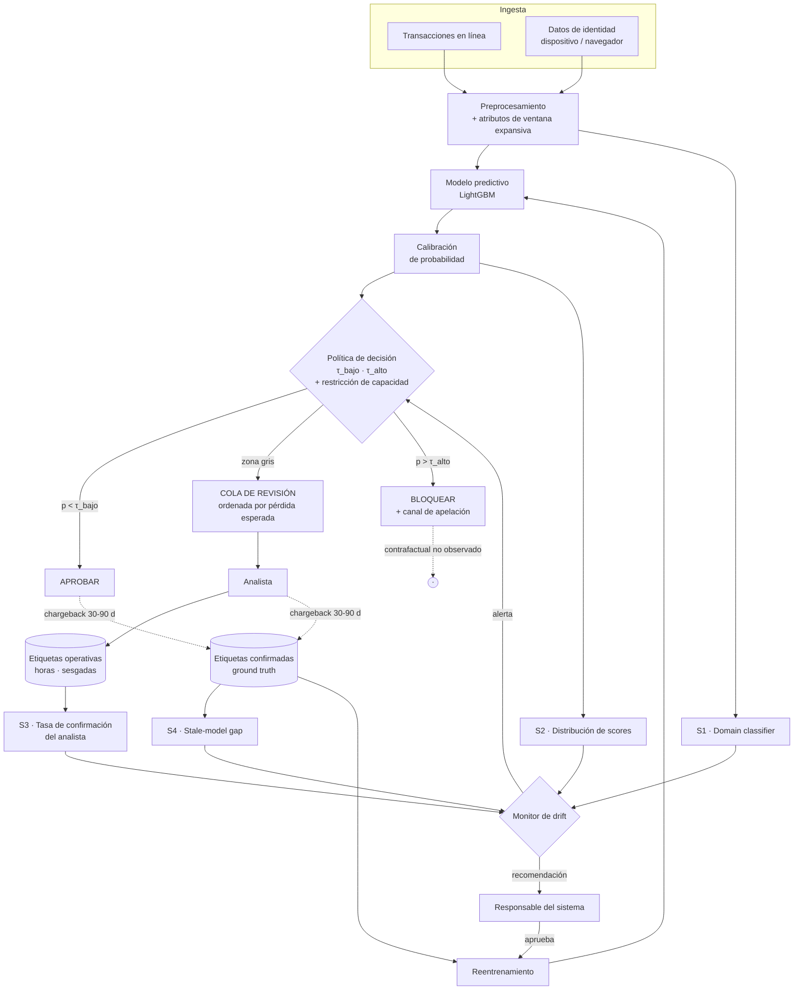

# Sistema adaptativo de decisión para detección de fraude transaccional bajo *concept drift*

**Curso:** Planificación y Toma de Decisiones en IA — UTEC
**Profesora:** Dra. Aurea Soriano-Vargas
**Entregable:** Propuesta (Etapa 3.1 — definición de objetivos, restricciones, métricas y diseño del sistema)
**Dataset:** IEEE-CIS Fraud Detection

---

## 1. Problema y caso de uso

Un comercio electrónico procesa aproximadamente **3,200 transacciones diarias** con tarjeta. Una fracción reducida es fraudulenta, pero cada fraude no detectado genera una pérdida directa por *chargeback*, y cada transacción legítima bloqueada por error genera fricción, costo de atención y riesgo de abandono del cliente.

El problema **no es predecir fraude**: es **decidir qué hacer con cada transacción** bajo tres condiciones que hacen que un clasificador entrenado una sola vez sea insuficiente.

1. **Los patrones de fraude evolucionan de forma adversarial.** El defraudador observa qué pasa y adapta su comportamiento. La relación entre las características de una transacción y su condición de fraude —P(y|X)— se mueve en el tiempo.
2. **La capacidad de revisión manual es finita.** No se puede enviar a un analista todo lo que el modelo considera sospechoso.
3. **Las etiquetas llegan con retraso.** Un fraude se confirma cuando el titular desconoce el cargo. Las principales redes de tarjetas (Visa, Mastercard, American Express, Discover) otorgan al titular **hasta 120 días** desde la fecha de la transacción para iniciar una disputa en la mayoría de los códigos de motivo, con extensiones en casos particulares. El sistema no puede saber hoy qué tan bien está funcionando hoy.

**Formulación como problema de IA:** clasificación supervisada binaria sobre `isFraud ∈ {0,1}`, cuya salida alimenta una política de decisión de tres acciones —**aprobar / revisar / bloquear**— sujeta a una restricción de capacidad, y cuyo desempeño se monitorea en el tiempo para disparar readaptación.

---

## 2. Justificación del dataset

La consigna exige justificar la elección en función del tipo de *concept drift* esperado. El equipo realizó un **benchmark propio y reproducible** comparando los tres datasets candidatos antes de decidir.

### 2.1 Metodología del benchmark

Se separaron dos fenómenos que suelen confundirse:

| Fenómeno | Definición | Medición |
|---|---|---|
| **Covariate drift** | Cambia P(X) | *Domain classifier*: ROC-AUC de un modelo que predice de qué ventana temporal proviene una fila, usando solo X. 0.5 = sin cambio; 1.0 = ventanas totalmente separables. |
| **Concept drift** | Cambia P(y\|X) | *Stale-model gap*: se entrena `f_early` en la ventana 0 y `f_current` en la ventana *k*, y **ambos se evalúan sobre la misma partición retenida de la ventana k**. La diferencia de PR-AUC estima cuánto se movió la regla X→y. |

Se usaron 5 ventanas cronológicas de igual cantidad, PR-AUC como métrica base (robusta al desbalance), corrección por *importance weighting* para descontar el efecto covariable, y una validación previa sobre datos sintéticos con drift inyectado conocido.

### 2.2 Resultados

| Dataset | Eje temporal | Covariate AUC | Degradación relativa (corregida) | Confianza |
|---|---|---|---|---|
| **IEEE-CIS Fraud** | Real, ~182 días | 0.78 → 0.95 | **~19 %** | Media |
| Jigsaw Civil Comments | Real, ~2016–17 | ~0.68 (plano) | ~6 % | Media |
| Diabetes 130-US | **Inexistente** | — | No evaluable | Baja |

**Hallazgo relevante sobre Diabetes 130-US:** el dataset **no contiene ningún campo de fecha por registro**. Ninguna de sus 50 columnas parsea como fecha. El único identificador por fila, `encounter_id`, no es monótono en el orden del archivo ni está documentado como índice cronológico. Un análisis temporal sobre ese dataset sería un supuesto no verificable, por lo que se descartó.

### 2.3 Alcance y limitaciones del hallazgo

Estos resultados constituyen **evidencia consistente con concept drift**, no una demostración formal de que P(y|X) cambió. El *stale-model gap* también puede recibir contribuciones de varianza de entrenamiento, tamaño finito de muestra y diferencias de soporte entre ventanas.

Dos limitaciones se declaran explícitamente:

- **Tratamiento pendiente de las variables tipo timedelta.** La documentación publicada por el proveedor del dataset (Vesta) describe `D1`–`D15` como variables de tipo *timedelta*, por ejemplo días transcurridos desde una transacción previa. El **significado individual de cada columna permanece enmascarado**, pero su naturaleza temporal como grupo está documentada. Ello implica que su rango puede desplazarse de forma mecánica junto con `TransactionDT`. En la corrida actual entraron sin normalizar, por lo que parte del *covariate AUC* creciente (0.78 → 0.95) podría deberse a este acoplamiento y no a un cambio de comportamiento. Antes de la etapa de modelado se re-ejecutará el benchmark en tres configuraciones —con `D*` crudas, normalizadas (`D − día_de_transacción`) y excluidas— para aislar la señal genuina.
- **Ausencia de intervalos de confianza.** El benchmark corrió con una sola semilla. Con ~9,000 filas por evaluación y una tasa base de ~3.7 %, cada partición contiene alrededor de 330 positivos. El promedio de degradación es robusto, pero la variación entre ventanas individuales no es distinguible del ruido. Se repetirá con 5 semillas reportando media ± desviación.

**Conclusión de selección:** IEEE-CIS presenta la señal de drift más fuerte y con un eje temporal real, está explícitamente permitido por la consigna, y su estructura de costos asimétricos permite construir un módulo de decisión no trivial. Su debilidad —columnas anonimizadas, que impiden *nombrar* semánticamente el drift— es un caveat documentado, no un impedimento.

---

## 3. Objetivos del sistema

| # | Objetivo | Criterio de éxito |
|---|---|---|
| O1 | Reducir la pérdida económica por fraude no detectado | Costo total esperado menor que el de la política actual y que el de un modelo estático |
| O2 | Mantener el desempeño de detección a lo largo del tiempo | La caída de PR-AUC del sistema adaptativo frente a un modelo reentrenado idealmente no supera un umbral definido en la etapa de modelado |
| O3 | Operar dentro de la capacidad real de revisión manual | La cola de revisión nunca excede la capacidad diaria declarada |
| O4 | Detectar degradación **antes** de que lleguen las etiquetas | Las señales no supervisadas anticipan la caída confirmada de desempeño |
| O5 | No trasladar el costo del error de forma desigual entre segmentos de clientes | La tasa de falsos positivos por segmento no se desvía más allá de una tolerancia definida |

---

## 4. Restricciones

### 4.1 De datos

- Etiquetas disponibles únicamente en la partición de entrenamiento del dataset; la evaluación se construye mediante particiones temporales propias.
- Features mayoritariamente anonimizadas (`V*`, `C*`, `D*`), lo que impide explicaciones semánticas.
- Ventana temporal total de ~182 días: limita el análisis de estacionalidad anual.
- Presencia extendida de valores faltantes, con columnas que superan el 90 % de ausencia.

### 4.2 Operativas

- **Latencia:** la decisión debe emitirse en línea, durante la autorización de la transacción.
- **Retraso de etiqueta:** la ventana regulatoria de disputa es de **hasta 120 días** desde la transacción (estándar de las principales redes de tarjetas). Para el diseño se **simulan** retrasos de 30, 60 y 90 días, con 120 días como escenario límite. Ninguna estrategia de adaptación puede asumir retroalimentación inmediata.
- **Capacidad de revisión manual finita:** cota dura, no un parámetro ajustable por el modelo.
- **Sesgo de selección en las etiquetas (*selective labels*):** las transacciones bloqueadas tienden a no revelar contrafactualmente si habrían resultado fraudulentas. El sistema no observa el resultado de sus propias intervenciones más restrictivas, por lo que aprender de sus decisiones pasadas sin corrección refuerza sus propios errores.

### 4.3 De recursos

- Entrenamiento y validación sobre infraestructura académica (Colab Pro / clúster Khipu).
- El cuello de botella es memoria y CPU, no GPU: el volumen de columnas y las validaciones temporales repetidas dominan el costo.

### 4.4 Decisiones que el sistema **no** puede tomar

Esta delimitación es parte del diseño, no una omisión:

- No cierra ni suspende cuentas de clientes.
- No reporta a centrales de riesgo ni a listas negras externas.
- No bloquea sin dejar disponible un canal de apelación humana.
- No decide de forma autónoma cuándo reentrenarse: emite una recomendación que un responsable aprueba.
- No emite explicaciones causales al cliente, dado que las variables son anónimas.

---

## 5. Métricas de éxito

### 5.1 Técnicas

| Métrica | Justificación |
|---|---|
| **PR-AUC** | Con una tasa base cercana al 3.5 %, ROC-AUC puede resultar poco informativa: al estar dominado por la clase negativa, admite valores altos aun cuando el desempeño sobre la clase positiva sea operativamente pobre. Se prioriza PR-AUC. |
| **Recall a precisión fija** | Traduce el desempeño a lenguaje operativo: cuánto fraude se captura sin exceder una tasa tolerable de falsas alarmas. |
| **Calibración (Brier / curva de confiabilidad)** | La política de decisión usa probabilidades como insumo; si no están calibradas, los umbrales carecen de sentido. |
| **Latencia de inferencia (p95)** | Restricción operativa medible. |

### 5.2 De decisión

El criterio central del sistema es el **costo esperado total**:

```
Costo = Σ_FN (monto_transacción)
      + Σ_FP (costo_fricción)
      + N_revisiones × (costo_analista)
```

- El término de falsos negativos usa el **monto real por fila** (`TransactionAmt`), no un valor promedio: el error de dejar pasar una transacción grande no equivale al de una pequeña.
- El umbral de decisión se elige **minimizando esta función**, no maximizando F1 ni fijándolo en 0.5. Se reportará la curva de costo total frente al umbral como evidencia de que el óptimo económico difiere del óptimo estadístico.
- Métrica complementaria: **pérdida evitada por analista-hora**, que mide el retorno de la capacidad de revisión.

### 5.3 Sociales

**Limitación previa, declarada explícitamente:** IEEE-CIS no contiene atributos protegidos (edad, género, origen, ingreso). Las columnas geográficas `addr1`/`addr2` están anonimizadas. Por lo tanto **no es posible realizar un análisis de equidad en el sentido estricto de atributos protegidos**. Lo que sí es medible y se reporta es la **disparidad operativa entre segmentos observables**: si el costo del error se concentra en algún grupo identificable de transacciones.

| Métrica | Qué mide |
|---|---|
| Tasa de falsos positivos por **rango de monto** | Si el sistema bloquea desproporcionadamente transacciones pequeñas. Esta es una disparidad operativa directa, no un proxy: el efecto sobre el cliente de bajo ticket es observable en los datos. |
| Tasa de falsos positivos por **segmentos observables** (dominio de correo, tipo de dispositivo, código de dirección) | Detecta concentración del error en poblaciones identificables. Se reporta como disparidad entre segmentos, **sin atribuirles significado socioeconómico**, que el dataset no permite verificar. |
| **Cobertura de decisión automática** | Fracción de transacciones resueltas sin intervención humana; indicador de carga operativa y de exposición al error automatizado. |
| **Tasa de bloqueo sin apelación resuelta** | Riesgo residual sobre el cliente legítimo afectado. **No calculable con IEEE-CIS**, que no registra apelaciones: se define como métrica del despliegue real, no del experimento. |

La imposibilidad de auditar equidad por atributos protegidos se traslada al informe como riesgo del despliegue: un sistema que no puede medir su impacto diferencial sobre poblaciones protegidas no debería operar con plena autonomía.

---

## 6. Diseño del sistema

### 6.1 Adquisición e integración de datos

Se integran dos fuentes heterogéneas del dataset, unidas por `TransactionID`:

- **Transaccional** (`train_transaction`): monto, producto, tarjeta, dirección, distancias, variables de conteo (`C*`), temporales (`D*`) y anonimizadas (`V*`).
- **Identidad** (`train_identity`): dispositivo, sistema operativo, navegador, resolución de pantalla — datos semiestructurados provenientes de una fuente distinta y con cobertura parcial.

Ambas son **fuente de tipo 2** (datos secundarios: recolectados para operación y reutilizados para modelado). La cobertura parcial de la tabla de identidad es en sí misma informativa y se tratará como señal, no solo como ausencia.

**Sobre el requisito de fuentes multimodales.** La consigna solicita considerar la adquisición desde fuentes multimodales. IEEE-CIS ofrece **integración multi-fuente** —dos tablas de origen y semántica distintos, con cobertura desigual y unidas por clave— pero **no multimodalidad en sentido estricto**: ambas son tabulares, sin texto libre, imagen ni audio. Se declara esta limitación en lugar de presentar la integración de dos tablas como multimodalidad. En el diseño del sistema desplegado se identifican las modalidades que un entorno productivo real sí incorporaría —descripciones de producto, historial de comunicación con el cliente, señales de comportamiento en sesión— y se especifica el punto de la arquitectura donde se integrarían, como extensión documentada y no como implementación.

**Atributos derivados con dimensión temporal:** agregaciones por ventana móvil sobre tarjeta y dispositivo (frecuencia, monto acumulado, tiempo desde la transacción anterior), calculadas siempre con **ventana expansiva hacia atrás**. Ningún atributo puede usar información posterior al instante de la transacción que describe.

### 6.2 Módulo predictivo

Escalera de modelos, con la comparación exigida por la consigna:

| Rol | Modelo | Justificación |
|---|---|---|
| Tradicional 1 | Regresión logística | Baseline interpretable, entrega probabilidades naturalmente calibrables, referencia lineal. |
| Tradicional 2 | Random Forest | Contraste no lineal, sin supuestos de linealidad, permite análisis de importancia de variables. |
| Avanzado | LightGBM | Maneja valores faltantes de forma nativa —crítico dada la estructura de ausencias—, es eficiente en CPU y es el estándar del dominio. |

### 6.3 Manejo de incertidumbre

- **Calibración de probabilidades** (Platt o isotónica) ajustada sobre la ventana de validación temporal, nunca sobre el conjunto de prueba.
- **Zona de abstención:** el intervalo entre los umbrales `τ_bajo` y `τ_alto` no se resuelve automáticamente, sino que se deriva a revisión humana. La incertidumbre se convierte en una acción, no en un número reportado.
- **Ampliación adaptativa de la zona gris:** cuando el monitor de drift se activa, la banda de abstención se ensancha. Ante evidencia de que el modelo puede estar desactualizado, el sistema traslada más decisiones al humano en lugar de sostener su confianza previa.

### 6.4 Módulo de toma de decisiones

La predicción entrega una probabilidad; la decisión requiere además costos y capacidad.

```
Si  p < τ_bajo                        → APROBAR
Si  p > τ_alto                        → BLOQUEAR
Si  τ_bajo ≤ p ≤ τ_alto               → COLA DE REVISIÓN
```

Cuando la cola excede la capacidad diaria, los casos **se ordenan por pérdida esperada** (`p × monto`) y no por probabilidad. Una transacción con 60 % de probabilidad y monto alto se revisa antes que una con 85 % y monto bajo. El excedente que no alcanza a revisarse se resuelve con la acción de menor costo esperado, decisión que queda registrada y auditada.

Los umbrales `τ_bajo` y `τ_alto` no son hiperparámetros arbitrarios: se derivan de minimizar la función de costo de §5.2 sujeta a la restricción de capacidad.

### 6.5 Componente de acción

| Acción | Efecto |
|---|---|
| Aprobar | La transacción procede sin fricción. Su etiqueta confirmada llega, si corresponde, vía disputa posterior. |
| Revisar | Ingresa a la cola priorizada. Genera un **veredicto operativo del analista** en horas, que **no equivale al ground truth**: es el juicio de un humano con información parcial. La etiqueta confirmada llega igualmente por la vía lenta. |
| Bloquear | Se rechaza y se notifica al cliente con canal de apelación. La transacción bloqueada **no revela contrafactualmente** si habría resultado fraudulenta, salvo que la apelación o una verificación posterior lo esclarezcan. |
| Alertar | Si el monitor de drift supera su umbral, se notifica al responsable del sistema con la recomendación de reentrenamiento. |

**Dos velocidades de retroalimentación.** El sistema produce dos tipos de etiqueta que no deben confundirse:

- **Etiqueta operativa** (horas): veredicto del analista sobre los casos revisados. Rápida, pero disponible solo sobre la zona gris —una muestra sesgada por selección— y sujeta al criterio humano.
- **Etiqueta confirmada**: resultado de disputa o *chargeback*. Es el objetivo real de aprendizaje. En el experimento queda disponible según el retraso *L* simulado, con *L* = 30 días en el escenario principal.

**Advertencia de diseño:** reentrenar únicamente con etiquetas operativas haría que el modelo aprenda a imitar al analista en lugar de a detectar fraude, degradándose hacia el comportamiento humano que pretende asistir. La etiqueta operativa se usa para **monitoreo rápido**; la confirmada, para **reentrenamiento**.

### 6.6 Mecanismo de monitoreo y adaptación

Este es el componente que responde a la restricción de retraso de etiqueta. **No se puede monitorear F1 en producción**, porque el desempeño confirmado de hoy solo se conoce en dos meses. El monitoreo opera por ello en cuatro señales de latencia y confiabilidad crecientes:

| Señal | Etiquetas | Latencia | Qué detecta | Sesgo |
|---|---|---|---|---|
| **S1 — Domain classifier** | No | Diaria | Cambio en P(X): las transacciones actuales son separables de la ventana de referencia. | No afectada por *selective labels*; sí por estacionalidad y cambios de pipeline |
| **S2 — Distribución de scores** | No | Diaria | Desplazamiento en la salida del modelo, indicio de cambio aguas arriba. | Igual que S1 |
| **S3 — Tasa de confirmación del analista** | Operativas | Horas | Caída en la proporción de casos de la cola que el analista confirma como sospechosos. | **Alto**: solo cubre la zona gris |
| **S4 — Stale-model gap** | Confirmadas | 30–90 días (hasta 120) | Confirmación de cambio en P(y\|X). | Bajo, pero excluye bloqueos |

S1 y S2 no requieren etiquetas y por tanto no las afecta el sesgo de *selective labels*, pero son indirectas y **no son neutrales en otros sentidos**: pueden activarse por estacionalidad, cambios en el pipeline de datos o variaciones legítimas del comportamiento de usuarios. Detectan que algo cambió, no que el modelo empeoró. S3 es rápida y supervisada pero mide únicamente la franja de decisiones ambiguas. S4 es la señal supervisada de mayor fidelidad respecto al desempeño predictivo —no perfecta, ya que excluye el contrafactual de los bloqueos— y llega tarde. **Ninguna señal basta por sí sola; la política de adaptación las combina según su latencia.**

El *domain classifier* del benchmark de selección se reutiliza aquí como componente operativo del sistema desplegado.

**Política de adaptación escalonada:**

| Condición | Acción |
|---|---|
| S1 o S2 activadas | Ampliar la zona de abstención y emitir alerta. Respuesta conservadora: ante duda, más decisiones al humano. |
| S1/S2 activadas **y** S3 en caída | Elevar la alerta a recomendación de reentrenamiento anticipado, señalando que se actúa sobre evidencia parcial. |
| S4 confirma degradación | Reentrenamiento aprobado por el responsable, con etiquetas confirmadas. |

Estrategias a comparar en la etapa de modelado: reentrenamiento periódico por lotes frente a un modelo incrementalmente adaptativo.

---

## 7. Arquitectura



**Elementos que el diagrama hace explícitos:** las dos velocidades de retroalimentación (etiqueta operativa en horas, etiqueta confirmada en meses), el hecho de que el reentrenamiento se alimenta solo de etiquetas confirmadas, el contrafactual no observado de las transacciones bloqueadas, la separación entre señales supervisadas y no supervisadas, y la presencia de un responsable humano entre la recomendación y el reentrenamiento.

---

## 8. Protocolo de evaluación temporal con retraso de etiqueta

### 8.1 Principio

El retraso de etiqueta **no interrumpe la observación de transacciones**. En producción las transacciones siguen llegando; lo que falta es su `y`. Un protocolo que descartara periodos completos eliminaría precisamente el tramo donde ocurre el fenómeno de interés.

La formulación correcta separa dos horizontes en cada instante *t*:

```
Observable  (X):        día 0 ─────────────────────────── t
Etiquetado  (X, y):     día 0 ──────────── t − L
Zona ciega  (X sin y):                     t − L ──────── t
```

Donde **L** es el retraso de etiqueta simulado. La zona ciega es el insumo de las señales no supervisadas S1 y S2: el sistema puede detectar que la distribución cambió, sin poder confirmar todavía si su desempeño cayó. Esa asimetría es la tesis del proyecto y ahora el protocolo la reproduce.

**Nota sobre la simulación:** IEEE-CIS tiene sus etiquetas completas. El retraso se **impone artificialmente** ocultando las etiquetas posteriores a *t − L*; no es una carencia del dataset.

### 8.2 Diseño *point-in-time correct*

El protocolo se construye de modo que **ninguna decisión —incluidos hiperparámetros, calibración y umbrales— use información que no estuviera disponible en el instante simulado**.

```
DESARROLLO OFFLINE       0 ──────────── 89
                         Ajuste, calibración y política fijados aquí.
                         ~292,000 transacciones · ~10,200 positivos

ARRANQUE                 90 ─────────── 119
                         X observable; etiquetas aún no maduras.
                         Alimenta S1 y S2 antes del primer bloque.

BACKTEST                 120 ─────────────────────── 181
                         Cuatro bloques de ~15 días.
                         ~201,000 transacciones · ~7,000 positivos
                         (~1,760 por bloque)
```

En cada instante *T* del backtest:

| Recurso | Disponible |
|---|---|
| Observaciones X | días 0 … *T* |
| Etiquetas y | días 0 … *T − L* |
| Datos de entrenamiento | solo el tramo etiquetado |
| Evaluación | bloque *T* … *T + Δ* |

**Por qué el desarrollo termina en el día 89.** El primer bloque del backtest inicia en *T* = 120. Con el escenario principal *L* = 30, en ese instante solo son legítimas las etiquetas hasta el día 90. Si el desarrollo hubiera usado etiquetas de los días 90–119 —como en una versión anterior de este protocolo— los umbrales y la calibración habrían incorporado información que el sistema simulado todavía no debería conocer. El corte en 89 elimina esa fuga.

**Política congelada.** Los hiperparámetros y la política de decisión se fijan **una sola vez** en la fase de desarrollo y no se re-ajustan por escenario. Esto replica la operación real —no se re-sintoniza el sistema cada vez que la retroalimentación se vuelve más lenta— y aísla la variable de interés: lo único que cambia entre escenarios es la **frescura de los datos de entrenamiento**, no la política.

*Limitación declarada:* la corrección temporal es exacta para *L* = 30. Para *L* ≥ 60 la política congelada se fijó con etiquetas hasta el día 89, que en *T* = 120 no estarían disponibles bajo ese retraso. Re-ajustar la política por cada valor de *L* dejaría ventanas de desarrollo inviables (para *L* = 90, apenas 30 días). Se opta por congelar la política y documentar la simplificación.

### 8.3 Análisis de sensibilidad al retraso

**Alcance:** el único escenario que se presenta como simulación temporal estricta es *L* = 30, que es *point-in-time correct*. Los valores de 60, 90 y 120 días constituyen un **análisis de sensibilidad**, no simulaciones completas de producción, dado que la política permanece congelada. Esta distinción se mantiene en todo el reporte de resultados.

El retraso se trata como **variable experimental**, no como constante, lo que convierte una restricción operativa en una pregunta de investigación:

> ¿Cuánto se degrada la capacidad de adaptación del sistema conforme aumenta el retraso de la retroalimentación?

| L (días) | Etiquetas disponibles en *T* = 120 | Etiquetas disponibles en *T* = 181 | Rol |
|---|---|---|---|
| **30** | hasta día 90 | hasta día 151 | **Escenario principal — *point-in-time correct*** |
| 60 | hasta día 60 | hasta día 121 | Sensibilidad |
| 90 | hasta día 30 | hasta día 91 | Sensibilidad |
| 120 | hasta día 0 — inviable | hasta día 61 | Sensibilidad; cota regulatoria, no evaluable en bloques tempranos |

Con un rango total de ~182 días, un retraso de 120 días dejaría al último bloque entrenando únicamente con los primeros 61 días. Se reporta como cota superior regulatoria, no como escenario operativo.

### 8.4 Disponibilidad de etiqueta

La etiqueta de una transacción se considera disponible cuando alcanza la antigüedad *L*:

```
available(y_i, t) = 1  si  t − t_i ≥ L
                    0  si  t − t_i <  L
```

*L* cumple así una doble función: representa tanto el retraso de reporte como el **horizonte de madurez** de la etiqueta. No se introduce un parámetro adicional de madurez, porque IEEE-CIS registra únicamente el `isFraud` final —sin fecha de disputa— y modelar un proceso de reporte que el dataset no contiene añadiría una variable artificial sin sustento empírico.

En un despliegue real la madurez sería un proceso gradual, no un umbral: durante el periodo de disputa una transacción fraudulenta aún no reportada aparece transitoriamente como legítima. Esa consideración se traslada al diseño de despliegue como caveat, no al protocolo experimental.

### 8.5 Regla no negociable

Todo atributo agregado se calcula con ventana expansiva hacia atrás. Cualquier codificación por frecuencia o estadístico calculado sobre el dataset completo constituye fuga temporal. Los cortes se verificarán contra el conteo real de transacciones por día antes de fijarse.

---

## 9. Trazabilidad de datos, fuentes y supuestos

Cada cifra utilizada en la propuesta se clasifica en una de tres categorías, según su origen.

### 9.1 Derivado del dataset

| Valor | Origen |
|---|---|
| 590,540 transacciones; rango temporal de ~182 días | Conteo directo y `TransactionDT` |
| ~3,245 transacciones/día | Cociente de los dos valores anteriores |
| Tasa base de fraude ~3.5 % | Proporción de `isFraud = 1` |
| Monto por transacción | Columna `TransactionAmt`, usada por fila |
| Naturaleza *timedelta* de `D1`–`D15` | Documentación publicada por el proveedor del dataset |

### 9.2 Fuente externa al dataset

| Valor | Origen |
|---|---|
| Ventana regulatoria de disputa: hasta 120 días desde la transacción para la mayoría de códigos de motivo, con extensiones en casos particulares | Reglas de disputa de Visa, Mastercard, American Express y Discover |

Esta cifra **no proviene de IEEE-CIS**. Es información del dominio de pagos y se cita como tal.

### 9.3 Supuesto del equipo

| Supuesto | Valor | Fundamento |
|---|---|---|
| Capacidad de revisión manual | 150 casos/día (~4.6 % del volumen) | 2 analistas × 8 h × ~10 casos/hora |
| Retraso de etiqueta experimental | L ∈ {30, 60, 90, 120} días; principal L = 30 | Barrido de sensibilidad acotado por la ventana regulatoria |
| Costo de fricción por falso positivo | Por definir | Atención al cliente más probabilidad de abandono |
| Costo de revisión manual por caso | Por definir | Costo laboral por analista-hora |

Los costos monetarios se fijarán antes de la etapa de modelado. El análisis incluirá **sensibilidad del umbral óptimo frente a estos parámetros**, de modo que las conclusiones no dependan de un valor puntual asumido.

---

## 10. Riesgos abiertos y próximos pasos

| Riesgo | Mitigación | Etapa |
|---|---|---|
| Parte del drift medido podría ser artefacto de las variables `D*` | Re-ejecución del benchmark en tres configuraciones de features | Previo a modelado |
| Ausencia de intervalos de confianza en el benchmark | Repetición con 5 semillas, reporte de media ± desviación | Previo a modelado |
| Fuga temporal en atributos agregados | Revisión cruzada del código de generación de atributos | Análisis de datos |
| Sesgo de selección: los bloqueos no revelan su contrafactual | Reserva de una fracción aleatoria de casos de alto riesgo que se derivan a revisión en lugar de bloquearse, generando etiquetas no sesgadas | Diseño de despliegue |
| Deriva del modelo hacia el criterio del analista | Separación estricta: etiquetas operativas solo para monitoreo, etiquetas confirmadas para reentrenamiento | Diseño de despliegue |
| Imposibilidad de auditar equidad por atributos protegidos | Declaración explícita de la limitación y restricción del nivel de autonomía del sistema | Despliegue |
| Retrasos de etiqueta altos dejan poca historia etiquetada en un rango de solo 182 días | L = 30 como escenario principal; L ≥ 90 reportado como estrés, no como operación | Evaluación |
| En despliegue real, etiquetas inmaduras cerca del corte aparecerían como negativos | Documentado como caveat de despliegue; en el experimento se resuelve con el umbral único *L* | Despliegue |
| Política congelada en desarrollo no es *point-in-time* exacta para L ≥ 60 | Esos escenarios se reportan como análisis de sensibilidad, no como simulación de producción | Evaluación |
| Costos monetarios asumidos sin fuente | Análisis de sensibilidad del umbral | Modelado |

**Próximos pasos inmediatos:** cierre de los parámetros de costo, verificación de las variables `D*`, y ejecución del análisis exploratorio con enfoque en la evolución temporal de las distribuciones.
