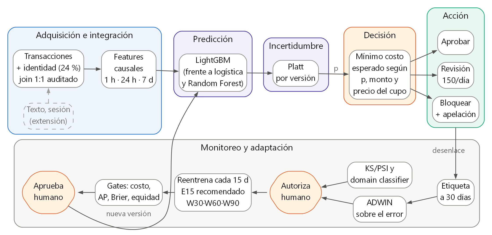

# Sistema adaptativo de decisión ante fraude transaccional

Curso: Planificación y Toma de Decisiones en IA, UTEC.  
Dataset: IEEE-CIS Fraud Detection, partición `train`, 590 540 transacciones en 182 días.  
Parámetros: semilla 42, retraso de etiqueta L = 30 días, reentrenamiento cada 15 días.

Resumen. El sistema decide para cada transacción entre aprobar, enviar a revisión o
bloquear, con una política de costo esperado sujeta a un cupo de 150 revisiones
diarias. Frente a aprobar todo, reduce el costo de 5,40 a 1,98 UM por transacción.
Sobre IEEE-CIS la distribución de entrada se mantiene estable (AUC de 0,551 en el
domain classifier), mientras que la relación entre features y fraude cambia con el
tiempo: con el volumen de entrenamiento fijo en 46 días, retrasar 30 días el corte
de los datos encarece 0,106 UM/tx, y es la única comparación que resiste 18
combinaciones de semilla y bloque. Ese efecto es menor que el costo de entrenar con
menos datos. Por eso la estrategia más barata es el reentrenamiento periódico sobre
todo el histórico (E15), y ninguna de las tres ventanas deslizantes evaluadas supera
de forma estable al modelo estático.

---

## 1. Problema, objetivos, restricciones y métricas

### Caso de uso

Un comercio electrónico procesa del orden de 3 200 transacciones diarias con tarjeta.
Un fraude no detectado cuesta el monto de la transacción; bloquear a un cliente
legítimo genera fricción y costo de atención. El problema se formula como
clasificación binaria sobre `isFraud`, cuya probabilidad alimenta una decisión de
tres acciones, y el desempeño se vigila en el tiempo para decidir cuándo readaptar
el modelo.

### Objetivos y resultado obtenido

| Obj. | Enunciado | Criterio | Resultado |
|---|---|---|---|
| O1 | Menor pérdida que la política actual y que el modelo estático | Costo inferior a 5,40 (aprobar todo) y a 2,09 UM/tx (S0) | 1,98 UM/tx con E15. Frente a S0 la ventaja es de 5,2 % y su intervalo incluye el cero |
| O2 | Sostener la detección en el tiempo | Una caída de AP superior al 10 % genera alerta | El AP de S0 pasa de 0,526 en B1 a 0,514 en B4. La baja de B2 afecta por igual a todas las estrategias |
| O3 | Operar dentro de la capacidad de revisión | Como máximo 150 casos diarios | Se cumple los 62 días del test |
| O4 | Señales sin etiqueta que anticipen la degradación | Retraso de cada señal frente al error confirmado | KS/PSI y domain classifier no registran cambio en P(X). ADWIN confirma deriva del error 30 días después del evento |
| O5 | No concentrar el error en un segmento | Una brecha superior a 2 pp en bloqueo de legítimas genera alerta | En validación la brecha máxima es 0,70 pp. En test, con W60, 2 de 14 segmentos con soporte superan el umbral (DeviceType desktop y mobile, 2,1 y 2,2 pp) |

### Restricciones

De datos: solo la partición `train` tiene etiqueta, las features `V*`, `C*` y `D*`
están anonimizadas, el periodo cubre 182 días y hay columnas con más de 90 % de
faltantes. Operativas: la decisión se emite durante la autorización; la etiqueta
confirmada llega 30 días después del evento, supuesto de simulación dentro del
plazo de disputa de las redes de tarjetas; el cupo de 150 revisiones es un límite
duro; y una transacción bloqueada no revela su desenlace (selective labels). De
recursos: 480 minutos de cómputo acumulado y 4 hilos.

El sistema tiene vedadas cinco decisiones: cerrar o suspender cuentas, reportar a
centrales de riesgo, bloquear sin canal de apelación, reentrenarse o promover una
versión sin autorización humana, y dar explicaciones causales al cliente a partir de
variables anónimas.

### Métricas

Técnicas: Average Precision (AP) y su skill sobre la prevalencia, F1 y balanced
accuracy en el umbral de FPR 1 % fijado en validación, recall a FPR máximo de 1 %,
recall a precisión mínima de 80 %, Brier, ECE y latencia p50, p95 y p99. Se prioriza
AP porque con 3,5 % de positivos el ROC-AUC queda dominado por la clase negativa.

De decisión: costo observado simulado por transacción, monto de fraude evitado,
revisiones diarias y demanda que excede el cupo.

Sociales: tasa de bloqueo de clientes legítimos, que incluye los bloqueos erróneos
del analista, disparidad de esa tasa por segmento con intervalo y soporte mínimo, y
cobertura automática.

---

## 2. Diseño del sistema

{: style="max-height:104mm"}

*Figura 1. Componentes e interacciones. La fila superior es el flujo de cada
transacción; la inferior, el ciclo de retroalimentación. Fuente: `docs/arquitectura.dot`.*

### Componentes

La adquisición integra transacciones e identidad con un left join uno a uno sobre
`TransactionID`, validado por la invariancia del número de filas. Ambas fuentes son
tabulares, de modo que el sistema implementa integración de varias fuentes; texto de
producto y señales de sesión figuran en el diagrama como extensión. El módulo
predictivo compara regresión logística, Random Forest y LightGBM con el
preprocesamiento ajustado dentro de cada fit. La incertidumbre se trata con una
calibración de Platt propia de cada versión y con intervalos por bootstrap de bloques
de 7 días. La decisión elige la acción de menor costo esperado y la acción se ejecuta
mediante un servicio HTTP y un replay que reserva el cupo.

### Decisión por costo esperado

Para una probabilidad calibrada `p` y un monto `m`:

```
E[aprobar]  = p * m
E[bloquear] = (1 - p) * c_FP
E[revisar]  = c_R + p * (1 - r_H) * m + (1 - p) * f_H * c_FP
```

con `c_R = 1 UM`, `r_H = 0,90` y `f_H = 0,02`. La unidad es la de `TransactionAmt`.
La transacción va a revisión cuando `min(E[aprobar], E[bloquear]) − E[revisar] > λ`;
en otro caso recibe la más barata entre aprobar y bloquear. El punto de indiferencia
entre aprobar y bloquear es `p* = c_FP / (m + c_FP)`, que depende del monto. Sobre la
reserva de desarrollo, la mejor regla de dos umbrales fijos sobre `p` cuesta
1,9696 UM/tx y la regla económica 1,5895, aun eligiendo los umbrales sobre esa misma
reserva.

Los dos parámetros se derivan de cantidades observables. El costo de un falso
positivo `c_FP` se fija como el menor valor que mantiene el bloqueo de legítimas bajo
el 1 % declarado: resulta 25 UM, con 0,89 %. `λ` es el precio sombra del cupo, el
menor valor que ajusta la demanda diaria a 150 plazas, y resulta 7,86 UM. Ninguna de
las dos calibraciones usa el costo observado, se ajustan alternando hasta
estabilizarse en tres pasadas y quedan selladas en el prerregistro.

### Calibración, cola y supervisión

La aritmética anterior exige que `p` sea una probabilidad. La regresión logística con
`class_weight=balanced` alcanza un ECE de 0,285; Platt lo reduce a 0,0044.

El cupo se reserva al admitir cada caso, de forma irrevocable y por `event_id`, sin
ordenar el día completo por `p × monto`, porque eso exigiría conocer transacciones
futuras. Agotado el cupo, el caso recibe la acción automática más barata. Una alerta
de drift genera una recomendación; el reentrenamiento y la promoción requieren
autorización humana registrada aunque todos los gates técnicos pasen. Sin una
versión válida el servicio responde 503 y la operación se pausa.

---

## 3. Datos: integración, exploración y atributos temporales


*Figura 2. Prevalencia semanal con intervalo de Wilson, volumen, faltantes por familia
de columnas y cobertura de identidad.*

| Comprobación | Resultado |
|---|---|
| Transacciones | 590 540 filas, 394 columnas |
| Identidad | 144 233 filas, 41 columnas |
| Filas tras el join | 590 540, invariante; 0 identificadores huérfanos |
| Cobertura de identidad | 24,4 %, preservada como `has_identity` |
| Prevalencia | 3,50 % global (20 663 fraudes), entre 2,1 % y 5,1 % por semana |
| Días sin datos o de volumen anómalo | ninguno en 182 días |

### Relojes y cambios en la distribución

`TransactionDT` es un desfase en segundos desde un origen desconocido. De él se
derivan `dia`, `semana` y una `hora` relativa, usada solo como ciclo de 24 horas. El
reloj de evento determina qué features son visibles; el de disponibilidad,
`available_at = dia + 30`, determina cuándo una etiqueta puede entrar a un ajuste, a
una métrica o a ADWIN.

La prevalencia semanal varía entre 2,1 % y 5,1 %, mientras la distribución de las
covariables permanece estable. Un domain classifier que distingue los primeros 60
días de la última semana antes de cada actualización obtiene un AUC de 0,551, con
umbral de alerta en 0,75. La validación adversarial columna a columna coincide: de las
425 columnas del panel, la mediana es 0,505 y la columna original más alta, `C9`,
llega a 0,600.

El avance había reportado un AUC de 0,78 a 0,95 en el benchmark que seleccionó el
dataset. Las dos cifras miden cosas distintas. El benchmark comparaba la primera
quinta parte del periodo con cada una de las siguientes usando todas las columnas,
entre ellas `D1`–`D15` sin normalizar, que miden días transcurridos y pueden separar
periodos sin que cambie el comportamiento; la propuesta ya lo señalaba como riesgo.
El monitor usa un panel acotado, ajusta el preprocesamiento solo en su tramo de
entrenamiento y excluye las variables que crecen con el calendario.

### Features causales

Se construyen tres proxies de entidad y, para cada uno, conteos y montos en ventanas
de 1 hora, 24 horas y 7 días, el rezago del monto y el tiempo desde el evento previo.

| Proxy | Definición | Entidades | Eventos por entidad | Singletons |
|---|---|---|---|---|
| Emisor | `card1` a `card6` más `addr1` | 43 018 | 13,7 | 40,4 % |
| Cliente | `card1 + addr1 + D1n` | 217 850 | 2,7 | 57,5 % |
| Dispositivo | `DeviceType + DeviceInfo` | 1 943 | 74,2 | 26,0 % |

`D1n`, el día absoluto menos `D1`, aproxima la fecha de alta de la tarjeta y separa
tarjetas del mismo emisor. Con LightGBM entrenado solo sobre features de historial,
la clave de emisor alcanza AP de 0,1668, la de cliente 0,1671 y ambas juntas 0,1829.
Los conteos expansivos acumulan desde el primer evento y crecen con el calendario:
la media de `card_cnt_expansivo` pasa de 138,8 en `[0,60)` a 707,4 en `[150,182)`.
Son las dos únicas columnas del panel con AUC adversarial superior a 0,70 y quedan
fuera del predictor; con ellas dentro, el domain classifier subía a 0,654.

### Controles de fuga

El repositorio incluye 150 pruebas automáticas. Alterar filas futuras no modifica las
medianas ni el vocabulario del preprocesamiento; invertir las etiquetas aún inmaduras
no cambia el predictor; permutar eventos con el mismo timestamp deja las features
idénticas; y los roles de cada versión no comparten ningún `TransactionID`.

---

## 4. Protocolo temporal

Todos los intervalos son semiabiertos y se expresan en días relativos.

```
dia:  0        30   45   60      69   76   83   90        120  135  150  165  182
      |---------|----|----|-------|----|----|----|---------|----|----|----|----|
      [ tuning fold 1 ]
      [ tuning fold 2      ]
      [     fit base / S0          ]
                                   [cal][pol][ H ]
                                                  [warmup X ]
                                                            [ B1][ B2][ B3][ B4 ]
```

En desarrollo hay tres reservas de 7 días: calibración, política y validación. La
política, los umbrales diagnósticos, la familia y la ventana se eligen una sola vez
sobre ellas y quedan congelados. En cada actualización `T` de {120, 135, 150, 165},
con corte `c = T − 30`, cada versión usa tres roles y dos reservas:

| Rol | Intervalo | Días |
|---|---|---|
| Predictor | `[c−W, c−14)` | 16 con W30, 46 con W60, 76 con W90 |
| Calibrador | `[c−14, c−7)` | 7 |
| Validación de promoción | `[c−7, c)` | 7 |

Como la política ya está congelada, reservarle otra ventana en cada actualización
restaba siete días al predictor sin cumplir función; liberarla lleva a W30 de 9 a 16
días de fit. Las reservas son idénticas para todas las estrategias, lo que permite
atribuir una diferencia de costo a la ventana.

### Volumen y frescura

Variar solo el ancho `W` cambia a la vez cuántos días entrena el modelo y cuán
reciente es su información. El diseño añade por eso un bloque que mantiene el volumen
y mueve el corte.

| Bloque | Estrategias | Qué varía | Qué se mantiene |
|---|---|---|---|
| Volumen variable | W30, W60, W90 | días de fit | corte en `c−14` |
| Antigüedad variable | W60, R46_medio, R46_antiguo | punto de corte | 46 días de fit |
| Referencias | S0 estático, E15 expansivo | reentrenamiento y olvido | misma política |

R46_medio usa 46 días que terminan 30 días antes que los de W60. R46_antiguo se
entrena una vez sobre los días 0 a 46 y se usa hasta el día 182.

### Madurez de las etiquetas y orden de construcción

`cutoff = T − L` delimita qué días de evento pueden usarse y `job_time = T` es el
instante contra el que se compara `available_at`. Con T = 120 el último día con
etiqueta confirmada es el 89. El orden es predictor, calibrador y validación: cada
paso consume scores del anterior sobre datos que ese paso no vio. Si un rol no alcanza
200 fraudes y 2 000 legítimas, la versión se marca no válida; el sistema no amplía la
ventana ni usa etiquetas inmaduras para completar el soporte.

### Prerregistro

La familia, los hiperparámetros, la economía calibrada y la ventana se congelan con
datos de desarrollo, y el hash `7d4c9fac0af4d15f` sella esa selección antes de abrir
el test. Si la configuración cambia entre la selección y el test, la corrida se
detiene. El benchmark que seleccionó IEEE-CIS ya había examinado periodos tardíos, de
modo que el trabajo es un backtest retrospectivo.

---

## 5. Modelado y evaluación temporal


*Figura 3. AP, costo y Brier del modelo estático por semana de test, con la tasa base.*

### Elección de modelos

La regresión logística es la referencia lineal y calibrable. Random Forest captura
interacciones mediante bagging y tolera faltantes imputados. LightGBM, el enfoque
avanzado, maneja de forma nativa cientos de columnas dispersas y con faltantes, que
es la estructura de IEEE-CIS. Cada familia se ajusta con tres configuraciones en dos
folds temporales (18 fits de tuning y tres ajustes finales) y se elige por costo.

| Familia | Config | AP | Costo con regla económica | Costo con el mejor umbral fijo | ECE sin calibrar / calibrado |
|---|---|---|---|---|---|
| LightGBM | `lgbm_31` | 0,6214 | 1,5895 | 1,9696 | 0,0037 / 0,0015 |
| Random Forest | `rf_200_20` | 0,5391 | 1,8728 | 2,2746 | 0,1425 / 0,0051 |
| Logística | `lr_c1_bal` | 0,4029 | 2,1910 | 2,8712 | 0,2850 / 0,0044 |

Sobre la misma reserva, aprobar todo cuesta 4,5937 UM/tx y bloquear todo 24,1365.
LightGBM queda congelada como familia adaptativa. La regla económica induce umbrales
distintos por monto:

| Monto | Revisar desde | Bloquear desde |
|---|---|---|
| 25 UM | `p` ≥ 0,4072 | `p` ≥ 0,5791 |
| 59 UM | `p` ≥ 0,1747 | `p` ≥ 0,5143 |
| 250 UM | `p` ≥ 0,0415 | `p` ≥ 0,3159 |

### Comportamiento en el tiempo

El AP del modelo estático pasa de 0,5257 en B1 a 0,5144 en B4 sin una tendencia
monótona. El descenso de B2, hasta 0,3907, aparece en las siete estrategias, incluidas
las que se reentrenan, y corresponde a un periodo más difícil para cualquier modelo.

Los umbrales diagnósticos se fijaron en validación y se aplican sin reajuste. En test,
S0 y R46_antiguo, que no se reentrenan, cumplen ambos objetivos: FPR de 0,93 % y
0,78 %, precisión de 80,1 % y 82,5 %. Las cinco estrategias que se reentrenan aplican
ese mismo umbral a versiones nuevas, exceden levemente el FPR (entre 1,06 % y 1,18 %)
y su precisión queda entre 75,4 % y 78,1 %. En el umbral de FPR 1 %, el F1 va de
0,461 a 0,488 y la balanced accuracy de 0,685 a 0,706.

### Selección de la ventana en desarrollo

| Estrategia | Días de fit | Fraudes en el fit | Costo UM/tx en validación |
|---|---|---|---|
| W60 | 46 | 5 768 | 2,2527 |
| W90 | 76 | 9 169 | 2,2708 |
| W30 | 16 | 2 191 | 2,3501 |

W60 y W90 difieren en 0,80 %, dentro del margen de desempate de 1 % que favorece la
ventana menor, y W30 queda 4,33 % por encima. W60 es la ventana deslizante elegida sin
observar el test. El enunciado incluye el reentrenamiento periódico entre las
estrategias de adaptación; en test, E15 alcanza 1,9840 UM/tx frente a 2,0921 del
estático y 2,1087 de W60, y es la estrategia que el informe recomienda operar, con la
salvedad de robustez de la sección 6.

---

## 6. Detección del drift y adaptación


*Figura 4. Siete estrategias sobre los mismos eventos: AP y costo por semana, demanda
de revisión frente al cupo y alertas por señal.*

| Estrategia | Días de fit | AP | F1 | Costo UM/tx [IC 95 %] | Δ frente a S0 [IC 95 %] | Bloqueo legítimas |
|---|---|---|---|---|---|---|
| E15 (recomendada) | 76 a 121 | 0,4965 | 0,488 | 1,984 [1,821; 2,155] | −0,108 [−0,205; 0,002] | 1,26 % |
| W90 | 76 | 0,4901 | 0,481 | 2,057 [1,909; 2,208] | −0,035 [−0,128; 0,061] | 1,36 % |
| S0 (estático) | 69 | 0,4828 | 0,480 | 2,092 [1,911; 2,256] | referencia | 0,87 % |
| W60 | 46 | 0,4802 | 0,480 | 2,109 [1,917; 2,330] | 0,017 [−0,114; 0,165] | 1,38 % |
| R46_antiguo | 46 | 0,4681 | 0,472 | 2,117 [1,943; 2,246] | 0,025 [−0,059; 0,090] | 0,98 % |
| W30 | 16 | 0,4701 | 0,471 | 2,183 [1,943; 2,421] | 0,091 [−0,061; 0,280] | 1,27 % |
| R46_medio | 46 | 0,4571 | 0,461 | 2,215 [2,033; 2,382] | 0,123 [0,004; 0,229] | 1,40 % |

*175 998 eventos por estrategia. Intervalos por bootstrap pareado de bloques de 7 días
con 200 remuestreos.*

### Robustez y separación de volumen y frescura

Un intervalo obtenido con una sola semilla puede excluir el cero por azar. Cada
diferencia se recalcula con 6 semillas y 3 tamaños de bloque, y solo se declara
concluyente si ninguna de las 18 combinaciones cruza el cero. Las seis diferencias
frente a S0 cruzan el cero en al menos una combinación; la de E15 lo hace en 8 de 18.
Frente a E15, en cambio, W30, W60 y W90 son más caras con intervalos que excluyen el
cero en la corrida base.

| Comparación | Factor aislado | Efecto UM/tx | Combinaciones que cruzan cero | Veredicto |
|---|---|---|---|---|
| R46_antiguo frente a W60 | frescura, corte al inicio del histórico | 0,0084 | 18 de 18 | no concluyente |
| W60 frente a W90 | volumen, 46 frente a 76 días | 0,0514 | 18 de 18 | no concluyente |
| W30 frente a W60 | volumen, 16 frente a 46 días | 0,0742 | 4 de 18 | no concluyente |
| R46_medio frente a W60 | frescura, corte 30 días más antiguo | 0,1059 | 0 de 18 | concluyente |
| W30 frente a W90 | volumen, 16 frente a 76 días | 0,1257 | 1 de 18 | no concluyente |

### Qué muestra la evidencia sobre el drift

El cambio está en P(y|X) y la distribución de entrada permanece estable. Con el
volumen fijo, retrasar el corte 30 días encarece 0,1059 UM/tx en las 18
combinaciones, y como las covariables no se desplazan, ese efecto solo puede venir de
la relación entre features y fraude. ADWIN, que observa el error individual con las
etiquetas maduras, registra 49 detecciones entre las siete estrategias. Esas
detecciones se agrupan en los mismos tramos de días de evento (128 a 132, 140, 160 a
167 y 171 a 175) tanto en las versiones recién reentrenadas como en el modelo
estático, lo que indica periodos difíciles comunes a todos los modelos más que un
modelo que caduca. El efecto de
antigüedad no es monótono: el modelo entrenado sobre los días 0 a 46 conserva su AP
(0,5077 en B1 y 0,5103 en B4) y cuesta casi lo mismo que la ventana más fresca.

La magnitud del drift, 0,106 UM/tx por 30 días de antigüedad, es menor que lo que
cuesta perder volumen (0,126 UM/tx entre 16 y 76 días; correlación entre días de fit
y costo de −0,74). Por eso reentrenar con todo el histórico rinde más que olvidar.

El benchmark del avance estimaba una degradación de 19 % comparando un modelo antiguo
con otro entrenado en la misma ventana que se evalúa, sin retraso de etiqueta. Con
L = 30 esa referencia no es alcanzable: toda versión nace con al menos 44 días de
antigüedad. Topal et al. [1], sobre el mismo dataset, observan con reentrenamiento
diario que las caídas se concentran en los boosters (−89 % y −92 % de recall a FPR 5 %)
y son de −24 % en Random Forest y −3 % en la logística. Aquí, LightGBM congelado 136
días (R46_antiguo) obtiene 0,377 de recall a FPR 1 % frente a 0,424 del reentrenado
(E15), 11 % menos.

---

## 7. Despliegue y operación

### Arquitectura de implementación

| Entregado y verificado localmente | Paso manual del equipo en GCP |
|---|---|
| Paquete versionado: predictor, preprocesador, Platt, política y manifest | Publicar la imagen en Artifact Registry |
| Imagen Docker `linux/amd64` de 1,06 GB con HEALTHCHECK | Crear el servicio en Cloud Run |
| Servicio HTTP con `/health` y `/predict` | Apuntar el replay al endpoint remoto |
| Replay con ledger SQLite transaccional, único dueño del cupo | Promoción, rollback y cierre de recursos |

Pub/Sub, Firestore, BigQuery, Cloud Scheduler y Vertex AI Pipelines aparecen en
`deploy/arquitectura_gcp.mmd` como diseño futuro, sin recursos creados.

### Flujo de datos y evidencia de la demo

La transacción llega al servicio con sus features precomputadas; el servicio devuelve
`p`, los tres costos esperados y la acción propuesta, y el replay confirma la decisión
y reserva el cupo de forma atómica por `event_id`. Las etiquetas entran al monitor al
madurar.

| Comprobación | Resultado |
|---|---|
| Acciones sobre datos reales | 4 678 aprobar, 201 revisar, 121 bloquear |
| Cupo e idempotencia | nunca excedido en 62 días; 50 reenvíos sin consumo adicional |
| Paridad entre contenedor y cálculo offline | probabilidad, costos y acción idénticos |
| Latencia sobre HTTP, 1 000 peticiones | p50 54,5 ms, p95 90,1 ms, p99 99,1 ms, objetivo p95 300 ms |
| Sin paquete montado | `/health` informa `model_unavailable` y `/predict` responde 503 |
| Cambio de versión y rollback | el score se restaura de forma exacta |

### Frecuencia de actualización

La cadencia de 15 días se midió sobre los mismos bloques de test con la política
congelada.

| Cadencia | Fits en el test | Costo UM/tx | Beneficio captado |
|---|---|---|---|
| Sin reentrenar | 1 | 2,0921 | referencia |
| Cada 15 días | 4 | 1,9840 | 100 % |
| Cada 30 días | 2 | 2,0613 | 29 % |
| Cada 45 días | 2 | 2,0517 | 37 % |

Las dos actualizaciones adicionales cuestan 3,3 minutos de cómputo. El EDA no permite
deducir la cadencia, porque observa X y la tasa base, ambas estables; con ese criterio
se concluiría que no hace falta reentrenar, decisión que cuesta 5,4 % más. Cadencias
menores de 15 días quedan sin evaluar.

### Autonomía, monitoreo y gates

KS/PSI se aplica a diario con corrección de Benjamini-Hochberg, el domain classifier
una vez por bloque y ADWIN al madurar cada etiqueta. En la corrida hubo 2 alertas
sobre 497 registros de señal, ambas de PSI de scores el día 170. Cinco
gates controlan la promoción: integridad frente a fugas, costo inferior al de aprobar
todo, no inferioridad (costo como máximo 1,01 veces el del modelo vigente, caída de
AP de hasta 0,01 y aumento de Brier de hasta 0,005), aumento del bloqueo de legítimas
de hasta 2 pp, y autorización humana registrada. Las 22 evaluaciones de la corrida
recomendaron promover. El rollback técnico se dispara con más de 1 % de errores HTTP
o p95 sobre 300 ms en dos lotes consecutivos; el deterioro de negocio solo se afirma
con etiquetas maduras y requiere revisión humana.

### Escalabilidad, costos e integración

La corrida completa consume 39,5 de los 480 minutos, en 34 tareas: el tuning 19,0 y
los ajustes finales y de adaptación 15,1. En operación el costo depende de CPU y
memoria por petición y del cold start en serving, del tamaño de la ventana en
reentrenamiento y del número de versiones y logs retenidos. El cupo está garantizado
para un orquestador secuencial; con varias réplicas haría falta un ledger
distribuido. La latencia se midió en local y el prototipo asume que la identidad
llega junto con la transacción.

---

## 8. Riesgos, alcance y conclusión

### Alcance de las conclusiones

| Afirmación | Evidencia disponible |
|---|---|
| El olvido mejora el costo | Ninguna ventana deslizante supera al estático de forma estable |
| Existe concept drift | ADWIN detecta deriva del error y el efecto de frescura es robusto; la comparación temporal no identifica la causa |
| La ventana elegida es óptima | Es la mejor de tres, con una cadencia y una semilla de ajuste |
| El sistema es justo | La disparidad se mide por segmentos operativos; el dataset no tiene atributos protegidos |
| Hay un ahorro económico real | Los costos son simulados y `c_FP` es el precio sombra de un objetivo declarado |

### Riesgos de un sistema dinámico

Confianza. El núcleo usa información completa: toda etiqueta madura a los 30 días
aunque la acción haya sido bloquear. En operación, una transacción bloqueada no revela
su desenlace, y reentrenar con esas etiquetas sesgaría el modelo hacia sus propias
decisiones. La corrección por etiquetas enmascaradas queda como trabajo futuro, y el
analista simulado no se usa para entrenar.

Estabilidad. Una versión nueva puede cambiar la distribución de scores y con ella el
nivel real de los umbrales, como ocurre con el FPR de las estrategias reentrenadas.
Platt por versión, el cooldown de 15 días y los gates de no inferioridad limitan esa
oscilación, y el hash de prerregistro impide reajustar tras ver el test.

Decisión automatizada. El sistema resuelve de forma automática cerca del 95 % de las
transacciones. Por eso las acciones de mayor impacto conservan apelación humana, la
promoción de versiones requiere aprobación registrada, y sin versión válida el
servicio se detiene en lugar de decidir por defecto. Los proxies de entidad agrupan
comportamiento y pueden colisionar, de modo que el sistema no atribuye decisiones a
personas identificadas.

### Conclusión

El sistema reduce el costo simulado de 5,40 a 1,98 UM por transacción frente a aprobar
todo, una mejora de 63,2 % que proviene del modelo calibrado y de la política
económica. El concept drift de IEEE-CIS es real pero pequeño: el efecto de frescura es
de 0,106 UM/tx por 30 días y el rango completo de las siete estrategias va de 1,98 a
2,21 UM/tx. Con un retraso de etiqueta de 30 días, la adaptación que mejor responde a
ese drift es reentrenar cada 15 días sobre todo el histórico, con monitoreo continuo
y promoción aprobada por una persona. Evaluar retrasos y cadencias menores que 30 y 15
días es el paso siguiente, porque es el régimen donde las ventanas deslizantes podrían
aportar. Los resultados provienen de un backtest retrospectivo.

### Referencias y trazabilidad

[1] Topal, Bozanta, Erer y Başar, «Handling Concept Drift in Fraud Detection: A
Replication Study», 38th Canadian Conference on Artificial Intelligence, 2025.

Cada cifra se asocia a un artefacto con hash en `reports/indice_evidencia.csv`. El
protocolo está en `docs/protocolo_experimental.md`, el contrato en
`docs/contrato_sistema.md`, la reproducción en `docs/reproducibilidad.md` y el
despliegue en `deploy/`. La propuesta del avance y el benchmark de selección están en
`docs/antecedentes/`.
