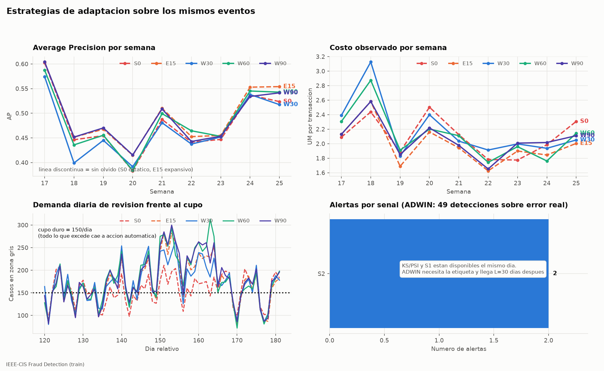
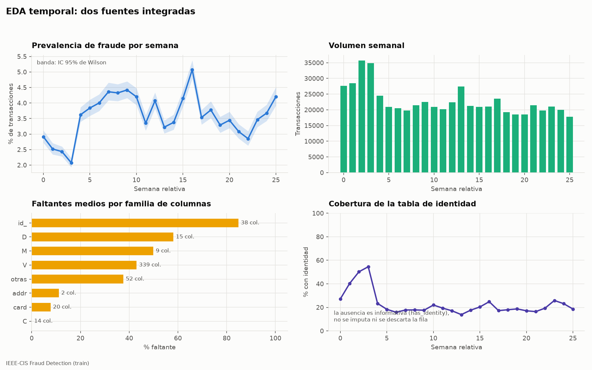
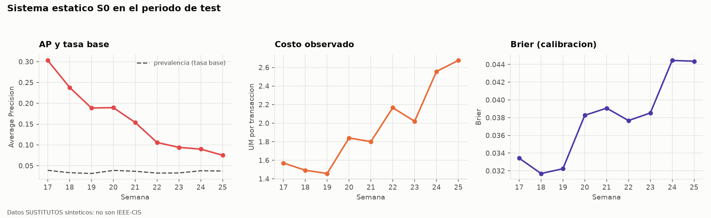

# Sistema adaptativo de decisión ante fraude transaccional

**Curso** Planificación y Toma de Decisiones en IA, UTEC
**Dataset** IEEE-CIS Fraud Detection, partición `train`, 590 540 transacciones en 182 días
**Semilla** 42. **Retraso de etiqueta** L = 30 días. **Cadencia** 15 días

> **Resultado principal.** {RESUMEN_PORTADA}

---

## Página 1. El problema de decisión

### Por qué la predicción no agota el problema

El sistema decide, para cada transacción, entre aprobar, enviar a revisión o
bloquear. Cuatro restricciones definen qué significa un buen modelo en este
contexto.

1. La etiqueta confirmada llega 30 días después del evento. Ninguna métrica de
   error está disponible en el momento de decidir.
2. La capacidad humana de revisión es de 150 casos diarios. Constituye un techo,
   no un parámetro a optimizar.
3. Un falso negativo cuesta el monto de la transacción. Un falso positivo cuesta
   fricción con un cliente legítimo.
4. La distribución de los datos cambia con el tiempo.

### Objetivos y verificación

{TABLA_OBJETIVOS}

### Familias de métricas

Las métricas técnicas comprenden Average Precision, skill normalizado por
prevalencia, F1 y balanced accuracy en un umbral declarado, recall a FPR máximo
del 1 %, recall a precisión mínima del 80 %, Brier, ECE y latencia p50, p95 y p99.

Las métricas de decisión comprenden costo observado simulado por transacción,
monto de fraude evitado, costo de falsos positivos, retorno por analista hora,
revisiones diarias y demanda excedente.

Las métricas sociales comprenden el bloqueo de clientes legítimos, distinto del
FPR del clasificador porque incorpora las legítimas que el analista bloquea por
error, la disparidad por segmento con soporte e intervalos, y la cobertura
automática.

El sistema distingue el cambio en P(X) del cambio en P(y|X). KS/PSI y el domain
classifier detectan el primero. Solo ADWIN sobre el error real observa el segundo,
con 30 días de retraso.

---

## Página 2. Arquitectura y modelo económico



*Figura 1. Comparación de las siete estrategias sobre los mismos eventos. El
diagrama de los cinco componentes está en `docs/arquitectura.mmd`.*

### Componentes

La adquisición integra dos fuentes por left join uno a uno sobre `TransactionID`,
validado por invariancia del número de filas. El predictor compara regresión
logística, Random Forest y LightGBM, con el preprocessing ajustado dentro de cada
fit. La decisión aplica el costo esperado sujeto al cupo de revisión. La
incertidumbre se trata con calibración de Platt por versión e intervalos por
bootstrap de bloques.

### Cálculo de la decisión

Para probabilidad calibrada `p` y monto `m`,

```
E[aprobar]  = p * m
E[bloquear] = (1 - p) * c_FP
E[revisar]  = c_R + p * (1 - r_H) * m + (1 - p) * f_H * c_FP
```

con `c_R = 1 UM`, `r_H = 0,90` y `f_H = 0,02`. La unidad monetaria es consistente
con `TransactionAmt` y no se convierte a moneda.

Se revisa si `min(E[aprobar], E[bloquear]) − E[revisar] > λ`, y en otro caso la
transacción recibe la más barata entre aprobar y bloquear. No hay umbrales sobre
`p` que decidan: el punto de indiferencia entre aprobar y bloquear es
`p* = c_FP / (m + c_FP)`, de modo que depende del monto y un corte fijo bloquea de
más en los montos bajos y de menos en los altos. Sobre la reserva de desarrollo la
regla de dos umbrales cuesta {COSTO_UMBRAL} UM/tx frente a {COSTO_ARGMIN} de la
económica, y eso que los umbrales se eligen minimizando sobre esa misma ventana.

Con montos bajos el costo fijo `c_R` supera la pérdida esperada, de modo que la
revisión deja de ser la acción de menor costo. Esa es la razón de que el sistema
tenga una tercera acción y no una decisión binaria.

Los dos parámetros de la política se derivan de una cantidad observable en lugar
de fijarse por criterio. El costo de un falso positivo no es observable, pero la
fracción de transacciones legítimas rechazadas sí lo es y es lo que la operación
restringe, de modo que se declara el objetivo del 1 % y se busca el menor `c_FP`
que lo cumple, que resulta {C_FP} y alcanza un {BLOQUEO_OBTENIDO} %. El parámetro
`λ` es el multiplicador de Lagrange del cupo y raciona una plaza escasa. Se calibra
por bisección como el menor valor que ajusta la demanda diaria a las {CUPO_DIARIO}
plazas, la deja en {DEMANDA_CON_PRECIO} exactas y resulta {PRECIO_CUPO} UM.

Ninguna de las dos calibraciones mira el costo observado. `c_FP` se ajusta contra
una tasa declarada y `λ` contra la capacidad, de modo que la política no se ajusta
al desenlace de la ventana. Se condicionan mutuamente y se calibran alternando
hasta estabilizarse, lo que ocurre en tres pasadas. Ambos quedan sellados en el
prerregistro.

### Evidencia sobre la necesidad de calibrar

La aritmética anterior exige que `p` sea una probabilidad y no un puntaje ordenado.
La configuración ganadora de la regresión logística usa `class_weight=balanced`,
que infla los puntajes hasta un ECE de {ECE_CRUDO_PEOR}; Platt lo corrige a
{ECE_CALIBRADO_PEOR}, una mejora por un factor de {FACTOR_ECE}. Sin esa corrección,
usar el puntaje crudo como probabilidad produciría un exceso de bloqueos que el AP
no reflejaría. La tabla completa por familia está en
`reports/tables/comparacion_modelos.csv`.

### Cola, cupo y supervisión humana

El cupo se reserva al admitir, de forma irrevocable y por `event_id`. El sistema no
ordena el día completo por `p × monto` para retener los 150 mejores casos, porque
eso exigiría conocer transacciones que aún no ocurrieron. La prioridad ordena el
servicio entre los ya admitidos y, agotado el cupo, el caso recibe la más barata
entre aprobar y bloquear.

Ninguna alerta despliega por sí sola. El reentrenamiento y la promoción exigen
autorización humana registrada aunque todos los gates técnicos pasen. Sin versión
válida el servicio responde 503 y pausa.

---

## Página 3. Datos, integración y causalidad



*Figura 2. Prevalencia semanal con intervalo de Wilson, volumen, faltantes por
familia de columnas y cobertura de identidad.*

### Integración auditada

| Comprobación | Resultado |
|---|---|
| Transacciones | 590 540 filas, 394 columnas |
| Identidad | 144 233 filas, 41 columnas |
| Filas tras el join | 590 540, invariante |
| Cobertura de identidad | 24,42 % |
| Identificadores de identidad huérfanos | 0 |
| Prevalencia global | 3,50 %, 20 663 fraudes |
| Monto mediano | 68,77 |

La ausencia de identidad constituye información y se preserva en `has_identity`.
Eliminar esas filas sesgaría el panel hacia clientes con dispositivo identificado.

### Relojes derivados

`TransactionDT` es un delta en segundos desde un origen desconocido, no una fecha.
De él se derivan `dia`, `semana` y una `hora` relativa que funciona como ciclo de
24 horas y no identifica hora local ni día laboral.

El reloj de evento determina qué features son visibles. El reloj de disponibilidad,
definido como `available_at = dia + 30`, determina cuándo una etiqueta puede
entrar a un fit, a una métrica o a ADWIN.

### Features causales y calidad de los proxies

El sistema construye tres proxies de entidad y, para cada uno, conteos y montos en
ventanas de 1 hora, 24 horas y 7 días, rezago del monto, tiempo desde el último
evento y conteo expansivo.

| Proxy | Definición | Entidades | Eventos por entidad | Singletons |
|---|---|---|---|---|
| Emisor | `card1` a `card6` más `addr1` | 43 018 | 13,7 | 40,4 % |
| Cliente | `card1 + addr1 + D1n` | 217 850 | 2,7 | 57,5 % |
| Dispositivo | `DeviceType + DeviceInfo` | 1 943 | 74,2 | 26,0 % |

Las dos claves de tarjeta se usan a la vez. `D1` mide los días desde que la tarjeta
empezó a usarse, de modo que restarlo del día absoluto identifica la fecha de alta
y separa tarjetas distintas del mismo emisor. Entrenando LightGBM solo con features
de historial sobre un test temporal, cada clave por separado alcanza AP de 0,1668 y
0,1671, y juntas 0,1829: la gruesa aporta soporte estadístico y la fina resolución
por tarjeta. Un proxy agrupa comportamiento y no identifica personas.

Los conteos expansivos quedan fuera del predictor porque acumulan desde el primer
evento, de modo que crecen con el calendario y sustituyen al día absoluto, que el
protocolo prohíbe. La media de `card_cnt_expansivo` pasa de 138,78 en `[0,60)` a
707,43 en `[150,182)`, mientras `card_cnt_7d` no correlaciona con el día. Una
validación adversarial por feature lo confirma: de las 425 columnas del panel solo
dos superan el AUC de 0,70 que la competencia usaba para descartar, y ambas son
conteos expansivos.

### Controles de leakage

Las 145 pruebas de `tests/` verifican los controles. Cuatro resultan decisivas.
Alterar las filas futuras no modifica medianas ni vocabulario del preprocessing.
Invertir las etiquetas aún inmaduras no cambia el predictor. Permutar los
identificadores de eventos con el mismo timestamp deja las features idénticas. Los
cuatro roles de cada versión no comparten ningún `TransactionID`.

---

## Página 4. Protocolo temporal

### Particiones

Todos los intervalos son semiabiertos y se expresan en días relativos.

```
dia:  0        30   45   60      69   76   83   90        120  135  150  165  182
      |---------|----|----|-------|----|----|----|---------|----|----|----|----|
      [ tuning fold 1 ]
      [ tuning fold 2      ]
      [     fit base / S0          ]
                                   [cal][pol][ H ]
                                                  [warmup X ]
                                                            [ B1][ B2][ B3][ B4 ]
```

En cada actualización `T` de {120, 135, 150, 165}, con `c = T - 30`, los roles se
distribuyen de la forma siguiente.

| Rol | Intervalo | Días efectivos |
|---|---|---|
| Predictor | `[c-W, c-14)` | 16 con W30, 46 con W60, 76 con W90 |
| Calibrador | `[c-14, c-7)` | 7 |
| Validación de promoción | `[c-7, c)` | 7 |

Hay dos reservas por versión, no tres. Los umbrales de referencia se eligen una
sola vez en desarrollo y quedan congelados, de modo que reservar una ventana de
política en cada actualización excluía siete días del fit sin cumplir función.
Liberarla beneficia sobre todo a las ventanas cortas, que son las que el
experimento evalúa: W30 pasa de 9 a 16 días de fit.

Las dos reservas son idénticas para todas las estrategias. Esa igualdad permite
atribuir una diferencia de costo al tamaño de ventana.

El experimento separa volumen de frescura por diseño. Variar solo `W` cambiaba a la vez
cuántos días entrena el modelo y cuán reciente es su información, de modo que
ninguna diferencia era atribuible. El diseño vigente añade un bloque de antigüedad
variable con volumen constante.

| Bloque | Estrategias | Qué varía | Qué se mantiene |
|---|---|---|---|
| Volumen variable | W30, W60, W90 | días de fit | corte en `c-14` |
| Antigüedad variable | W60, R46_medio, R46_antiguo | punto de corte | 46 días de fit |

### Distinción entre cutoff y tiempo del job

`cutoff = T - L` delimita qué días de evento pueden usarse. `job_time = T` indica
cuándo se ejecuta el ajuste y constituye el valor contra el que se compara
`available_at`. Con T igual a 120 y L igual a 30, el último día de evento con
etiqueta confirmada es el 89. Comparar contra `cutoff` en lugar de `job_time`
exigiría `dia < 60` y dejaría vacías las colas de calibración y validación.

### Orden de construcción

El orden es predictor, calibrador y validación. Cada paso consume scores
producidos por el anterior sobre datos que ese paso no vio. Invertir el orden haría
que el calibrador corrigiera un modelo distinto del que se despliega. La política
no consume una reserva propia, porque se congela en desarrollo y consiste en el
modelo de costos.

Si un rol no alcanza el soporte mínimo de 200 fraudes y 2 000 legítimas en el fit,
la versión se marca no válida. El sistema no amplía la ventana ni incorpora
etiquetas inmaduras para completar el soporte.

### Prerregistro

La familia, los hiperparámetros, la economía calibrada y la ventana desplegable se
congelan usando solo desarrollo. El hash `{HASH_PRE}` sella esa selección antes de
abrir el test. `c_FP` entra al sello porque pasó de ser una constante del config a
un parámetro derivado de los datos de desarrollo, de modo que sin sellarlo sería
posible recalibrarlo después de ver el test. Si la configuración cambiara entre la selección y el test, la
corrida se detiene.

El benchmark histórico que seleccionó IEEE-CIS ya examinó periodos tardíos del
dataset. Este trabajo continúa siendo un backtest retrospectivo y no una
validación prospectiva.

---

## Página 5. Modelos y selección en desarrollo



*Figura 3. Evolución de AP, costo y Brier del sistema estático en el periodo de
test, con la tasa base superpuesta.*

### Comparación de familias

La selección aplica el criterio de costo, no el de AP. El proceso ejecuta 18 fits
de tuning y tres ajustes finales.

{TABLA_FAMILIAS}

Las referencias simuladas sobre la reserva de política alcanzan {BASE_APROBAR} UM/tx
al aprobar todo y {BASE_BLOQUEAR} UM/tx al bloquear todo. {FAMILIA_ELEGIDA} queda
congelada como familia adaptativa.

La columna de umbral fijo es el costo que alcanzaría el mejor par de cortes
globales sobre `p`, elegido por minimización sobre la misma reserva. La diferencia
con la columna de argmin mide lo que cuesta ignorar el monto.

La regla económica induce un umbral distinto por monto. Con la economía calibrada:

{TABLA_UMBRALES_IMPLICADOS}

### Objetivos diagnósticos y AP por bloque

{TEXTO_AP_BLOQUE}

{TEXTO_DIAGNOSTICOS} El informe reporta el nivel obtenido y no ajusta el umbral,
porque hacerlo convertiría un objetivo incumplido en un resultado ajustado a
posteriori.

### Selección de la ventana desplegable

El protocolo exige elegir la ventana con datos de desarrollo. La evaluación se
realiza sobre la reserva de validación, posterior al predictor y al calibrador de
cada paquete.

{TABLA_SELECCION_W}

{TEXTO_SELECCION_W}

---

## Página 6. Resultado del experimento central

Siete estrategias evaluadas sobre los mismos eventos, la misma semilla, la misma
política y la misma familia. 175 998 eventos por estrategia en cuatro bloques.
Las tres primeras varían el volumen de entrenamiento y las tres últimas lo
mantienen constante en 46 días variando solo la antigüedad.

{TABLA_ADAPTACION}

*Intervalos por bootstrap pareado de bloques contiguos de 7 días con 200
remuestreos.*

### Volumen frente a frescura

Un intervalo obtenido con una semilla fija puede excluir el cero por azar. Toda
diferencia se reevalúa con 6 semillas y 3 tamaños de bloque, 18 combinaciones, y
solo se declara concluyente si ninguna cruza el cero. Con ese criterio,
{TEXTO_ROBUSTEZ}

El experimento separa volumen y frescura por diseño. El bloque de volumen variable
mueve los días de fit manteniendo el corte, y el de antigüedad variable mueve el
corte manteniendo 46 días de fit.

{TABLA_VOLUMEN_FRESCURA}

{TEXTO_VOLUMEN_FRESCURA}

El dataset presenta concept drift sin presentar data drift, y la evidencia separa
ambas afirmaciones. La distribución de entrada se mantiene estable, con un AUC de
{AUC_DOMINIO} en el domain classifier frente a un umbral de alerta de 0,75 y
ninguna columna original por encima de 0,61 en la validación adversarial por
feature. La relación entre features y fraude sí cambia, y lo registran las
{N_ADWIN} detecciones de ADWIN sobre el error individual. El efecto de frescura
medido a volumen constante solo puede provenir de ese cambio, dado que las entradas
permanecen estables.

La magnitud de ese drift, {EFECTO_FRESCURA} UM/tx por cada 30 días de antigüedad,
queda por debajo de lo que cuesta entrenar con menos muestra. Esa es la razón de
que descartar histórico no resulte rentable en este dataset.

### Contraste con la literatura sobre el mismo dataset

Topal et al. [1] comparan sobre IEEE-CIS modelos congelados tras los primeros 16
días contra modelos reentrenados a diario, y concluyen que existe concept drift. Su
titular, un recall a FPR del 5 % de 0,03 frente a 0,37, parece contradecir lo
anterior. Su tabla por familia no lo hace.

| Familia | Congelado | Reentrenado | Caída |
|---|---|---|---|
| XGBoost | 0,04 | 0,35 | −89 % |
| LightGBM | 0,03 | 0,37 | −92 % |
| Random Forest | 0,25 | 0,33 | −24 % |
| Logística | 0,29 | 0,30 | −3 % |
| **Este trabajo**, LightGBM congelado 136 días | **0,3769** | **0,4240** | **−11 %** |

El colapso se concentra en los dos boosters, cuyo recall de 0,03 y 0,04 a FPR del
5 % queda por debajo del 0,05 que produciría una asignación aleatoria. Una deriva
del fenómeno degradaría a las cuatro familias en proporción parecida, y Random
Forest y la logística caen un 24 % y un 3 %, que es el orden de magnitud medido
aquí.

La medición de aquí es directa. La estrategia congelada en los días 0 a 46 y usada
hasta el 182 conserva su AP, con 0,5077 en B1 y 0,5103 en B4, de modo que 136 días
de antigüedad no la degradan bajo este panel de features.

El diseño de aquí permite además una distinción que el suyo no necesita hacer,
entre reentrenar y descartar histórico. Su método de reentrenamiento usa todos los
datos disponibles, y en este trabajo la estrategia expansiva, que reentrena cada 15
días sin descartar, resulta la más barata de las siete.

---

## Página 7. Despliegue, operación y costo

### Entregado frente a diseñado

| Entregado y verificado localmente | Ejecuta el equipo de forma manual |
|---|---|
| Paquete versionado con hashes | Publicación de la imagen en Artifact Registry |
| Imagen Docker construida y probada | Creación del servicio en Cloud Run |
| Servicio HTTP con `/health` y `/predict` | Apuntar el replay al endpoint remoto |
| Replay con ledger SQLite transaccional | Promoción, rollback y cierre de recursos |
| Runbook y política de promoción | |

Pub/Sub, Firestore, BigQuery, Cloud Scheduler y Vertex AI Pipelines figuran en el
diagrama como diseño futuro. No existen recursos creados ni código de integración.

### Evidencia de la demo local

| Comprobación | Resultado |
|---|---|
| Tres acciones sobre datos reales | {ACCIONES_REPLAY} |
| Cupo respetado | Nunca excedido en 62 días |
| Idempotencia con 50 reenvíos | Aprobada, sin consumo adicional de cupo |
| Imagen Docker | `linux/amd64`, 1,06 GB, HEALTHCHECK en verde |
| Paridad contenedor frente a cálculo offline | Probabilidad, costos y acción emitida |
| Latencia p95 sobre HTTP al contenedor | {P95_HTTP} ms frente a un objetivo de 300 ms |
| Acciones del contenedor sobre 1 000 peticiones | {ACCIONES_HTTP} |
| Sin paquete montado | `/health` informa `model_unavailable` y `/predict` devuelve 503 |
| Cambio de versión y rollback | Score restaurado de forma exacta |

### Señales de drift y gates

{TEXTO_SENALES}

{TEXTO_GATES}

### Frecuencia, autonomía y gates

El reentrenamiento ocurre cada 15 días con la ventana W60 elegida en desarrollo.
El monitoreo aplica KS/PSI a diario, S1 por bloque y ADWIN al madurar cada
etiqueta. Cinco gates controlan la promoción. El primero verifica integridad y
bloquea la versión ante cualquier leakage. El segundo exige costo inferior al de
aprobar todo en el arranque. El tercero aplica no inferioridad con costo máximo de
1,01 veces el del champion, caída de AP no superior a 0,01 y aumento de Brier no
superior a 0,005. El cuarto limita el aumento del bloqueo de legítimas a 2 puntos
porcentuales. El quinto exige autorización humana registrada.

El rollback técnico responde a errores HTTP superiores al 1 % o a p95 por encima de
300 ms en dos lotes consecutivos, y opera de forma inmediata bajo regla
preautorizada. El deterioro de negocio solo puede afirmarse con etiquetas maduras,
30 días después, y exige revisión humana.

### Costo de cómputo

| Trabajo | Tareas | Minutos |
|---|---|---|
| Tuning | 18 | 17,3 |
| Ajustes finales y de adaptación | 6 | 9,9 |
| Selección de ventana | 3 | 0,8 |
| Backtest completo | 1 | 3,2 |
| Datos y features | 5 | 0,3 |
| Total | 33 | 31,5 de 480 |

El perfil completo de recursos cupo dentro del presupuesto declarado.

### Escala, costo e integración

El informe no estima montos porque dependen de la cuenta, la región y el tráfico.
Los factores de costo son el consumo de CPU y memoria por petición junto con el
cold start en serving, el tamaño de la ventana y el ancho del panel en
reentrenamiento, y el número de versiones retenidas junto con el volumen de logs en
almacenamiento.

Tres límites quedan declarados. El cupo está garantizado únicamente para un
orquestador secuencial. La latencia medida es local y no representa una región
cloud. El prototipo asume identidad simultánea y features precomputadas.

---

## Página 8. Límites y conclusión

### Afirmaciones que no se sostienen

| Afirmación | Motivo |
|---|---|
| El olvido mejora el costo | No ocurre. Ninguna ventana deslizante bate al estático |
| Existe concept drift demostrado | ADWIN detecta deriva en el error. La comparación temporal no la identifica causalmente |
| La ventana elegida es la óptima | Es la mejor de tres, con una cadencia y una semilla |
| El sistema es justo | La disparidad medida es operativa, sin atributos protegidos verificables |
| El sistema funciona en producción | El cupo está garantizado solo para un orquestador secuencial |
| Existe un ahorro económico medido | Los costos son simulados y `c_FP` es el precio sombra de un objetivo declarado |

### Alcance, selective labels y riesgos residuales

El resultado no invalida el diseño adaptativo. Indica que la cadencia de 15 días con
L igual a 30 no encuentra deriva suficiente para justificar el descarte de datos, y
el protocolo no puede evaluar adaptación más rápida que L, porque con un retraso de
etiqueta de 30 días toda versión nace con esa antigüedad. {TEXTO_SOPORTE}

El núcleo emplea información completa, de modo que toda etiqueta madura a los 30
días incluso si la acción simulada fue bloquear. En operación real una transacción
bloqueada no revela su desenlace y las etiquetas quedarían sesgadas por las
decisiones previas del sistema. La corrección mediante masked label quedó fuera del
alcance.

El precio sombra del cupo administra mejor la escasez, pero no la elimina. Con 150
plazas diarias el sistema resuelve de forma automática la gran mayoría de las
transacciones, de modo que mejorar el AP presenta rendimientos decrecientes.

Los riesgos residuales cuentan con controles entregados. Platt por versión corrige
los scores descalibrados, la cadencia y el cooldown de 15 días limitan la
oscilación de versiones, `available_at` gobierna las etiquetas tardías, la ausencia
de modelo válido produce 503 y pausa, y el hash de prerregistro bloquea el retuning
tras observar el test.

### Conclusión

{TEXTO_CONCLUSION}

Este trabajo constituye un backtest retrospectivo. Un backtest no demuestra que el
sistema funcione en el futuro.

---

### Trazabilidad

Cada cifra es trazable a un `run_id` y a un artefacto con hash en
`reports/indice_evidencia.csv`.

[1] Topal, Bozanta, Erer y Başar, *Handling Concept Drift in Fraud Detection: A
Replication Study*, 38th Canadian Conference on Artificial Intelligence, Calgary,
2025.

Los antecedentes son `propuesta_proyecto1_final.md`, `concept_drift_findings.md` y
`concept_drift_benchmark_instructions.md`. El benchmark que seleccionó IEEE-CIS se
cita como evidencia consistente con drift, no como prueba causal, y sus
limitaciones de preprocessing quedan declaradas.

Las decisiones de diseño y la medición que sustenta cada una están en
`docs/decisiones_de_diseno.md`.

El protocolo está en `docs/protocolo_experimental.md`, el contrato en
`docs/contrato_sistema.md` y la reproducción en `docs/reproducibilidad.md`. El
despliegue está en `deploy/gcp_runbook.md` y `deploy/promocion_rollback.md`. La
evidencia ejecutable consta de tres notebooks en `notebooks/` y 145 pruebas en
`tests/`.
